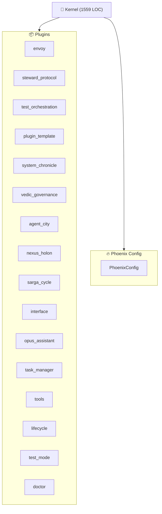

<!--
AUTO-GENERATED by RENDERER_ARCHITECTURE
Last Updated: 2025-12-17 02:27 UTC
Kernel: RUNNING (1 agents)
Quick Start: python -m vibe_core.cli boot
--># Architecture Overview

## Component Sizes

| Component | File | LOC |
| --- | --- | --- |
| Kernel | kernel_impl.py | 1559 |
| BaseRenderer | base.py | 654 |
| InterfaceConfig | section_main.py | 576 |
| InterfacePlugin | plugin_main.py | 540 |
| PhoenixConfig | config.py | 500 |
| Kernel Ops | kernel_ops.py | 326 |
| EventBus | event_bus.py | 257 |

## Plugin Status

| Plugin | Status | Type |
| --- | --- | --- |
| steward_protocol | ✅ Active | StewardProtocolPlugin |
| sarga_cycle | ✅ Active | SargaCyclePlugin |
| tools | ✅ Active | ToolsPlugin |
| vedic_governance | ✅ Active | VedicGovernancePlugin |
| nexus_holon | ✅ Active | NexusHolon |
| lifecycle | ✅ Active | LifecyclePlugin |
| envoy | ✅ Active | EnvoyPlugin |
| opus_assistant | ✅ Active | OpusAssistantPlugin |
| task_manager | ✅ Active | TaskManagerPlugin |
| system_chronicle | ✅ Active | SystemChroniclePlugin |
| agent_city | ✅ Active | AgentCityPlugin |
| interface | ✅ Active | InterfacePlugin |
| doctor | ✅ Active | DoctorPlugin |
| test_orchestration | ✅ Active | TestOrchestrationPlugin |