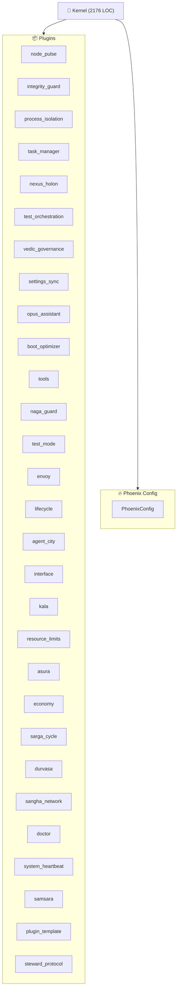

<!--
AUTO-GENERATED by RENDERER_ARCHITECTURE
Last Updated: 2026-01-09 06:09 UTC
Kernel: RUNNING (1 agents)
Quick Start: python -m vibe_core.cli boot
--># Architecture Overview

## Component Sizes

| Component | File | LOC |
| --- | --- | --- |
| Kernel | kernel_impl.py | 2176 |
| BaseRenderer | base.py | 654 |
| PhoenixConfig | config.py | 647 |
| InterfaceConfig | section_main.py | 576 |
| EventBus | event_bus.py | 558 |
| InterfacePlugin | plugin_main.py | 540 |
| Kernel Ops | kernel_ops.py | 507 |

## Plugin Status

| Plugin | Status | Type |
| --- | --- | --- |
| node_pulse | ✅ Active | NodePulsePlugin |
| tools | ✅ Active | ToolsPlugin |
| naga_guard | ✅ Active | NagaGuardPlugin |
| sarga_cycle | ✅ Active | SargaCyclePlugin |
| steward_protocol | ✅ Active | StewardProtocolPlugin |
| process_isolation | ✅ Active | ProcessIsolationPlugin |
| nexus_holon | ✅ Active | NexusHolon |
| vedic_governance | ✅ Active | VedicGovernancePlugin |
| lifecycle | ✅ Active | LifecyclePlugin |
| envoy | ✅ Active | EnvoyPlugin |
| resource_limits | ✅ Active | ResourceLimitsPlugin |
| opus_assistant | ✅ Active | OpusAssistantPlugin |
| task_manager | ✅ Active | TaskManagerPlugin |
| settings_sync | ✅ Active | SettingsSyncPlugin |
| boot_optimizer | ✅ Active | BootOptimizerPlugin |
| agent_city | ✅ Active | AgentCityPlugin |
| interface | ✅ Active | InterfacePlugin |
| economy | ✅ Active | EconomyPlugin |
| durvasa | ✅ Active | DurvasaPlugin |
| sangha_network | ✅ Active | SanghaNetworkPlugin |
| doctor | ✅ Active | DoctorPlugin |
| system_heartbeat | ✅ Active | SystemHeartbeatPlugin |
| samsara | ✅ Active | SamsaraPlugin |
| test_orchestration | ✅ Active | OrchestrationPlugin |