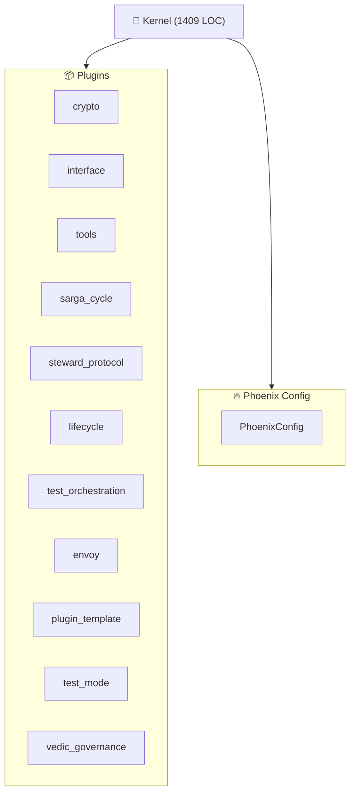

<!--
AUTO-GENERATED by RENDERER_ARCHITECTURE
Last Updated: 2025-12-08 20:47 UTC
Kernel: STOPPED (1 agents)
Quick Start: python -m vibe_core.cli boot
--># Architecture Overview

## Component Sizes

| Component | File | LOC |
| --- | --- | --- |
| Kernel | kernel_impl.py | 1409 |
| BaseRenderer | base.py | 644 |
| InterfaceConfig | section_main.py | 576 |
| InterfacePlugin | plugin_main.py | 564 |
| PhoenixConfig | config.py | 500 |
| Kernel Ops | kernel_ops.py | 326 |
| EventBus | event_bus.py | 249 |

## Plugin Status

| Plugin | Status | Type |
| --- | --- | --- |
| crypto | ✅ Active | CryptoPlugin |
| tools | ✅ Active | ToolsPlugin |
| sarga_cycle | ✅ Active | SargaCyclePlugin |
| steward_protocol | ✅ Active | StewardProtocolPlugin |
| lifecycle | ✅ Active | LifecyclePlugin |
| vedic_governance | ✅ Active | VedicGovernancePlugin |
| envoy | ✅ Active | EnvoyPlugin |
| interface | ✅ Active | InterfacePlugin |
| test_orchestration | ✅ Active | TestOrchestrationPlugin |