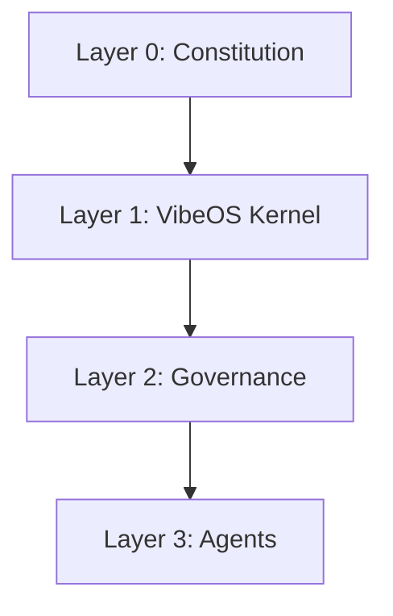
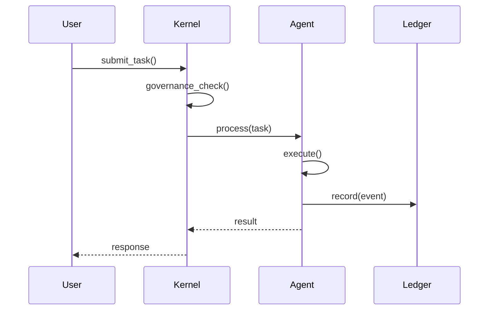
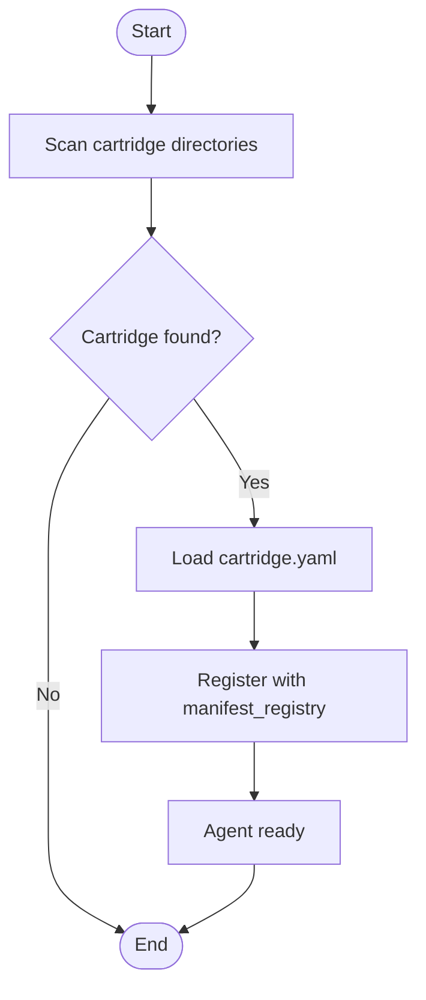

# ARCHITECTURE.md

> **🔬 Auto-Generated Documentation**  
> Generated: 2025-12-03 02:24:17 UTC  
> Circuit: `ARCHITECTURE_ANALYSIS` (VEDA-4)  
> Agent: ANALYST  

---

## 🏛️ System Overview

**STEWARD Protocol** is a **Governed AGI Operating System** built on constitutional principles and multi-layered architecture.

### Architecture Layers




**Layer 0: Constitutional Foundation**
- `CONSTITUTION.md` - Governance rules and principles
- Constitutional Kernel - Enforcement layer

**Layer 1: VibeOS Kernel**
- Kernel Type: `Not Running`
- Event Store: `/Users/ss/Downloads/steward-protocol/data/vibe_ledger.db`
- Registered Agents: **27**

**Layer 2: Governance Layer**
- CIVIC (Bureaucracy & Licensing)
- AUDITOR (Quality Gates)
- ARCHIVIST (Audit Trail)

**Layer 3: Agent Layer**
- System Agents (Devatas): Core infrastructure
- Citizen Agents: Application-level capabilities

---

## 🔄 Dataflow Architecture

### Request → Response Flow




### Event Flow Description

The STEWARD Protocol processes tasks through a multi-stage pipeline:

1. **Task Submission** (`kernel.submit_task()`)
   - User/operator submits task to kernel
   - Task enters scheduler queue

2. **Governance Check** (Constitutional validation)
   - Task validated against CONSTITUTION.md rules
   - CIVIC checks agent licensing
   - AUDITOR validates compliance

3. **Agent Selection** (Capability routing)
   - Manifest registry consulted for capabilities
   - Best agent selected based on skills

4. **Execution** (Agent processes task)
   - Agent invokes appropriate tools
   - Tool Protocol ensures standardization
   - Results accumulated

5. **Ledger Recording** (Immutable audit trail)
   - All events recorded to SQLite ledger
   - ARCHIVIST maintains audit trail
   - Path: `/Users/ss/Downloads/steward-protocol/data/vibe_ledger.db`

---

## 🔧 Cartridge Lifecycle




### Discovery Phase

1. **Scan Directories**
   - `steward/system_agents/` (System agents)
   - `agent_city/registry/` (Citizen agents)

2. **Locate Cartridges**
   - Find `cartridge.yaml` manifests
   - Extract metadata (name, version, capabilities)

### Registration Phase

1. **Validate Manifest**
   - Check required fields (id, name, version)
   - Validate tool protocol compliance

2. **Register with Kernel**
   - Add to `manifest_registry`
   - Assign agent ID
   - Mark as available

### Execution Phase

1. **Task Routing**
   - Kernel matches task to agent capabilities
   - Agent receives task via Tool Protocol

2. **Tool Invocation**
   - Agent discovers available tools
   - Tools implement `vibe_core.tools.tool_protocol.Tool`
   - Results returned to kernel

---

## 📊 Event Store (Ledger)

**Database Type:** SQLite (Append-Only)  
**Location:** `/Users/ss/Downloads/steward-protocol/data/vibe_ledger.db`  
**Total Events:** 4138

### Schema (Introspected from Live Database)


```sql
CREATE TABLE ledger_events (
                id INTEGER PRIMARY KEY AUTOINCREMENT,
                event_id TEXT,
                timestamp TEXT NOT NULL,
                event_type TEXT NOT NULL,
                task_id TEXT,
                agent_id TEXT NOT NULL,
                payload TEXT,
                result TEXT,
                error TEXT,
                details TEXT,
                current_hash TEXT NOT NULL,
                previous_hash TEXT NOT NULL,
                created_at TEXT DEFAULT CURRENT_TIMESTAMP
            )
```

```sql
CREATE TABLE sqlite_sequence(name,seq)
```


### Example Queries

```sql
-- Get all events for a specific agent
SELECT * FROM ledger_events 
WHERE agent_id = 'herald' 
ORDER BY id DESC 
LIMIT 10;

-- Count events by type
SELECT event_type, COUNT(*) as count 
FROM ledger_events 
GROUP BY event_type 
ORDER BY count DESC;

-- Recent governance decisions
SELECT * FROM ledger_events 
WHERE event_type = 'governance_decision' 
ORDER BY timestamp DESC 
LIMIT 5;
```

### Sample Events


```json
[
  {
    "agent_id": "YOUR_AGENT_ID",
    "created_at": "2025-12-03 02:24:12",
    "current_hash": "c3136b1efb93e054b90e0255186e77bafc571be7988731b6e865f38581386f01",
    "details": null,
    "error": null,
    "event_id": "EVT-004138",
    "event_type": "capability_registered",
    "id": 4138,
    "payload": "{\"capabilities\": [\"YOUR_CAPABILITY_1\", \"YOUR_CAPABILITY_2\"], \"timestamp\": \"2025-12-03T02:24:12.971155\"}",
    "previous_hash": "faa91f31ea0cf6ba0e5c425557ddba6d286175656284ead9f0aca3e478b1f67a",
    "result": null,
    "task_id": null,
    "timestamp": "2025-12-03T02:24:12.971254"
  },
  {
    "agent_id": "steward",
    "created_at": "2025-12-03 02:24:12",
    "current_hash": "faa91f31ea0cf6ba0e5c425557ddba6d286175656284ead9f0aca3e478b1f67a",
    "details": null,
    "error": null,
    "event_id": "EVT-004137",
    "event_type": "capability_registered",
    "id": 4137,
    "payload": "{\"capabilities\": [\"discovery\", \"registration\", \"governance\"], \"timestamp\": \"2025-12-03T02:24:12.916787\"}",
    "previous_hash": "b5da5f0afa75452de10e2287552e0fc7afddd871066fbcc3c5cd3d3187923c65",
    "result": null,
    "task_id": null,
    "timestamp": "2025-12-03T02:24:12.916887"
  },
  {
    "agent_id": "YOUR_AGENT_ID",
    "created_at": "2025-12-03 02:24:02",
    "current_hash": "b5da5f0afa75452de10e2287552e0fc7afddd871066fbcc3c5cd3d3187923c65",
    "details": null,
    "error": null,
    "event_id": "EVT-004136",
    "event_type": "capability_registered",
    "id": 4136,
    "payload": "{\"capabilities\": [\"YOUR_CAPABILITY_1\", \"YOUR_CAPABILITY_2\"], \"timestamp\": \"2025-12-03T02:24:02.786682\"}",
    "previous_hash": "416943590f53ee739b325f20d4aaa2c7bd12adcd88acb3fe4da58e0439e52ab4",
    "result": null,
    "task_id": null,
    "timestamp": "2025-12-03T02:24:02.786779"
  },
  {
    "agent_id": "steward",
    "created_at": "2025-12-03 02:24:02",
    "current_hash": "416943590f53ee739b325f20d4aaa2c7bd12adcd88acb3fe4da58e0439e52ab4",
    "details": null,
    "error": null,
    "event_id": "EVT-004135",
    "event_type": "capability_registered",
    "id": 4135,
    "payload": "{\"capabilities\": [\"discovery\", \"registration\", \"governance\"], \"timestamp\": \"2025-12-03T02:24:02.734983\"}",
    "previous_hash": "bd02193d53df09872901e228f096fdfa6e958d049a0a55c04efaa410b1862e2f",
    "result": null,
    "task_id": null,
    "timestamp": "2025-12-03T02:24:02.735077"
  },
  {
    "agent_id": "YOUR_AGENT_ID",
    "created_at": "2025-12-03 02:23:52",
    "current_hash": "bd02193d53df09872901e228f096fdfa6e958d049a0a55c04efaa410b1862e2f",
    "details": null,
    "error": null,
    "event_id": "EVT-004134",
    "event_type": "capability_registered",
    "id": 4134,
    "payload": "{\"capabilities\": [\"YOUR_CAPABILITY_1\", \"YOUR_CAPABILITY_2\"], \"timestamp\": \"2025-12-03T02:23:52.675937\"}",
    "previous_hash": "882f6ea787d8f74f629bc01f1dbd56787dd8f2954995a34ab24a96410bbd8591",
    "result": null,
    "task_id": null,
    "timestamp": "2025-12-03T02:23:52.676080"
  }
]
```


---

## 🛠️ Tool Invocation Protocol

All tools in STEWARD Protocol implement the **Tool Protocol** interface:

```python
# vibe_core/tools/tool_protocol.Tool

class Tool:
    @property
    def name(self) -> str:
        """Tool identifier (e.g., 'herald.broadcast')"""
        
    @property
    def description(self) -> str:
        """Human-readable description"""
        
    @property
    def parameters_schema(self) -> dict[str, Any]:
        """JSON schema for parameters"""
    
    def validate(self, parameters: dict[str, Any]) -> None:
        """Validate parameters before execution"""
    
    def execute(self, parameters: dict[str, Any]) -> ToolResult:
        """Execute tool and return result"""
```

### Tool Discovery

1. Agent cartridge declares tools in `cartridge.yaml`
2. Kernel scans `tools/` directory for Tool implementations
3. Tools registered in manifest with name and schema
4. Runtime invocation via `tool.execute(params)`

### Execution Pattern

```python
# Standard tool invocation pattern
tool = get_tool("analyst.architecture")
result = tool.execute({
    "action": "introspect_kernel",
})

if result.success:
    data = result.output
else:
    logger.error(result.error)
```

---

## 🔗 Integration Patterns

### Agent Communication

Agents communicate through the **Kernel Message Bus**:
- No direct agent-to-agent calls
- All communication via kernel
- Ensures governance and audit trail

### Governance Flow

```
Task → Constitutional Check → License Check → Capability Check → Execute
```

### Error Handling

- All errors logged to ledger
- ARCHIVIST maintains error audit trail
- SUPREME_COURT handles appeals (if needed)

---

## 📚 Related Documentation

For additional context, see:

- **[INDEX.md](INDEX.md)** - Documentation navigation (VEDA-4 organized)
- **[CITYMAP.md](CITYMAP.md)** - Agent map and responsibilities
- **[README.md](README.md)** - Quick start guide
- **[OPERATIONS.md](OPERATIONS.md)** - Operational procedures
- **[CONSTITUTION.md](CONSTITUTION.md)** - Governance rules

---

## 🔬 Introspection Metadata

**Generated by:** ANALYST Agent  
**Circuit:** `ARCHITECTURE_ANALYSIS` (VEDA-4)  
**Introspection Method:** Live kernel state + AST analysis  
**No Hardcoded Values:** All data from runtime introspection ✅  

**Kernel State Snapshot:**
- Kernel Type: `Not Running`
- Agent Count: 27
- Ledger Path: `/Users/ss/Downloads/steward-protocol/data/vibe_ledger.db`
- Scheduler State: None

---

*This document is automatically generated. Do not edit manually.*  
*To regenerate: Run ARCHITECTURE_ANALYSIS circuit via ANALYST agent.*