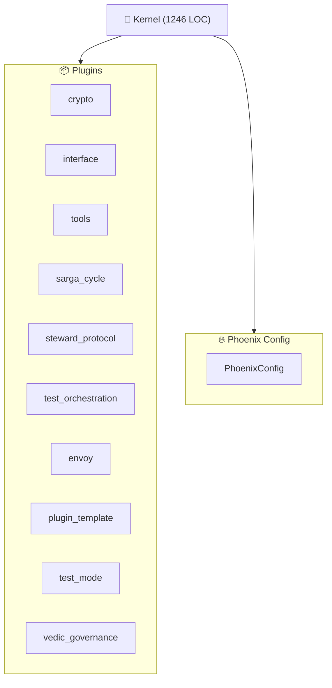

<!--
AUTO-GENERATED by InterfacePlugin
Last Updated: 2025-12-06 20:47:56 UTC
Kernel: KernelStatus.STOPPED
-->
> **Docs:** [README](README.md) · [INDEX](INDEX.md) · [AGENTS](AGENTS.md) · [CITYMAP](CITYMAP.md) · [HELP](HELP.md) · [TASKS](TASKS.md) · [SETTINGS](SETTINGS.md) · [ENVOY](ENVOY.md)

<!-- @LIVE:mermaid_diagram -->
## Mermaid Diagram

<!-- /@LIVE -->
<!-- @LIVE:component_sizes -->
## Component Sizes

| Component | File | LOC |
| --- | --- | --- |
| Kernel | kernel_impl.py | 1246 |
| InterfaceConfig | section_main.py | 576 |
| PhoenixConfig | config.py | 554 |
| BaseRenderer | base.py | 485 |
| Kernel Ops | kernel_ops.py | 326 |
| InterfacePlugin | plugin_main.py | 268 |
| EventBus | event_bus.py | 249 |
<!-- /@LIVE -->
<!-- @LIVE:plugin_status -->
## Plugin Status

| Plugin | Status | Type |
| --- | --- | --- |
| crypto | ✅ Active | CryptoPlugin |
| tools | ✅ Active | ToolsPlugin |
| sarga_cycle | ✅ Active | SargaCyclePlugin |
| steward_protocol | ✅ Active | StewardProtocolPlugin |
| vedic_governance | ✅ Active | VedicGovernancePlugin |
| interface | ✅ Active | InterfacePlugin |
| test_orchestration | ✅ Active | TestOrchestrationPlugin |
<!-- /@LIVE -->
*Generated by InterfacePlugin | 2025-12-06 20:47:56 UTC*