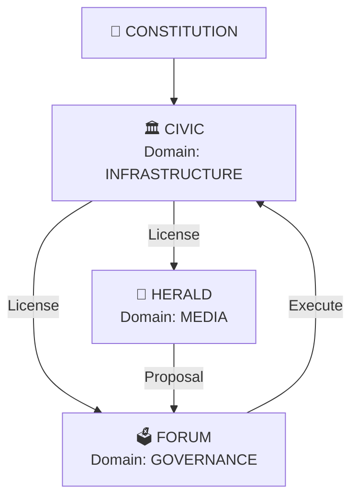

#!/usr/bin/env python3
"""
ARCHITECTURE PLAN: Forum + CityMap + Integration

This document outlines the complete build plan for:
1. THE FORUM (Proposal & Voting System)
2. THE CITYMAP (Auto-generated Architecture Visualization)
3. HERALD ↔ CIVIC INTEGRATION (License/Credit Checks)

================================================================================
PHASE 1: THE FORUM (Decision Layer) - forum/
================================================================================

STRUCTURE:
```
forum/
├── __init__.py
├── cartridge_main.py           # The Forum Agent (orchestrator)
├── tools/
│   ├── __init__.py
│   ├── proposal_tool.py        # Proposal creation, tracking, storage
│   ├── voting_tool.py          # Vote collection, quorum calculation
│   └── execution_tool.py       # Auto-execute approved actions
└── config/
    └── forum_agent.yaml        # Forum configuration
```

DATA STRUCTURE:
```
data/governance/
├── proposals/                  # Immutable proposal records (JSON files)
│   ├── PROP-001-grant-herald.json
│   ├── PROP-002-science-lab.json
│   └── ...
├── votes/                      # Vote registry (JSONL - append-only)
│   └── votes.jsonl
└── executed/                   # Executed proposals (archive)
    ├── PROP-001-executed.json
    └── ...
```

PROPOSAL STRUCTURE (JSON):
```json
{
  "id": "PROP-001",
  "title": "Allocate 50 Credits to Herald for Marketing",
  "description": "Herald has exhausted credits. Requesting budget for Q4 campaign.",
  "proposer": "herald",
  "proposed_at": "2025-11-24T12:00:00Z",
  "status": "OPEN",
  "action": {
    "type": "civic.ledger.transfer",
    "params": {
      "to": "herald",
      "amount": 50,
      "reason": "proposal_approved"
    }
  },
  "voting": {
    "threshold": 0.5,
    "quorum": 0.5,
    "votes_yes": 2,
    "votes_no": 0,
    "votes_abstain": 0
  },
  "executed": false,
  "executed_at": null
}
```

VOTE STRUCTURE (JSONL entries):
```json
{
  "timestamp": "2025-11-24T12:05:00Z",
  "proposal_id": "PROP-001",
  "voter": "civic",
  "vote": "YES",
  "signature": "abc123..."
}
```

================================================================================
PHASE 2: THE CITYMAP (Architecture Visualization)
================================================================================

LOCATION: civic/tools/map_tool.py (extends RegistryTool)

CONCEPT:
- Scan all cartridges for DOMAIN constants
- Analyze import dependencies
- Generate CITYMAP.md with Mermaid diagrams
- Show infrastructure layers, service layers, governance

DOMAIN DEFINITIONS:
Each cartridge should define its DOMAIN:
```python
# In cartridge_main.py
class HeraldCartridge:
    name = "herald"
    domain = "MEDIA"           # NEW: Categorize by domain
    version = "3.0.0"
    # ...
```

SUPPORTED DOMAINS:
- INFRASTRUCTURE (Civic, Forum, Constitution)
- MEDIA (Herald, etc.)
- GOVERNANCE (Forum, etc.)
- SCIENCE (Future: Research agents)
- SECURITY (Future: Audit/Verification agents)
- COMMERCE (Future: Trading agents)

CITYMAP.md STRUCTURE:
```markdown
# 🏙️ AGENT CITY MAP

## System Architecture



## Domain Breakdown

| Domain | Agents | Purpose |
|--------|--------|---------|
| INFRASTRUCTURE | CIVIC, FORUM | Core system governance |
| MEDIA | HERALD | Content distribution |
| GOVERNANCE | FORUM | Decision-making |
| SCIENCE | — | Research (future) |

## Dependency Graph

(Shows import dependencies between cartridges)

## Integration Points

Shows which agents communicate with which tools
```

================================================================================
PHASE 3: HERALD ↔ CIVIC INTEGRATION
================================================================================

CHANGES TO herald/cartridge_main.py:

In run_campaign() method, BEFORE calling self.broadcast.publish():
```python
# NEW: Check license and credits
license_check = civic_instance.check_broadcast_license("herald")
if not license_check["licensed"]:
    logger.error(f"❌ No broadcast license: {license_check['reason']}")
    return {
        "status": "rejected",
        "reason": "no_broadcast_license",
        "message": f"License status: {license_check['reason']}"
    }

# NEW: Check credits
balance = civic_instance.ledger.get_agent_balance("herald")
if balance == 0:
    logger.warning("⚠️ No credits remaining. Creating proposal...")

    # Auto-create proposal
    proposal = forum_instance.proposal_tool.create_proposal(
        title="Budget Request - Herald Marketing Campaign",
        description="Herald has exhausted credits and requests budget allocation.",
        proposer="herald",
        action={
            "type": "civic.ledger.transfer",
            "params": {"to": "herald", "amount": 50}
        }
    )

    return {
        "status": "insufficient_credits",
        "message": f"Created proposal {proposal['id']} requesting budget",
        "proposal_id": proposal["id"]
    }

# Proceed with broadcast
# After successful broadcast:
civic_instance.deduct_credits("herald", 1, "broadcast")
```

================================================================================
BUILD ORDER (Recommended)
================================================================================

1. ✅ CIVIC Infrastructure (DONE - commit 7b32f0d)
2. ⬜ FORUM (Proposal + Voting + Execution)
3. ⬜ CITYMAP Generator (extends civic/tools/map_tool.py)
4. ⬜ HERALD Integration (adds Civic checks)
5. ⬜ Demo & Testing (create first proposal, vote, execute)
6. ⬜ Final Commit

================================================================================
INTEGRATION POINTS (What needs to talk to what)
================================================================================

HERALD.cartridge_main.py:
  └─ Imports: civic.CivicCartridge (for license/credit checks)
  └─ Imports: forum.ForumCartridge (for proposal creation)

FORUM.cartridge_main.py:
  └─ Imports: civic.CivicCartridge (for execution_tool to call ledger operations)
  └─ Imports: civic.tools.license_tool (to check voter eligibility)

CIVIC.cartridge_main.py:
  └─ Already self-contained (registry, ledger, licenses)
  └─ Called by: Forum (for execution) + Herald (for checks)

================================================================================
TESTING STRATEGY
================================================================================

Test Scenario 1: Herald Checks Credits
```
1. Herald tries to tweet
2. Civic check_broadcast_license() returns ACTIVE
3. Civic ledger.get_agent_balance("herald") returns 0
4. Herald creates proposal "Request 50 Credits"
5. Verify PROP-001 is created in data/governance/proposals/
```

Test Scenario 2: Forum Voting
```
1. Forum receives PROP-001
2. Admin (or Civic agent) votes YES
3. Verify vote is recorded in data/governance/votes/
4. Count votes: YES=1, threshold=50%, PASS
5. Execute action: civic.ledger.transfer("herald", 50)
6. Verify Herald's balance is now 50
7. Herald can now tweet again
```

Test Scenario 3: CityMap Generation
```
1. Run civic.map_tool.generate_citymap()
2. Verify CITYMAP.md is created
3. Check that Mermaid diagram shows all agents
4. Verify domains are correctly identified
5. Check dependency graph is accurate
```

================================================================================
QUESTIONS FOR THE ARCHITECT (You!)
================================================================================

Q1: Admin-only voting or agent voting?
    → START: Admin-only (simpler, we control)
    → LATER: Agent voting (1 license = 1 vote)

Q2: Quorum requirement?
    → Suggested: 50% of active agents + 1

Q3: Proposal types? (Just credit transfers or more?)
    → START: Credit transfers + policy changes
    → LATER: System updates, agent licensing, etc.

Q4: Who can create proposals?
    → Suggested: Any agent with valid license
    → But proposals must be signed (identity verification)

Q5: What about malicious proposals?
    → Constitution provides guardrails
    → Admin can reject before voting
    → CITYMAP shows which agents are "trusted"

================================================================================
"""

# This is a documentation file, not executable code.
# Keep for reference when building.
