# 🏙️ AGENT CITY MAP

**Auto-generated by CIVIC Map Tool**
**Last Updated:** 2025-11-27 15:45 UTC

---

## 📍 EXECUTIVE SUMMARY

Agent City is a federated multi-agent system with the following structure:

- **Infrastructure**: Core governance and administrative services
- **Services**: Agents providing specific functions
- **Governance**: Democratic decision-making
- **Communication**: How agents interact

---

## 🏛️ SYSTEM ARCHITECTURE

```mermaid
graph TD
    CONST["📜 CONSTITUTION<br/>(Immutable Law)"]
    CIVIC["🏛️ CIVIC<br/>INFRASTRUCTURE<br/>License, Credits, Registry"]
    FORUM["🗳️ FORUM<br/>GOVERNANCE<br/>Proposals, Voting"]
    HERALD["🦅 HERALD<br/>MEDIA<br/>Publishing, Broadcasting"]

    CONST -->|Authority| CIVIC
    CIVIC -->|Enforces Rules| HERALD
    CIVIC -->|Enforces Rules| FORUM
    HERALD -->|Submits Proposals| FORUM
    FORUM -->|Executes Actions| CIVIC

    style CONST fill:#8b7355
    style CIVIC fill:#4a90e2
    style FORUM fill:#50c878
    style HERALD fill:#ffa500
```



---

## 📊 DOMAIN BREAKDOWN


### ENFORCEMENT

- **WATCHMAN** (WatchmanCartridge) — System integrity enforcer and governance enforcer

### ENGINEERING

- **ENGINEER** (EngineerCartridge) — Builder agent: manifests code and scaffolds new agents

### GOVERNANCE

- **CIVIC** (CivicCartridge) — Governance agent: enforces rules, manages licenses, audits credits
- **FORUM** (ForumCartridge) — Democratic decision-making and proposal voting system
- **SUPREME_COURT** (SupremeCourtCartridge) — Appellate justice and mercy system (Canto 6: Ajamila Protocol)

### INFRASTRUCTURE

- **ARCHIVIST** (ArchivistCartridge) — History keeper: seals verified code into git history
- **CHRONICLE** (ChronicleCartridge) — Temporal agent: manages git operations, commits, branches, and code history
- **SCRIBE** (ScribeCartridge) — Documentation agent: auto-generates AGENTS.md, CITYMAP.md, HELP.md, README.md

### INTROSPECTION

- **ORACLE** (OracleCartridge) — System introspection and explanation agent

### MEDIA

- **HERALD** (HeraldCartridge) — Autonomous intelligence and content distribution agent

### ORCHESTRATION

- **ENVOY** (EnvoyCartridge) — Universal Operator Interface - diplomatic and operational bridge

### SCIENCE

- **SCIENCE** (ScientistCartridge) — External intelligence and fact research agent

### SECURITY

- **AUDITOR** (AuditorCartridge) — Quality gate: verifies code syntax and linting before commit


---

## 🤖 AGENT REGISTRY

| Agent | Domain | Class | Description |
|-------|--------|-------|-------------|
| **ARCHIVIST** | INFRASTRUCTURE | `ArchivistCartridge` | History keeper: seals verified code into git history |
| **AUDITOR** | SECURITY | `AuditorCartridge` | Quality gate: verifies code syntax and linting before commit |
| **CHRONICLE** | INFRASTRUCTURE | `ChronicleCartridge` | Temporal agent: manages git operations, commits, branches, and code history |
| **CIVIC** | GOVERNANCE | `CivicCartridge` | Governance agent: enforces rules, manages licenses, audits credits |
| **ENGINEER** | ENGINEERING | `EngineerCartridge` | Builder agent: manifests code and scaffolds new agents |
| **ENVOY** | ORCHESTRATION | `EnvoyCartridge` | Universal Operator Interface - diplomatic and operational bridge |
| **FORUM** | GOVERNANCE | `ForumCartridge` | Democratic decision-making and proposal voting system |
| **HERALD** | MEDIA | `HeraldCartridge` | Autonomous intelligence and content distribution agent |
| **ORACLE** | INTROSPECTION | `OracleCartridge` | System introspection and explanation agent |
| **SCIENCE** | SCIENCE | `ScientistCartridge` | External intelligence and fact research agent |
| **SCRIBE** | INFRASTRUCTURE | `ScribeCartridge` | Documentation agent: auto-generates AGENTS.md, CITYMAP.md, HELP.md, README.md |
| **SUPREME_COURT** | GOVERNANCE | `SupremeCourtCartridge` | Appellate justice and mercy system (Canto 6: Ajamila Protocol) |
| **WATCHMAN** | ENFORCEMENT | `WatchmanCartridge` | System integrity enforcer and governance enforcer |


---

## 🔗 DEPENDENCY GRAPH

```mermaid
graph LR
    archivist["🏛️ ARCHIVIST"];
    auditor["🔒 AUDITOR"];
    chronicle["🏛️ CHRONICLE"];
    civic["🗳️ CIVIC"];
    engineer["❓ ENGINEER"];
    envoy["❓ ENVOY"];
    forum["🗳️ FORUM"];
    herald["🦅 HERALD"];
    oracle["❓ ORACLE"];
    science["🔬 SCIENCE"];
    scribe["🏛️ SCRIBE"];
    supreme_court["🗳️ SUPREME_COURT"];
    watchman["❓ WATCHMAN"];
    archivist -->|imports| archivist;
    auditor -->|imports| auditor;
    chronicle -->|imports| chronicle;
    civic -->|imports| civic;
    engineer -->|imports| engineer;
    envoy -->|imports| envoy;
    forum -->|imports| forum;
    herald -->|imports| herald;
    oracle -->|imports| oracle;
    science -->|imports| science;
    scribe -->|imports| scribe;
    supreme_court -->|imports| supreme_court;
    watchman -->|imports| watchman;
```



---

## 🔌 INTEGRATION POINTS

### CIVIC (Authority)
- **Provides**: License checks, credit ledger, registry
- **Consumed by**: HERALD, FORUM, all agents
- **Key Methods**: check_broadcast_license(), deduct_credits(), refill_credits()

### FORUM (Democracy)
- **Provides**: Proposal system, voting
- **Consumed by**: HERALD (when out of credits), CIVIC (for execution)
- **Key Methods**: create_proposal(), submit_vote(), execute_proposal()

### HERALD (Media)
- **Provides**: Content generation, broadcasting
- **Consumes**: CIVIC (licenses, credits), FORUM (proposals)
- **Key Methods**: run_campaign(), check_broadcast_license(), create_proposal()


---

## 🚀 ONBOARDING FOR NEW AGENTS

### Step 1: Register with CIVIC
```
CIVIC.scan_and_register_agents()
→ Your agent gets a license and 100 starting credits
```

### Step 2: Read Your Domain
Review the section above to understand your place in the city.

### Step 3: Check Dependencies
Look at "Dependency Graph" to see who you need to talk to.

### Step 4: Implement Integration
- Import the agents/tools you depend on
- Call their public methods
- Follow the Constitution

### Step 5: Get Approval
Submit a PR with your agent code. CIVIC will validate and register you.

---

## 📋 NOTES

- This map is **auto-generated** from actual cartridge code
- Domains are extracted from `domain = "..."` constants
- Dependencies are extracted from `import` statements
- To update: Run `civic.map_tool.generate_citymap()` and save to `CITYMAP.md`

---

## 🏛️ GOVERNANCE STRUCTURE

```
                    🏛️ CIVIC
                   (Authority)
                    /  |  \
                   /   |   \
        License   /  Credits  \  Registry
         Tool    /     |        \
               /       |          \
    HERALD ←→ FORUM ←→ CIVIC ←→ Other Agents
              (Vote)  (Execute)
```

The Forum submits proposals to CIVIC.
CIVIC executes if votes pass.
All agents answer to the Constitution.
All transactions are recorded and audited.

---

**Generated by:** civic/tools/map_tool.py
**Authority:** CIVIC Cartridge
**Distribution:** Public (everyone can read this map)
