# 🏙️ AGENT CITY MAP

**Auto-generated by CIVIC Map Tool**
**Last Updated:** 2025-11-24 14:09 UTC

---

## 📍 EXECUTIVE SUMMARY

Agent City is a federated multi-agent system with the following structure:

- **Infrastructure**: Core governance and administrative services
- **Services**: Agents providing specific functions
- **Governance**: Democratic decision-making
- **Communication**: How agents interact

---

## 🏛️ SYSTEM ARCHITECTURE

```mermaid
graph TD
    CONST["📜 CONSTITUTION<br/>(Immutable Law)"]
    CIVIC["🏛️ CIVIC<br/>INFRASTRUCTURE<br/>License, Credits, Registry"]
    FORUM["🗳️ FORUM<br/>GOVERNANCE<br/>Proposals, Voting"]
    HERALD["🦅 HERALD<br/>MEDIA<br/>Publishing, Broadcasting"]

    CONST -->|Authority| CIVIC
    CIVIC -->|Enforces Rules| HERALD
    CIVIC -->|Enforces Rules| FORUM
    HERALD -->|Submits Proposals| FORUM
    FORUM -->|Executes Actions| CIVIC

    style CONST fill:#8b7355
    style CIVIC fill:#4a90e2
    style FORUM fill:#50c878
    style HERALD fill:#ffa500
```



---

## 📊 DOMAIN BREAKDOWN


### GOVERNANCE

- **CIVIC** (UnknownCartridge) — 
- **FORUM** (UnknownCartridge) — 

### INFRASTRUCTURE

- **ARCHIVIST** (ArchivistCartridge) — 
- **ARTISAN** (ArtisanCartridge) — THE ARTISAN - Media & Tech Ops Agent.
- **AUDITOR** (AuditorCartridge) — 
- **ENGINEER** (EngineerCartridge) — THE ENGINEER - Meta-Agent & Builder.
- **WATCHMAN** (WatchmanCartridge) — 

### MEDIA

- **HERALD** (UnknownCartridge) — 

### ORCHESTRATION

- **ENVOY** (UnknownCartridge) — 

### SCIENCE

- **SCIENCE** (UnknownCartridge) — 


---

## 🤖 AGENT REGISTRY

| Agent | Domain | Class | Description |
|-------|--------|-------|-------------|
| **ARCHIVIST** | INFRASTRUCTURE | `ArchivistCartridge` |  |
| **ARTISAN** | INFRASTRUCTURE | `ArtisanCartridge` | THE ARTISAN - Media & Tech Ops Agent. |
| **AUDITOR** | INFRASTRUCTURE | `AuditorCartridge` |  |
| **CIVIC** | GOVERNANCE | `UnknownCartridge` |  |
| **ENGINEER** | INFRASTRUCTURE | `EngineerCartridge` | THE ENGINEER - Meta-Agent & Builder. |
| **ENVOY** | ORCHESTRATION | `UnknownCartridge` |  |
| **FORUM** | GOVERNANCE | `UnknownCartridge` |  |
| **HERALD** | MEDIA | `UnknownCartridge` |  |
| **SCIENCE** | SCIENCE | `UnknownCartridge` |  |
| **WATCHMAN** | INFRASTRUCTURE | `WatchmanCartridge` |  |

---

## 🔗 DEPENDENCY GRAPH

```mermaid
graph LR
    archivist["🏛️ ARCHIVIST"];
    artisan["🏛️ ARTISAN"];
    auditor["🏛️ AUDITOR"];
    civic["🗳️ CIVIC"];
    engineer["🏛️ ENGINEER"];
    envoy["❓ ENVOY"];
    forum["🗳️ FORUM"];
    herald["🦅 HERALD"];
    science["🔬 SCIENCE"];
    watchman["🏛️ WATCHMAN"];
    archivist -->|imports| archivist;
    artisan -->|imports| artisan;
    auditor -->|imports| auditor;
    civic -->|imports| civic;
    engineer -->|imports| engineer;
    envoy -->|imports| envoy;
    forum -->|imports| forum;
    herald -->|imports| artisan;
    herald -->|imports| herald;
    watchman -->|imports| herald;
```




---

## 🔌 INTEGRATION POINTS

### CIVIC (Authority)
- **Provides**: License checks, credit ledger, registry
- **Consumed by**: HERALD, FORUM, all agents
- **Key Methods**: check_broadcast_license(), deduct_credits(), refill_credits()

### FORUM (Democracy)
- **Provides**: Proposal system, voting
- **Consumed by**: HERALD (when out of credits), CIVIC (for execution)
- **Key Methods**: create_proposal(), submit_vote(), execute_proposal()

### HERALD (Media)
- **Provides**: Content generation, broadcasting
- **Consumes**: CIVIC (licenses, credits), FORUM (proposals)
- **Key Methods**: run_campaign(), check_broadcast_license(), create_proposal()


---

## 🚀 ONBOARDING FOR NEW AGENTS

### Step 1: Register with CIVIC
```
CIVIC.scan_and_register_agents()
→ Your agent gets a license and 100 starting credits
```

### Step 2: Read Your Domain
Review the section above to understand your place in the city.

### Step 3: Check Dependencies
Look at "Dependency Graph" to see who you need to talk to.

### Step 4: Implement Integration
- Import the agents/tools you depend on
- Call their public methods
- Follow the Constitution

### Step 5: Get Approval
Submit a PR with your agent code. CIVIC will validate and register you.

---

## 📋 NOTES

- This map is **auto-generated** from actual cartridge code
- Domains are extracted from `domain = "..."` constants
- Dependencies are extracted from `import` statements
- To update: Run `civic.map_tool.generate_citymap()` and save to `CITYMAP.md`

---

## 🏛️ GOVERNANCE STRUCTURE

```
                    🏛️ CIVIC
                   (Authority)
                    /  |  \
                   /   |   \
        License   /  Credits  \  Registry
         Tool    /     |        \
               /       |          \
    HERALD ←→ FORUM ←→ CIVIC ←→ Other Agents
              (Vote)  (Execute)
```

The Forum submits proposals to CIVIC.
CIVIC executes if votes pass.
All agents answer to the Constitution.
All transactions are recorded and audited.

---

**Generated by:** civic/tools/map_tool.py
**Authority:** CIVIC Cartridge
**Distribution:** Public (everyone can read this map)
