# 🏙️ AGENT CITY MAP

**Auto-generated by SCRIBE (The Documentarian)**
**Last Updated:** 2025-11-28 14:57 UTC

---

## 📊 SYSTEM STATUS DASHBOARD

```
╔══════════════════════════════════════════════════════════════╗
║                    AGENT CITY STATUS                          ║
╠══════════════════════════════════════════════════════════════╣
║  👥 Agents:           13 registered                      ║
║  🌌 Boot Cycle:      DAY_OF_BRAHMA                          ║
║  ⚡ Security:        GREEN                                  ║
║  💰 Economy:         NOT_INITIALIZED                        ║
║  🌍 Topology:        Bhu-Mandala geometry active              ║
╚══════════════════════════════════════════════════════════════╝
```

---

## 🏗️ 3-LAYER ARCHITECTURE

Agent City is built on three distinct layers:

```
┌─────────────────────────────────────────────────────────┐
│  LAYER 3: AGENT LAYER (13 agents)                    │
│  👥 Autonomous agents providing services                │
├─────────────────────────────────────────────────────────┤
│  LAYER 2: ROUTING LAYER                                  │
│  🌊 Request routing, semantic analysis, execution        │
├─────────────────────────────────────────────────────────┤
│  LAYER 1: KERNEL LAYER                                   │
│  ⚡ Boot, security, topology, ledger                     │
└─────────────────────────────────────────────────────────┘
```

---

## ⚡ LAYER 1: KERNEL INFRASTRUCTURE

**Location:** `vibe_core/`

The foundational layer that powers Agent City. All agents run on this substrate.

### 🌌 Discovered Kernel Modules

**agent_interface** (`vibe_core/agent_interface.py` - 377 lines)
- AGENT SYSTEM INTERFACE - The Bridge Between Kernel and Agents
- Key components: AgentSystemInterface class, add_dependency(), get_dependencies()

**agent_protocol** (`vibe_core/agent_protocol.py` - 245 lines)
- VibeAgent Protocol - Interface Definition
- Key components: Capability enum, class class, Capabilit class

**boot_orchestrator** (`vibe_core/boot_orchestrator.py` - 173 lines)
- ⚡ BOOT ORCHESTRATOR ⚡
- Key components: BootOrchestrator class, boot(), get_kernel()

**bridge** (`vibe_core/bridge.py` - 29 lines)
- 🌉 THE NEURAL BRIDGE 🌉

**dependency_manager** (`vibe_core/dependency_manager.py` - 223 lines)
- DEPENDENCY MANAGER - Central pyproject.toml Management
- Key components: DependencyManager class, add_dependency(), remove_dependency()

**event_bus** (`vibe_core/event_bus.py` - 247 lines)
- CANTO 10: THE FLUTE (Event Bus - The Song of Agents)
- Key components: EventType enum, EventColor enum, EventTyp class

**identity** (`vibe_core/identity.py` - 194 lines)
- Agent identity and manifest generation.
- Key components: ManifestGenerator class, generate(), generate_all()

**kernel** (`vibe_core/kernel.py` - 172 lines)
- VibeKernel Interface Stub
- Key components: KernelStatus enum, KernelStatu class, VibeScheduler class

**kernel_impl** (`vibe_core/kernel_impl.py` - 809 lines)
- ⚙️ REAL VIBE KERNEL IMPLEMENTATION ⚙️
- Key components: InMemoryScheduler class, InMemoryManifestRegistry class, submit_task()

**ledger** (`vibe_core/ledger.py` - 386 lines)
- ⚙️ VIBE CORE: LEDGER MODULE ⚙️
- Key components: InMemoryLedger class, SQLiteLedger class, record_event()

**lineage** (`vibe_core/lineage.py` - 382 lines)
- ⛓️  PARAMPARA - THE LINEAGE CHAIN ⛓️
- Key components: class class, LineageChain class, add_block()

**narasimha** (`vibe_core/narasimha.py` - 307 lines)
- ⚡ NARASIMHA.PY - THE HYPERVISOR KILL-SWITCH ⚡
- Key components: ThreatLevel enum, logger class, ThreatLeve class

**network_proxy** (`vibe_core/network_proxy.py` - 214 lines)
- KERNEL NETWORK PROXY - Controlled External Access
- Key components: KernelNetworkProxy class, add_to_whitelist(), remove_from_whitelist()

**phoenix_config** (`vibe_core/phoenix_config.py` - 193 lines)
- Layer 3: Phoenix Configuration Engine
- Key components: PhoenixConfigEngine class, from class, enforce_import_order()

**process_manager** (`vibe_core/process_manager.py` - 247 lines)
- PROCESS MANAGER - The "Airbag" System
- Key components: ProcessStatus enum, from class, ProcessStatu class

**pulse** (`vibe_core/pulse.py` - 236 lines)
- CANTO 10: THE PULSE (Spandana - Primordial Vibration)
- Key components: SystemState enum, PulseFrequency enum, SystemStat class

**resource_manager** (`vibe_core/resource_manager.py` - 249 lines)
- RESOURCE MANAGER - Real OS-Level Enforcement
- Key components: from class, class class, calculate_quota_from_credits()

**sarga** (`vibe_core/sarga.py` - 354 lines)
- 🌌 SARGA.PY - THE BOOT PROCESS AS COSMIC CREATION 🌌
- Key components: Element enum, Cycle enum, from class

**topology** (`vibe_core/topology.py` - 574 lines)
- 🕉️ TOPOLOGY.PY - STEWARD PROTOCOL BHU-MANDALA ⛛
- Key components: Varsha enum, from class, Varsh class

**vfs** (`vibe_core/vfs.py` - 286 lines)
- VIRTUAL FILESYSTEM (VFS) - Agent Sandboxing
- Key components: VirtualFileSystem class, open(), exists()


---

## 🌊 LAYER 2: ROUTING INFRASTRUCTURE

**Key Agent Tools** that route requests and execute workflows.

### 🔧 ENVOY Tools

**city_control_tool** (`steward/system_agents/envoy/tools/city_control_tool.py` - 506 lines)
- THE ENVOY CITY CONTROL TOOL - Universal Operator Interface to Agent City

**curator_tool** (`steward/system_agents/envoy/tools/curator_tool.py` - 342 lines)
- THE CURATOR - Governance Analysis Tool for ENVOY

**diplomacy_tool** (`steward/system_agents/envoy/tools/diplomacy_tool.py` - 251 lines)
- THE ENVOY - Diplomacy Tool

**gap_report_tool** (`steward/system_agents/envoy/tools/gap_report_tool.py` - 484 lines)
- G.A.P. Report Tool - Governability Audit Proof

**hil_assistant_tool** (`steward/system_agents/envoy/tools/hil_assistant_tool.py` - 114 lines)
- HIL Assistant Tool - Verbal Abstraction Daemon (VAD) Layer

**milk_ocean** (`steward/system_agents/envoy/tools/milk_ocean.py` - 741 lines)
- MILK OCEAN ROUTER (Kshira-Samudra Gateway)

**run_campaign_tool** (`steward/system_agents/envoy/tools/run_campaign_tool.py` - 527 lines)
- RunCampaignTool - Multi-Agent Marketing Campaign Orchestration

### 🔧 CIVIC Tools

**dashboard_tool** (`steward/system_agents/civic/tools/dashboard_tool.py` - 333 lines)
- Agent City Operations Dashboard Generator

**economy** (`steward/system_agents/civic/tools/economy.py` - 438 lines)
- THE CIVIC CENTRAL BANK - Double-Entry Bookkeeping Engine

**ledger_tool** (`steward/system_agents/civic/tools/ledger_tool.py` - 395 lines)
- CIVIC Ledger Tool - Agent Bank & Credit System (Wrapper for CivicBank)

**license_tool** (`steward/system_agents/civic/tools/license_tool.py` - 556 lines)
- CIVIC License Tool - Broadcasting Authority & Permissions

**lifecycle_enforcer** (`steward/system_agents/civic/tools/lifecycle_enforcer.py` - 345 lines)
- LIFECYCLE ENFORCER - The Kernel-Level Permission Gate

**lifecycle_manager** (`steward/system_agents/civic/tools/lifecycle_manager.py` - 507 lines)
- LIFECYCLE MANAGER - The Vedic Lifecycle Engine

**vault** (`steward/system_agents/civic/tools/vault.py` - 381 lines)
- THE CIVIC VAULT - Secure Asset Management System


---

## 👥 LAYER 3: AGENT LAYER

**The Citizens of Agent City** - 13 autonomous agents.

### 🗺️ Agents by Domain


#### ENFORCEMENT

- **WATCHMAN** (WatchmanCartridge) — System integrity enforcer and governance enforcer

#### ENGINEERING

- **ENGINEER** (EngineerCartridge) — Builder agent: manifests code and scaffolds new agents

#### GOVERNANCE

- **CIVIC** (CivicCartridge) — Governance agent: enforces rules, manages licenses, audits credits
- **FORUM** (ForumCartridge) — Democratic decision-making and proposal voting system
- **SUPREME_COURT** (SupremeCourtCartridge) — Appellate justice and mercy system (Canto 6: Ajamila Protocol)

#### INFRASTRUCTURE

- **ARCHIVIST** (ArchivistCartridge) — History keeper: seals verified code into git history
- **CHRONICLE** (ChronicleCartridge) — Temporal agent: manages git operations, commits, branches, and code history
- **SCRIBE** (ScribeCartridge) — Documentation agent: auto-generates AGENTS.md, CITYMAP.md (3-layer), HELP.md, README.md

#### INTROSPECTION

- **ORACLE** (OracleCartridge) — System introspection and explanation agent

#### MEDIA

- **HERALD** (HeraldCartridge) — Autonomous intelligence and content distribution agent

#### ORCHESTRATION

- **ENVOY** (EnvoyCartridge) — Universal Operator Interface - diplomatic and operational bridge

#### SCIENCE

- **SCIENCE** (ScientistCartridge) — External intelligence and fact research agent

#### SECURITY

- **AUDITOR** (AuditorCartridge) — Quality gate: verifies code syntax and linting before commit


### 📋 Complete Agent Registry

| Agent | Domain | Class | Description |
|-------|--------|-------|-------------|
| **ARCHIVIST** | INFRASTRUCTURE | `ArchivistCartridge` | History keeper: seals verified code into git history |
| **AUDITOR** | SECURITY | `AuditorCartridge` | Quality gate: verifies code syntax and linting before commit |
| **CHRONICLE** | INFRASTRUCTURE | `ChronicleCartridge` | Temporal agent: manages git operations, commits, branches, and code history |
| **CIVIC** | GOVERNANCE | `CivicCartridge` | Governance agent: enforces rules, manages licenses, audits credits |
| **ENGINEER** | ENGINEERING | `EngineerCartridge` | Builder agent: manifests code and scaffolds new agents |
| **ENVOY** | ORCHESTRATION | `EnvoyCartridge` | Universal Operator Interface - diplomatic and operational bridge |
| **FORUM** | GOVERNANCE | `ForumCartridge` | Democratic decision-making and proposal voting system |
| **HERALD** | MEDIA | `HeraldCartridge` | Autonomous intelligence and content distribution agent |
| **ORACLE** | INTROSPECTION | `OracleCartridge` | System introspection and explanation agent |
| **SCIENCE** | SCIENCE | `ScientistCartridge` | External intelligence and fact research agent |
| **SCRIBE** | INFRASTRUCTURE | `ScribeCartridge` | Documentation agent: auto-generates AGENTS.md, CITYMAP.md (3-layer), HELP.md, README.md |
| **SUPREME_COURT** | GOVERNANCE | `SupremeCourtCartridge` | Appellate justice and mercy system (Canto 6: Ajamila Protocol) |
| **WATCHMAN** | ENFORCEMENT | `WatchmanCartridge` | System integrity enforcer and governance enforcer |


---

## 🔄 REQUEST FLOW

How a user request flows through Agent City:

```
USER INPUT
    ↓
┌─────────────────────┐
│ Universal Provider  │ ← Semantic routing
│ (Sankhya Analysis)  │
└─────────────────────┘
    ↓
┌─────────────────────┐
│ Milk Ocean Router   │ ← Priority detection
│ (Brahma Protocol)   │
└─────────────────────┘
    ↓
┌─────────────────────┐
│ ENVOY               │ ← Task orchestration
│ (Brain of City)     │
└─────────────────────┘
    ↓
┌─────────────────────┐
│ Target Agent        │ ← Execution
│ (SCIENCE, HERALD..) │
└─────────────────────┘
```

---

## 🏛️ GOVERNANCE FLOW

How Agent City governs itself:

```mermaid
graph TD
    CONST["📜 CONSTITUTION<br/>(Immutable Law)"]
    CIVIC["🏛️ CIVIC<br/>Registry, Licenses, Credits"]
    FORUM["🗳️ FORUM<br/>Proposals & Voting"]
    WATCHMAN["⚔️ WATCHMAN<br/>Integrity Enforcement"]
    AGENTS["👥 ALL AGENTS"]

    CONST -->|Enforces| CIVIC
    CONST -->|Enforces| WATCHMAN
    CIVIC -->|Manages| AGENTS
    WATCHMAN -->|Monitors| AGENTS
    AGENTS -->|Submit Proposals| FORUM
    FORUM -->|Executes via| CIVIC

    style CONST fill:#8b7355
    style CIVIC fill:#4a90e2
    style FORUM fill:#50c878
    style WATCHMAN fill:#dc143c
```



---

## 🌍 CITY TOPOLOGY (Bhu-Mandala)

Agents are arranged in concentric rings by authority level:

```
         🏔️ MOUNT MERU (Center)
              CIVIC
               │
      ┌────────┼────────┐
    RING 1   RING 2   RING 3
   WATCHMAN  FORUM   ENVOY
   HERALD   SCIENCE CHRONICLE
                      SCRIBE
                    (Outer rings)
```

**Authority Levels:**
- **Center (10):** CIVIC - Highest authority
- **Ring 1 (9-8):** WATCHMAN, HERALD - Security & Media
- **Ring 2 (7-6):** FORUM, ENVOY, SCIENCE - Governance & Operations
- **Ring 3 (5-4):** Support agents - Infrastructure

---

## 💰 ECONOMIC SYSTEM

**Civic Bank Status:**
- **Status:** NOT_INITIALIZED
- **Note:** Ledger not initialized


**How Credits Flow:**
1. MINT creates credits (infinite supply)
2. Agents receive 100 CR on registration
3. Services cost credits (e.g., SCIENCE API call = 5 CR)
4. Out of credits? Submit proposal to FORUM for grant

---

## 🔒 SECURITY SYSTEM

**Narasimha Protocol (Hypervisor Killswitch):**
- **Threat Level:** GREEN
- **Status:** DORMANT
- **Threats Detected:** 0
- **Description:** No threats detected


**Watchman Patrol (Ground-level Enforcement):**
- Scans codebase for violations (mocks, test infrastructure in prod)
- Issues penalties via Civic Bank
- Can freeze rogue agents

---

## 📋 NOTES

This map is **auto-generated** from live system introspection:
- **Kernel modules** discovered via `VibeCoreIntrospector`
- **Agent tools** discovered via `ToolsIntrospector`
- **Agents** discovered via `CartridgeIntrospector`
- **Runtime state** read from ledger and system files

**To regenerate:**
```bash
python -m steward.system_agents.scribe.cartridge_main
```

---

**Generated by:** scribe/tools/citymap_renderer.py
**Authority:** SCRIBE (The Documentarian)
**Philosophy:** "A city that maps itself is a city that knows itself."
