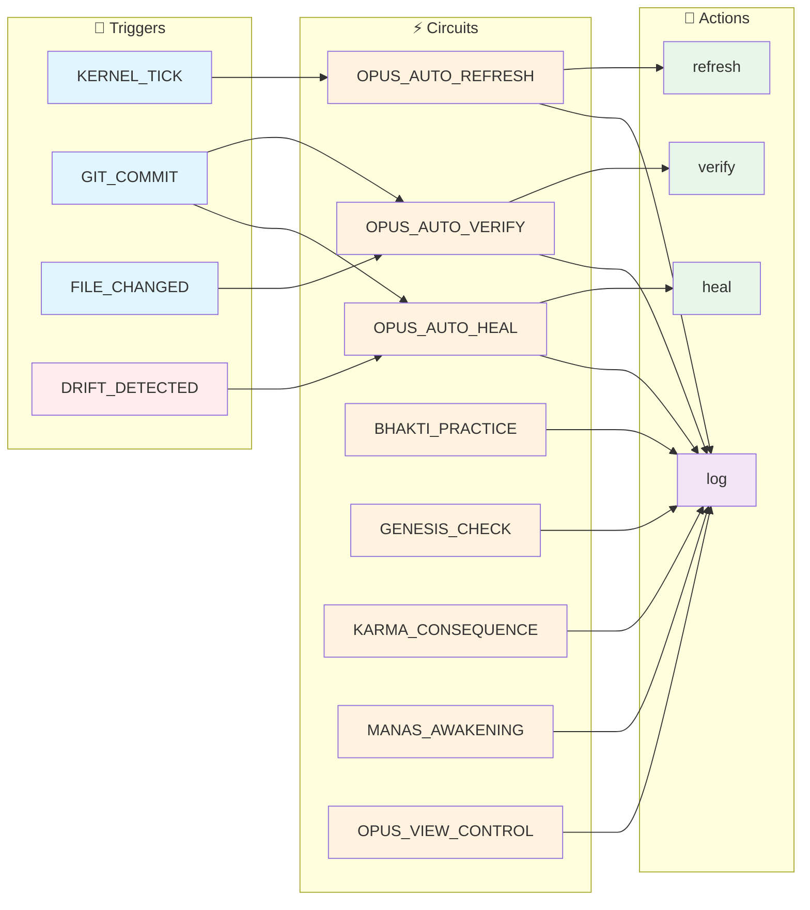
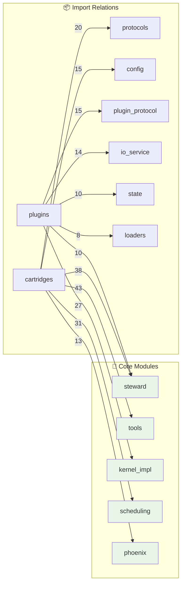

# OPUS - System State

> 🟡 **NOTICE** - Trust Score 63% - Minor issues detected

**🟡 DEGRADED** | Updated: 2025-12-13 17:50:38 UTC | Kernel: STOPPED (0 agents)

---

## 🎛️ Control Plane

**Status:** full_power | **Karma:** 100% | **Health:** DEGRADED

**Panels:**

- [x] Tests - [x] Code Health - [ ] Debug _(hidden)_

**Layer 1.5 Settings:**
- [ ] Auto-Heal Mode - [x] Simulation Mode _(safe)_- [ ] Aggressive Refactoring - [x] Budget Limit: $5.00

**💰 Treasury:** $0.0000 / $5.00 (0.0%)

---

## 🎯 Intent Buffer

🧠 **MANAS Active** | 4 intents (2 blocked, 1 executing, 1 pending) | Idle: 0 min

### 1. Refactor `__init__` in kernel_impl.py (Complexity: 18)

> 🩺 **Auto-generated by complexity_analyzer** - The kernel's initialization has grown too complex.
> ☢️ **VISNU PROTECTED** - Layer 0 file. Recommendation only, no auto-execution.

| Property | Value |
|----------|-------|
| **ID** | `manas_0002` |
| **Priority** | 🟡 MEDIUM |
| **Risk** | 🔴 PROTECTED |
| **Source** | OPUS-034 First Audit |
| **Execution** | ❌ BLOCKED (VISNU) |

**Reasoning:** McCabe complexity of 18 exceeds threshold (15). Extract initialization subsystems (agent registry setup, event bus config, bank/vault init) into dedicated helper methods or a `KernelInitializer` class.

**Status:** Documented for future manual review. Layer 0 is hands-off.

---

### 2. Refactor `tick` in kernel_impl.py (Complexity: 18)

> 🩺 **Auto-generated by complexity_analyzer** - The kernel's heartbeat function is bloated.
> ☢️ **VISNU PROTECTED** - Layer 0 file. Recommendation only, no auto-execution.

| Property | Value |
|----------|-------|
| **ID** | `manas_0003` |
| **Priority** | 🟡 MEDIUM |
| **Risk** | 🔴 PROTECTED |
| **Source** | OPUS-034 First Audit |
| **Execution** | ❌ BLOCKED (VISNU) |

**Reasoning:** McCabe complexity of 18 exceeds threshold (15). The tick function handles too many responsibilities. Extract IPC processing, health checks, and agent coordination into dedicated tick phases.

**Status:** Documented for future manual review. Layer 0 is hands-off.

---

### 3. Refactor `daily_ritual.py` (Complexity: 29 → <15)

> 🔧 **ACTIONABLE** - Layer 3 file. Safe to refactor in Shadow Lab.

| Property | Value |
|----------|-------|
| **ID** | `manas_0004` |
| **Priority** | 🟢 LOW |
| **Risk** | ✅ SAFE |
| **Source** | OPUS-034 Operation Safe Hands |
| **Execution** | ✅ APPROVED (Shadow Lab) |

**Reasoning:** The 4 phase functions repeat identical try/except patterns for ledger recording. Extract helper methods to reduce duplication.

- [x] Approve `manas_0004` *(Shadow Lab execution)*
- [ ] Reject `manas_0004`

---

### 4. Review 39 TODOs in codebase

> Found 39 TODO comments in the codebase. Some may be outdated or no longer relevant.

| Property | Value |
|----------|-------|
| **ID** | `manas_0001` |
| **Priority** | 🟢 LOW |
| **Risk** | ✅ SAFE |

**Reasoning:** TODOs are technical debt markers. Regular review ensures they're still valid and prioritized appropriately.

- [ ] Approve `manas_0001`
- [ ] Reject `manas_0001`

---

---

## ⚡ Syscall Console

_No syscalls recorded yet. The system learns from successful executions._

---

<!-- @LIVE:state_of_mind -->
## 🧠 State of Mind

*What the system knows right now (synthesized from Prakriti)*

### Layer 1 - Sthula (Physical Reality)

- **Branch:** `claude/fix-merge-conflict-01N38bUtnX3WuFCJFtPxijj4` @ `c6fcc8f`
- **Working Tree:** ⚠️ Uncommitted
### Layer 2 - Prana (Runtime Energy)

- **Kernel:** ⚪ STOPPED- **Agents:** 0 active
- **Session:** `control-test...`
### Layer 3 - Purusha (Cognitive Identity)

- **Ephemeral Thoughts:** 0
- **Active Persona:** None
### ⚖️ Karma State

- **Score:** 🟢 **100%** (full_power)
- **Trend:** ➡️ Stable
### 🎯 Focus Areas

- Commit pending changes
- Documentation drift detected

<!-- /@LIVE -->

<!-- @LIVE:system_journal -->
## 📓 System Journal

*Recent observations and insights from the system*

| Time | Severity | Source | Message |
|------|----------|--------|---------|
| `09:50:00` | ⚠️ | battle_test | This observation should survive OPUS.md deletion! |
| `8.967857` | ⚠️ | opus_assistant | Second observation |
| `8.963975` | ⚠️ | opus_assistant | New warning observation |
| `8.949831` | 🚨 | opus_assistant | Alert message |
| `8.948820` | ⚠️ | opus_assistant | Warning message |
| `8.695413` | ⚠️ | auto_verify | Drift detected after commit {{ trigger_event.commi |
| `8.421318` | ⚠️ | auto_verify | Drift detected after commit {{ trigger_event.commi |
| `4.110395` | ⚠️ | opus_assistant | Second observation |
| `4.106864` | ⚠️ | opus_assistant | New warning observation |
| `4.094317` | 🚨 | opus_assistant | Alert message |
| `4.093514` | ⚠️ | opus_assistant | Warning message |
| `4.052010` | ⚠️ | auto_verify | Drift detected after commit {{ trigger_event.commi |
| `4.014657` | ⚠️ | auto_verify | Drift detected after commit {{ trigger_event.commi |
| `8.186832` | ⚠️ | opus_assistant | Second observation |
| `8.181692` | ⚠️ | opus_assistant | New warning observation |
| ... | ... | ... | _+4 more entries_ |

<!-- /@LIVE -->

<!-- @LIVE:circuit_status -->
## ⚡ Cognitive Circuits

*Autonomous behavior patterns available to the system*

| Circuit | Triggers | States | Action | Description |
|---------|----------|--------|--------|-------------|
| **OPUS_AUTO_HEAL** | `OPUS.DRIFT_PERSISTENT, OPUS.HEALTH_CRITICAL` | 7 | [⚡ Run](command:steward.circuit.run?id=OPUS_AUTO_HEAL)
 | Automatic recovery suggestions when drif |
| **OPUS_AUTO_REFRESH** | `KERNEL_BOOT, KERNEL_TICK, GIT_COMMIT...` | 6 | [⚡ Run](command:steward.circuit.run?id=OPUS_AUTO_REFRESH)
 | Keep OPUS.md always up-to-date |
| **OPUS_AUTO_VERIFY** | `GIT_COMMIT, FILE_CHANGED` | 7 | [⚡ Run](command:steward.circuit.run?id=OPUS_AUTO_VERIFY)
 | Automatic drift detection triggered by g |
| **BHAKTI_PRACTICE** | `ERROR_OCCURRED, TEST_CREATED, DOCS_UPDATED...` | 10 | [⚡ Run](command:steward.circuit.run?id=BHAKTI_PRACTICE)
 | Recognition and reward for devotional ac |
| **GENESIS_CHECK** | `KERNEL_BOOT, GENESIS` | 10 | [⚡ Run](command:steward.circuit.run?id=GENESIS_CHECK)
 | Check last session's karma before full b |
| **KARMA_CONSEQUENCE** | `VERIFICATION_COMPLETED, DRIFT_DETECTED, CONTEXT_SYNTHESIS` | 12 | [⚡ Run](command:steward.circuit.run?id=KARMA_CONSEQUENCE)
 | Connect OPUS trust observations to Vedic |
| **MANAS_AWAKENING** | `HOURLY_PULSE, IDLE_DETECTED, MANAS_FORCE_THINK...` | 9 | [⚡ Run](command:steward.circuit.run?id=MANAS_AWAKENING)
 | Proactive intent generation - transforms |
| **OPUS_VIEW_CONTROL** | `opus.view.toggle, opus.view.set, opus.view.reset` | 3 | [⚡ Run](command:steward.circuit.run?id=OPUS_VIEW_CONTROL)
 | Handles UI toggle interactions from OPUS |

**8 circuits** ready for autonomous execution

### Circuit Flow (Mermaid)

<!-- /@LIVE -->

<!-- @LIVE:verification -->
## System Verification (OPUS-000)

**Trust Score: **🟡 DEGRADED** 63%** (30 docs verified, 2 without @HARNESS)

### OPUS Docs

| Doc | Score | Files | Tests | Wiring | Absent | Config | Semantic |
|-----|-------|-------|-------|--------|--------|--------|----------|
| 000-INDEX.md | - | ⚪ | ⚪ | ⚪ | ⚪ | ⚪ | ⚪ |
| 001-KERNEL-EXTRACTION.md | 75% | ✅ | ✅ | ✅ | ✅ | ✅ | ⚪ |
| 002-PHOENIX-CONFIG.md | 75% | ✅ | ✅ | ✅ | ✅ | ✅ | ⚪ |
| 003-AOS-FOUNDATION-REPAIR | 75% | ✅ | ✅ | ✅ | ✅ | ✅ | ⚪ |
| 004-BOOT-SEQUENCE-AUDIT.m | 75% | ✅ | ✅ | ✅ | ✅ | ✅ | ⚪ |
| 005-UNIFICATION-ROADMAP.m | 75% | ✅ | ✅ | ✅ | ✅ | ✅ | ⚪ |
| 006-GAD000-COMPLIANCE-AUD | 75% | ✅ | ✅ | ✅ | ✅ | ✅ | ⚪ |
| 008-PRAKRITI-PROTOTYPE.md | 30% | ❌ | ❌ | ✅ | ✅ | ✅ | ⚪ |
| 009-UNIFIED-STATE-PRAKRIT | 65% | ✅ | ✅ | ✅ | ✅ | ✅ | ⚪ |
| 010-VERIFICATION-PROTOCOL | 75% | ✅ | ✅ | ✅ | ✅ | ✅ | ⚪ |
| 011-LAYERED-ROUTER.md | 65% | ✅ | ✅ | ✅ | ✅ | ✅ | ⚪ |
| 012-SYSTEM-AGENTS.md | 65% | ✅ | ✅ | ✅ | ✅ | ✅ | ⚪ |
| 014-UNIFIED-UI-TRANSPAREN | 65% | ✅ | ✅ | ✅ | ✅ | ✅ | ⚪ |
| 015-CONTAINER-FORMAT.md | 75% | ✅ | ✅ | ✅ | ✅ | ✅ | ⚪ |
| 015a-SECURITY-ADDENDUM.md | 65% | ✅ | ✅ | ✅ | ✅ | ✅ | ⚪ |
| 016-RUNTIME-SEPARATION.md | 65% | ✅ | ✅ | ✅ | ✅ | ✅ | ⚪ |
| 017-SECURITY-AUDIT.md | 65% | ✅ | ✅ | ✅ | ✅ | ✅ | ⚪ |
| 018-SENIOR-SECURITY-AUDIT | 65% | ✅ | ✅ | ✅ | ✅ | ✅ | ⚪ |
| 019-P0-RELEASE-MILESTONE. | 65% | ✅ | ✅ | ✅ | ✅ | ✅ | ⚪ |
| 020-CONTAINER-MIGRATION.m | 65% | ✅ | ✅ | ✅ | ✅ | ✅ | ⚪ |
| 021-TEST-ARCHITECTURE.md | 65% | ✅ | ✅ | ✅ | ✅ | ✅ | ⚪ |
| 022-KERNEL-SCALING.md | 65% | ✅ | ✅ | ✅ | ✅ | ✅ | ⚪ |
| 023-FRACTAL-UI-ARCHITECTU | 45% | ✅ | ✅ | ❌ | ✅ | ✅ | ⚪ |
| 024-KERNEL-PROTECTION-AUD | 50% | ✅ | ❌ | ✅ | ✅ | ✅ | ⚪ |
| 025-PATH-LOBOTOMY-CRISIS. | 75% | ✅ | ✅ | ✅ | ✅ | ✅ | ⚪ |
| 026-SEMANTIC-VERIFICATION | 40% | ✅ | ❌ | ❌ | ✅ | ✅ | ⚪ |
| 027-UNIFIED-STATE-IMPLEME | 50% | ✅ | ❌ | ✅ | ✅ | ✅ | ⚪ |
| 028-PRAKRITI-GIT-INTEGRAT | 50% | ✅ | ❌ | ✅ | ✅ | ✅ | ⚪ |
| 029-OPUS-PLUGIN-ARCHITECT | 50% | ✅ | ❌ | ✅ | ✅ | ✅ | ⚪ |
| 030-GENESIS-PLUGIN.md | - | ⚪ | ⚪ | ⚪ | ⚪ | ⚪ | ⚪ |
| 031-OPUS-MULTIVERSE-VISIO | 65% | ✅ | ✅ | ✅ | ✅ | ✅ | ⚪ |
| README.md | 65% | ✅ | ✅ | ✅ | ✅ | ✅ | ⚪ |

### ❌ Failures

- **008-PRAKRITI-PROTOTYPE.md** [files]: vibe_core/plugins/interface/renderers/opus/opus_renderer.py
- **008-PRAKRITI-PROTOTYPE.md** [tests]: python scripts/ci/test_kernel_boot.py
- **008-PRAKRITI-PROTOTYPE.md** [doc]: ## Status
- **009-UNIFIED-STATE-PRAKRITI.md** [doc]: ## Status
- **011-LAYERED-ROUTER.md** [doc]: ## Status
- **011-LAYERED-ROUTER.md** [doc]: ## Implementation
- **012-SYSTEM-AGENTS.md** [doc]: ## Status
- **014-UNIFIED-UI-TRANSPARENCY.md** [doc]: ## Status
- **015a-SECURITY-ADDENDUM.md** [doc]: ## Implementation
- **016-RUNTIME-SEPARATION.md** [doc]: ## Implementation
- _...and 29 more_

<!-- /@LIVE -->

<!-- @LIVE:architecture_plans -->
## Architecture Plans

**31 documents** in `docs/architecture/OPUS/`

- [000-INDEX](docs/architecture/OPUS/000-INDEX.md)
- [001-KERNEL-EXTRACTION](docs/architecture/OPUS/001-KERNEL-EXTRACTION.md)
- [002-PHOENIX-CONFIG](docs/architecture/OPUS/002-PHOENIX-CONFIG.md)
- [003-AOS-FOUNDATION-REPAIR](docs/architecture/OPUS/003-AOS-FOUNDATION-REPAIR.md)
- [004-BOOT-SEQUENCE-AUDIT](docs/architecture/OPUS/004-BOOT-SEQUENCE-AUDIT.md)
- [005-UNIFICATION-ROADMAP](docs/architecture/OPUS/005-UNIFICATION-ROADMAP.md)
- [006-GAD000-COMPLIANCE-AUDIT](docs/architecture/OPUS/006-GAD000-COMPLIANCE-AUDIT.md)
- [008-PRAKRITI-PROTOTYPE](docs/architecture/OPUS/008-PRAKRITI-PROTOTYPE.md)
- [009-UNIFIED-STATE-PRAKRITI](docs/architecture/OPUS/009-UNIFIED-STATE-PRAKRITI.md)
- [010-VERIFICATION-PROTOCOL](docs/architecture/OPUS/010-VERIFICATION-PROTOCOL.md)
- [011-LAYERED-ROUTER](docs/architecture/OPUS/011-LAYERED-ROUTER.md)
- [012-SYSTEM-AGENTS](docs/architecture/OPUS/012-SYSTEM-AGENTS.md)
- [014-UNIFIED-UI-TRANSPARENCY](docs/architecture/OPUS/014-UNIFIED-UI-TRANSPARENCY.md)
- [015-CONTAINER-FORMAT](docs/architecture/OPUS/015-CONTAINER-FORMAT.md)
- [015a-SECURITY-ADDENDUM](docs/architecture/OPUS/015a-SECURITY-ADDENDUM.md)
- [016-RUNTIME-SEPARATION](docs/architecture/OPUS/016-RUNTIME-SEPARATION.md)
- [017-SECURITY-AUDIT](docs/architecture/OPUS/017-SECURITY-AUDIT.md)
- [018-SENIOR-SECURITY-AUDIT](docs/architecture/OPUS/018-SENIOR-SECURITY-AUDIT.md)
- [019-P0-RELEASE-MILESTONE](docs/architecture/OPUS/019-P0-RELEASE-MILESTONE.md)
- [020-CONTAINER-MIGRATION](docs/architecture/OPUS/020-CONTAINER-MIGRATION.md)
- [021-TEST-ARCHITECTURE](docs/architecture/OPUS/021-TEST-ARCHITECTURE.md)
- [022-KERNEL-SCALING](docs/architecture/OPUS/022-KERNEL-SCALING.md)
- [023-FRACTAL-UI-ARCHITECTURE](docs/architecture/OPUS/023-FRACTAL-UI-ARCHITECTURE.md)
- [024-KERNEL-PROTECTION-AUDIT](docs/architecture/OPUS/024-KERNEL-PROTECTION-AUDIT.md)
- [025-PATH-LOBOTOMY-CRISIS](docs/architecture/OPUS/025-PATH-LOBOTOMY-CRISIS.md)
- [026-SEMANTIC-VERIFICATION](docs/architecture/OPUS/026-SEMANTIC-VERIFICATION.md)
- [027-UNIFIED-STATE-IMPLEMENTATION](docs/architecture/OPUS/027-UNIFIED-STATE-IMPLEMENTATION.md)
- [028-PRAKRITI-GIT-INTEGRATION](docs/architecture/OPUS/028-PRAKRITI-GIT-INTEGRATION.md)
- [029-OPUS-PLUGIN-ARCHITECTURE](docs/architecture/OPUS/029-OPUS-PLUGIN-ARCHITECTURE.md)
- [030-GENESIS-PLUGIN](docs/architecture/OPUS/030-GENESIS-PLUGIN.md)
- [031-OPUS-MULTIVERSE-VISION](docs/architecture/OPUS/031-OPUS-MULTIVERSE-VISION.md)
<!-- /@LIVE -->

<!-- @LIVE:module_index -->
## 📦 Module Index

*Quick navigation to understand the codebase structure*

| Module | Description | Files | Tests | Path |
|--------|-------------|-------|-------|------|
| **agents** | Agent implementations for vibe-agency OS. | 6 | ❌ | `vibe_core/agents/` |
| **cartridges** | Cartridges - ARCH-050 | 179 | ✅ | `vibe_core/cartridges/` |
| **cli** | Fractal CLI System - Auto-discoverable, plugin-based command | 12 | ❌ | `vibe_core/cli/` |
| **config** | THE DHARMA ENGINE: Configuration-Driven System Architecture | 2 | ❌ | `vibe_core/config/` |
| **cortex** | CORTEX - The Cognitive Engine Layer | 6 | ❌ | `vibe_core/cortex/` |
| **gateway** | (2 files) | 2 | ❌ | `vibe_core/gateway/` |
| **governance** | Governance layer for Vibe Agency. | 2 | ❌ | `vibe_core/governance/` |
| **knowledge** | Unified Knowledge Graph Module | 4 | ❌ | `vibe_core/knowledge/` |
| **llm** | LLM integration for vibe-agency OS. | 9 | ❌ | `vibe_core/llm/` |
| **loaders** | Unified Loader System - VEDA-4 Pattern for ALL Item Types. | 8 | ❌ | `vibe_core/loaders/` |
| **phoenix** | Phoenix Configuration System - The config that never dies. | 36 | ❌ | `vibe_core/phoenix/` |
| **playbook** | Playbook Package (OPERATION SEMANTIC MOTOR) | 7 | ❌ | `vibe_core/playbook/` |
| **plugins** | Kernel Plugins Package | 114 | ✅ | `vibe_core/plugins/` |
| **protocols** | VIBE_CORE PROTOCOLS - Layer 1: Interfaces Only | 8 | ❌ | `vibe_core/protocols/` |
| **runtime** | Runtime Components Package | 26 | ❌ | `vibe_core/runtime/` |
| **scheduling** | Task scheduling definitions for VibeOS | 3 | ❌ | `vibe_core/scheduling/` |
| **scripts** | (1 files) | 1 | ❌ | `vibe_core/scripts/` |
| **settings** | Settings Section Plugin System | 6 | ❌ | `vibe_core/settings/` |
| **specialists** | Specialist Agents - HAP Framework (Hierarchical Agent Patter | 4 | ❌ | `vibe_core/specialists/` |
| **state** | vibe_core/state - Unified State Management (PRAKRITI) | 9 | ❌ | `vibe_core/state/` |

**20 modules** in `vibe_core/`

<!-- /@LIVE -->

<!-- @LIVE:hot_paths -->
## 🔥 Hot Paths

*Most frequently changed files (last 100 commits) - start here to understand the project*

| File | Commits | Last Change |
|------|---------|-------------|
| `vibe_core/plugins/opus_assistant/events/kernel_tick.py` | 4 | feat(opus): Add MANAS - The Cognitive Ke |
| `vibe_core/cartridges/agent_city/dharma/cartridge_main.py` | 3 | refactor(dharma): Single source of truth |
| `vibe_core/plugins/opus_assistant/render/opus_dashboard_renderer.py` | 2 | feat(opus): Wire MANAS to Intent Buffer  |
| `vibe_core/cartridges/agent_city/dharma/tests/test_dharma_integration.py` | 2 | feat(dharma): Add Self-Correction Loop - |
| `vibe_core/cartridges/agent_city/__init__.py` | 2 | fix(dharma): Add container compatibility |
| `vibe_core/cortex/engines/circuit_engine.py` | 2 | fix(circuit): Add backward compatibility |
| `vibe_core/cli/unified_cli.py` | 2 | feat(cli): Add execute command for auton |
| `vibe_core/plugins/opus_assistant/manas/__init__.py` | 1 | feat(opus): Add MANAS - The Cognitive Ke |
| `vibe_core/plugins/opus_assistant/manas/cognitive_kernel.py` | 1 | feat(opus): Add MANAS - The Cognitive Ke |
| `vibe_core/plugins/opus_assistant/manas/intent_generator.py` | 1 | feat(opus): Add MANAS - The Cognitive Ke |

<!-- /@LIVE -->

<!-- @LIVE:dependency_graph -->
## 🕸️ Module Dependencies

*Which modules import which - understand the architecture at a glance*

### Critical Modules (Most Imported)

- **steward** - Heavily depended upon, changes here ripple!
- **tools** - Heavily depended upon, changes here ripple!
- **kernel_impl** - Heavily depended upon, changes here ripple!
- **scheduling** - Heavily depended upon, changes here ripple!
- **phoenix** - Heavily depended upon, changes here ripple!

### Dependency Flow (Mermaid)

### Module Sizes

| Module | Files | Critical? |
|--------|-------|-----------|
| `cartridges` | 179 |  |
| `plugins` | 114 |  |
| `phoenix` | 36 | ⭐ |
| `runtime` | 26 |  |
| `cli` | 12 |  |
| `steward` | 11 | ⭐ |
| `task_management` | 10 |  |
| `llm` | 9 |  |
| `state` | 9 |  |
| `tools` | 9 | ⭐ |
| `loaders` | 8 |  |
| `protocols` | 8 |  |
| `playbook` | 7 |  |
| `agents` | 6 |  |
| `cortex` | 6 |  |
| `settings` | 6 |  |
| `knowledge` | 4 |  |
| `specialists` | 4 |  |
| `scheduling` | 3 | ⭐ |
| `config` | 2 |  |
| `gateway` | 2 |  |
| `governance` | 2 |  |
| `store` | 2 |  |
| `scripts` | 1 |  |

<!-- /@LIVE -->

<!-- @LIVE:prakriti_state -->
## Prakriti State (OPUS-027)

### 📍 Session

| Property | Value |
| --- | --- |
| Session ID | `control-test` |
| Boot Commit | `unknown` |
| Boot Mode | full_power |
| Started | `2025-12-13T08:00:00` |

### 🔮 Three Layers

| Layer | Name | Status | Details |
| --- | --- | --- | --- |
| 1 | STHULA (Physical) | 🟡 | Dirty on `claude/fix-merge-conflict-01N38bUtnX3WuFCJFtPxijj4` |
| 2 | PRANA (Runtime) | ⏹️ | Stopped |
| 3 | PURUSHA (Identity) | ⚪ | No personas defined |

### 🔗 Cryptographic Zipper

| Component | Hash | Synced |
| --- | --- | --- |
| Git HEAD | `c6fcc8f` | ⚪ |
| Ledger HEAD | `0be20d98fde5` | ⚪ |

<!-- /@LIVE -->

<!-- @LIVE:code_health -->
## Code Health (TODO/HACK/FIXME)

**Total: 13** (TODO: 13, HACK: 0, FIXME: 0)

TODOs (13)

- `vibe_core/cartridges/system/archivist/tools/audit_tool.py:78` - # TODO: Implement real verification with public_key when HER
- `vibe_core/cartridges/system/engineer/cartridge_main.py:465` - # TODO: Implement agent-specific logic
- `vibe_core/cartridges/system/engineer/templates/agent/cartridge_main.py:101` - # TODO: Implement your capability
- `vibe_core/cartridges/system/engineer/templates/agent/cartridge_main.py:106` - # TODO: Implement your capability
- `vibe_core/cartridges/system/envoy/tools/wiring_audit_scripts.py:221` - "# TODO.*implement": "MEDIUM",
- `vibe_core/cli/unified_cli.py:60` - "delegate": None,  # TODO: Migrate to plugin
- `vibe_core/config/__init__.py:21` - # TODO: Remove in v2.0
- `vibe_core/playbook/__init__.py:22` - # TODO: Remove in v2.0
- `vibe_core/plugins/doctor/plugin_main.py:86` - # TODO: Clarify offline mode dependency injection.
- `vibe_core/plugins/envoy/plugin_main.py:517` - # TODO: Create envoy.yaml config section
- `vibe_core/plugins/interface/renderers/opus/panels/code_health.py:58` - # TODOs (collapsible if many)
- `vibe_core/plugins/interface/renderers/opus/panels/code_health.py:65` - lines.append("### TODOs")
- `vibe_core/task_management/task_manager.py:341` - # TODO: Integrate with UnifiedRouter for dynamic prioritizat

<!-- /@LIVE -->

<!-- @LIVE:complexity_health -->
## 🩺 Code Health (Complexity)

**Audited: 2025-12-13** | Scanned by: `complexity_analyzer` (OPUS-034 Genesis)

### Kernel Health Summary

| File | Total | Rating | Functions | Threshold Breaches |
|------|-------|--------|-----------|-------------------|
| `kernel_impl.py` | **125** | 🔴 COMPLEX | 49 | ⚠️ 2 functions > 15 |
| `boot_orchestrator.py` | **53** | 🟡 COMPLEX | 17 | ✅ None |
| `daily_ritual.py` | **29** | 🟡 COMPLEX | 7 | ✅ None |

### ⚠️ Threshold Breaches (Complexity > 15)

| Function | File | Complexity | Action |
|----------|------|------------|--------|
| `__init__` | `kernel_impl.py` | **18** | 🔧 Refactor needed |
| `tick` | `kernel_impl.py` | **18** | 🔧 Refactor needed |

### Top Complex Functions (Watchlist)

| Rank | Function | File | Complexity |
|------|----------|------|------------|
| 1 | `__init__` | kernel_impl.py | 18 |
| 2 | `tick` | kernel_impl.py | 18 |
| 3 | `register_agent` | kernel_impl.py | 14 |
| 4 | `boot` | kernel_impl.py | 11 |
| 5 | `_phase_midday` | daily_ritual.py | 11 |
| 6 | `_execute_intent` | boot_orchestrator.py | 11 |
| 7 | `run_with_operator` | boot_orchestrator.py | 11 |
| 8 | `shutdown` | kernel_impl.py | 10 |

### 📊 Diagnosis

The kernel (`kernel_impl.py`) shows signs of **accumulated complexity**:
- **49 functions** in a single file
- Two core functions (`__init__`, `tick`) exceed the safety threshold
- Total complexity of 125 indicates potential architectural debt

**Recommendation:** Extract initialization logic and tick subsystems into dedicated modules.

<!-- /@LIVE -->

<!-- @LIVE:test_health -->
## Test Suite Health

| Metric | Count | Status |
| --- | --- | --- |
| Active Tests | 84 | - |
| Archived (broken) | 1 | - |
| Organized | 84/84 | - |
| Unit Tests | 34 | - |
| Integration Tests | 44 | - |
| Hardening Tests | 4 | - |
| Using Fixtures | 9/12 (75%) | OK |

**Debt:** 1 tests in `tests/archive/` need revival
<!-- /@LIVE -->

---

<!-- @AI:current_work -->
## Current Work

<!-- AI: Update this with what you're working on -->
_Define current task_
<!-- /@AI -->

<!-- @AI:blockers -->
## Blockers

<!-- AI: List any blockers -->
_None_
<!-- /@AI -->

<!-- @HUMAN:notes -->
## Notes

<!-- Human can write here -->
_Add notes here_
<!-- /@HUMAN -->

---
*Generated by OPUS Assistant Plugin | 2025-12-13 17:50:38 UTC*