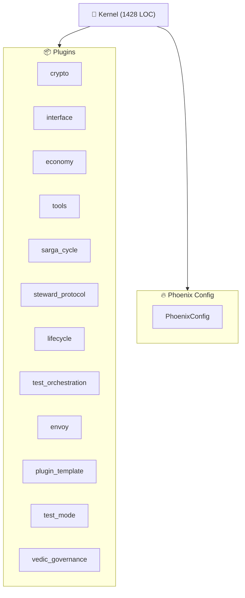

<!--
AUTO-GENERATED by RENDERER_OPUS
Last Updated: 2025-12-09 07:09 UTC
Kernel: STOPPED (1 agents)
Quick Start: python -m vibe_core.cli boot
--><!--
AUTO-GENERATED by InterfacePlugin
Last Updated: 2025-12-09 07:09:43 UTC
Kernel: KernelStatus.STOPPED
-->
> **Docs:** [README](README.md) · [INDEX](INDEX.md) · [AGENTS](AGENTS.md) · [CITYMAP](CITYMAP.md) · [HELP](HELP.md) · [TASKS](TASKS.md) · [SETTINGS](SETTINGS.md) · [ENVOY](ENVOY.md)

<!-- @LIVE:status -->
## Status

**Kernel**: STOPPED | **Agents**: 0 | **LOC**: 1428
<!-- /@LIVE -->
<!-- @LIVE:metrics -->
## Metrics

| Metric | Current | Target | Delta | Status |
| --- | --- | --- | --- | --- |
| kernel_impl.py LOC | 1428 | 1008 | 420 | 🔴 |
| Plugins Loaded | 10 | 8+ | - | ✅ |
<!-- /@LIVE -->
<!-- @LIVE:architecture_plans -->
## Architecture Plans

**OPUS Architecture Plans** v2.1.0

### Current Plans

| Priority | Status | Plan | Description |
|----------|--------|------|-------------|
| **🔴 P0** | ✅ | [Sonnet Execution Plan](docs/architecture/OPUS/SONNET_EXECUTION_PLAN.md) | Complete 4-phase remediation plan ready for Sonnet |
| **🔴 P0** | 🔄 | [Verified Delta Plan](docs/architecture/OPUS/VERIFIED_DELTA_PLAN.md) | SSOT - Single Source of Truth for what needs fixin |
| **🔴 P0** | 🔄 | [Runtime Separation](docs/architecture/OPUS/OPUS_RUNTIME_SEPARATION.md) | CODE|CONFIG|RUNTIME separation, 8 BREAKS identifie |
| P2 | 📦 | [Kernel Extraction Plan](docs/architecture/OPUS/001-KERNEL-EXTRACTION.md) | Extract non-kernel logic to plugins (superseded by |
| P2 | ✓ | [Phoenix Config Optimization](docs/architecture/OPUS/002-PHOENIX-CONFIG.md) | Config loading optimization - IMPLEMENTED |

### Roadmap

- **phase1**: Plugin TODOs - Fix signature_valid and valid_until
- **phase2**: State Persistence - Add Ledger persistence to plugins
- **phase3**: Stub Elimination - Replace stubs with warnings
- **phase4**: Test Restore - Move archived tests back to active

### Execution Order

- • **Phase 1: PLUGIN_TODOS** (3 tasks)
- • **Phase 2: PERSISTENCE** (3 tasks)
- ⏳ **Phase 3: STUB_ELIMINATION** (2 tasks)
- ⏳ **Phase 4: TEST_RESTORE** (1 tasks)
- • **Phase 5: TEST_STANDARDIZATION** (4 tasks)
<!-- /@LIVE -->
<!-- @LIVE:code_health -->
## Code Health (TODO/HACK/FIXME)

**Total: 13** (TODO: 13, HACK: 0, FIXME: 0)

TODOs (13)

- `vibe_core/cartridges/system/archivist/tools/audit_tool.py:78` - # TODO: Implement real verification with public_key when HER
- `vibe_core/cartridges/system/envoy/tools/wiring_audit_scripts.py:221` - "# TODO.*implement": "MEDIUM",
- `vibe_core/cartridges/system/engineer/cartridge_main.py:465` - # TODO: Implement agent-specific logic
- `vibe_core/cartridges/system/engineer/templates/agent/cartridge_main.py:101` - # TODO: Implement your capability
- `vibe_core/cartridges/system/engineer/templates/agent/cartridge_main.py:106` - # TODO: Implement your capability
- `vibe_core/playbook/__init__.py:22` - # TODO: Remove in v2.0
- `vibe_core/config/__init__.py:21` - # TODO: Remove in v2.0
- `vibe_core/plugins/interface/renderers/state.py:93` - # TODO: Visualize ephemeral layout or critical keys
- `vibe_core/plugins/interface/renderers/opus/panels/code_health.py:58` - # TODOs (collapsible if many)
- `vibe_core/plugins/interface/renderers/opus/panels/code_health.py:65` - lines.append("### TODOs")
- `vibe_core/plugins/envoy/plugin_main.py:517` - # TODO: Create envoy.yaml config section
- `vibe_core/runtime/prompt_composer.py:237` - project_root = Path.cwd()  # TODO: Get from context if avail
- `vibe_core/cli/unified_cli.py:47` - "delegate": None,  # TODO: Migrate to plugin

<!-- /@LIVE -->
<!-- @LIVE:test_health -->
## Test Suite Health

| Metric | Count | Status |
| --- | --- | --- |
| Active Tests | 62 | - |
| Organized | 62/62 | - |
| Unit Tests | 28 | - |
| Integration Tests | 28 | - |
| Hardening Tests | 4 | - |
| Using Fixtures | 13/14 (93%) | OK |

<!-- /@LIVE -->
<!-- @LIVE:architecture -->
## Architecture

<!-- /@LIVE -->
<!-- @LIVE:component_sizes -->
## Component Sizes

| Component | File | LOC |
| --- | --- | --- |
| Kernel | kernel_impl.py | 1428 |
| BaseRenderer | base.py | 644 |
| InterfaceConfig | section_main.py | 576 |
| InterfacePlugin | plugin_main.py | 564 |
| PhoenixConfig | config.py | 500 |
| Kernel Ops | kernel_ops.py | 326 |
| EventBus | event_bus.py | 267 |
<!-- /@LIVE -->
<!-- @LIVE:plugin_status -->
## Plugin Status

| Plugin | Status | Type |
| --- | --- | --- |
| crypto | ✅ Active | CryptoPlugin |
| tools | ✅ Active | ToolsPlugin |
| sarga_cycle | ✅ Active | SargaCyclePlugin |
| steward_protocol | ✅ Active | StewardProtocolPlugin |
| lifecycle | ✅ Active | LifecyclePlugin |
| vedic_governance | ✅ Active | VedicGovernancePlugin |
| envoy | ✅ Active | EnvoyPlugin |
| interface | ✅ Active | InterfacePlugin |
| economy | ✅ Active | EconomyPlugin |
| test_orchestration | ✅ Active | TestOrchestrationPlugin |
<!-- /@LIVE -->
<!-- @AI:current_goal -->
## Current Goal

<!-- AI can write here -->
_No entries_
<!-- /@AI -->
<!-- @AI:phase_status -->
## Phase Status

<!-- AI can write here -->
_No entries_
<!-- /@AI -->
<!-- @AI:extraction_log -->
## Extraction Log

<!-- AI can write here -->
_No entries_
<!-- /@AI -->
<!-- @AI:blockers -->
## Blockers

<!-- AI can write here -->
_No entries_
<!-- /@AI -->
<!-- @HUMAN:next_actions -->
## Next Actions

<!-- User section -->
_No entries_
<!-- /@HUMAN -->
*Generated by InterfacePlugin | 2025-12-09 07:09:45 UTC*