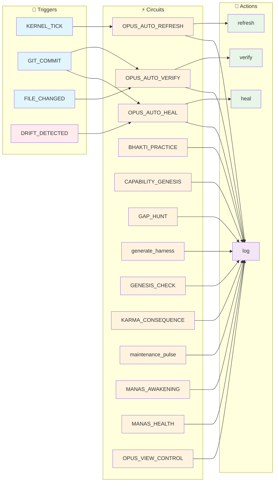
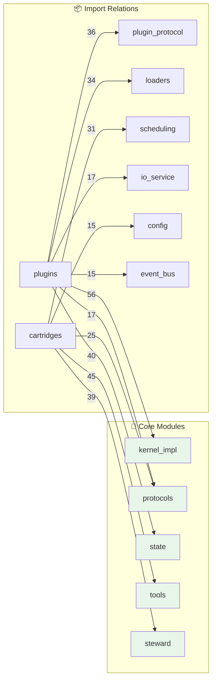

<!--
AUTO-GENERATED by RENDERER_OPUS
Last Updated: 2025-12-25 09:20 UTC
Kernel: STOPPED (1 agents)
Quick Start: python -m vibe_core.cli boot
-->

# OPUS - System State

> 🟡 **NOTICE** - Trust Score 75% - Minor issues detected

**🟡 DEGRADED** | Updated: 2025-12-25 09:20:09 UTC | Kernel: STOPPED (0 agents)

---

## 🎛️ Control Plane

**Status:** full_power | **Karma:** 100% | **Health:** DEGRADED

**Panels:**

- [x] Tests - [x] Code Health - [ ] Debug _(hidden)_

**Layer 1.5 Settings:**
- [ ] Auto-Heal Mode - [x] Live Fire Mode 🔥_(active!)_- [ ] Aggressive Refactoring - [x] Budget Limit: $5.00

**💰 Treasury:** $0.0000 / $5.00 (0.0%)

---

## 🎯 Intent Buffer

🧠 **MANAS Active** | 3 pending | Idle: 1 min

### 1. 🗑️ Disk space cleanup

> Disk is 87.5% full - MANAS duty to maintain health

| Property | Value |
|----------|-------|
| **ID** | `dharma_cleanup_disk_fcca72ab` |
| **Priority** | 🟡 MEDIUM |
| **Risk** | ✅ SAFE |
| **Auto-Execute** | ⚡ Yes (if enabled) |
**Reasoning:** Svadharma: System duty to maintain own resources

- [ ] Approve `dharma_cleanup_disk_fcca72ab`
- [ ] Reject `dharma_cleanup_disk_fcca72ab`

---

### 2. 🗑️ Disk space cleanup

> Disk is 87.5% full - MANAS duty to maintain health

| Property | Value |
|----------|-------|
| **ID** | `dharma_cleanup_disk_ddbf534e` |
| **Priority** | 🟡 MEDIUM |
| **Risk** | ✅ SAFE |
| **Auto-Execute** | ⚡ Yes (if enabled) |
**Reasoning:** Svadharma: System duty to maintain own resources

- [ ] Approve `dharma_cleanup_disk_ddbf534e`
- [ ] Reject `dharma_cleanup_disk_ddbf534e`

---

### 3. 🗑️ Disk space cleanup

> Disk is 87.5% full - MANAS duty to maintain health

| Property | Value |
|----------|-------|
| **ID** | `dharma_cleanup_disk_3599e30e` |
| **Priority** | 🟡 MEDIUM |
| **Risk** | ✅ SAFE |
| **Auto-Execute** | ⚡ Yes (if enabled) |
**Reasoning:** Svadharma: System duty to maintain own resources

- [ ] Approve `dharma_cleanup_disk_3599e30e`
- [ ] Reject `dharma_cleanup_disk_3599e30e`

---

📜 Recently Executed (2)

| Intent | Status | Time |
|--------|--------|------|
| Pramana Live Fire pramana_fire | ✅ | `2.768109` |
| Pramana Live Fire pramana_fire | ✅ | `5.283028` |

---

## ⚡ Syscall Console

**Status:** 37.2% real success | 500 total | 186 learned

| Time | Intent | Type | Result |
|------|--------|------|--------|
| `5.558894` | Execute ALLOCATE_PRANA | **ALLOCATE_PRANA** | ✅ |
| `5.556470` | Execute ALLOCATE_PRANA | **ALLOCATE_PRANA** | ✅ |
| `5.552410` | Execute ALLOCATE_PRANA | **ALLOCATE_PRANA** | ✅ |
| `5.549905` | Execute ALLOCATE_PRANA | **ALLOCATE_PRANA** | ✅ |
| `5.547276` | Execute ALLOCATE_PRANA | **ALLOCATE_PRANA** | ✅ |

**By Type:**
- `SPAWN_COGNITION`: 0/128 successful
- `GRANT_MANDATE`: 0/186 successful
- `ALLOCATE_PRANA`: 186/186 successful

> 🧠 **Experience Replay:** 20 entries available for few-shot learning

---

## 🧠 MANAS Status

### System Status

| Metric | Value |
|--------|-------|
| **Kernel** | 🟢 ONLINE |
| **Intent Buffer** | 3 pending |
| **Last Updated** | `never` |

### Pending Intents (3)

| Intent | Type | Priority | Risk | Created |
|--------|------|----------|------|---------|
| 🗑️ Disk space cleanup | `` | 🟡 medium | ✅ | `?` |
| 🗑️ Disk space cleanup | `` | 🟡 medium | ✅ | `?` |
| 🗑️ Disk space cleanup | `` | 🟡 medium | ✅ | `?` |

Intent Details

#### 🗑️ Disk space cleanup

- **ID:** `dharma_cleanup_disk_fcca72ab`
- **Type:** ``
- **Description:** Disk is 87.5% full - MANAS duty to maintain health
- **Reasoning:** Svadharma: System duty to maintain own resources
- **Auto-Execute:** ⚡ Yes

---
#### 🗑️ Disk space cleanup

- **ID:** `dharma_cleanup_disk_ddbf534e`
- **Type:** ``
- **Description:** Disk is 87.5% full - MANAS duty to maintain health
- **Reasoning:** Svadharma: System duty to maintain own resources
- **Auto-Execute:** ⚡ Yes

---
#### 🗑️ Disk space cleanup

- **ID:** `dharma_cleanup_disk_3599e30e`
- **Type:** ``
- **Description:** Disk is 87.5% full - MANAS duty to maintain health
- **Reasoning:** Svadharma: System duty to maintain own resources
- **Auto-Execute:** ⚡ Yes

---

### Documentation Health (Self-Healing)

| Metric | Value |
|--------|-------|
| **Total OPUS Docs** | 145 |
| **With @HARNESS** | 100 |
| **Coverage** | 🟠 **58%** |
| **Broken Harnesses** | 🔴 65 |

### 🧠 Neural Learning (OPUS-133)

*"MANAS lernt nicht um zu gewinnen, sondern um zu dienen."*

#### ⏱️ Operational Status

| Event | Timestamp | Status |
|-------|-----------|--------|
| **Last Synapse Update** | `never` | ⚪ No activity |
| **Last Reinforcement** | `2025-12-20T15:48:26` | 🔴 -0.10 |
| **Synapses File** | `2025-12-21T19:11:44` | 📄 .opus_state/synapses.json |

Last Reinforcement Details

- **Intent:** `evaluate_renderer_pattern`
- **Title:** Recognize render_sections() as correct pattern
- **Result:** ❌ Failure- **Weight:** 0.250 → 0.150
- **Delta:** -0.100

#### 📊 Synaptic Metrics

| Metric | Value | Description |
|--------|-------|-------------|
| **Synapses** | 43 triggers / 43 connections | Learned patterns |
| **Avg Weight** | 🟠 **0.44** | Pattern confidence |
| **High Confidence** | 1 | Weights > 0.8 |
| **Low Confidence** | 4 | Weights < 0.3 |
| **Latest Learning** | `2025-12-20T15:37:44` | Most recent synapse |

#### Prabhupada Patch (Anti-Ego)

| Feature | Config | Purpose |
|---------|--------|---------|
| 🍂 **Vairagya** | >0.95 → ×0.99 | Ego pruning |
| 🕉️ **Nishkama** | 5 duties | No reward for duties |
| 🛡️ **Prasadam** | >0.8 | Grace for pure intent |

---

<!-- @LIVE:state_of_mind -->
## 🧠 State of Mind

*What the system knows right now (synthesized from Prakriti)*

### Layer 1 - Sthula (Physical Reality)

- **Branch:** `main` @ `888a174`
- **Working Tree:** ⚠️ Uncommitted
### Layer 2 - Prana (Runtime Energy)

- **Kernel:** ⚪ STOPPED- **Agents:** 0 active
- **Session:** `5a21397f...`
### Layer 3 - Purusha (Cognitive Identity)

- **Ephemeral Thoughts:** 0
- **Active Persona:** None
### ⚖️ Karma State

- **Score:** 🟢 **100%** (full_power)
- **Trend:** ➡️ Stable
### 🎯 Focus Areas

- Commit pending changes

<!-- /@LIVE -->

<!-- @LIVE:system_journal -->
## 📓 System Journal

*Recent observations and insights from the system*

| Time | Severity | Source | Message |
|------|----------|--------|---------|
| `7.871613` | ⚠️ | opus_assistant | Second observation |
| `7.856872` | ⚠️ | opus_assistant | New warning observation |
| `7.809107` | 🚨 | opus_assistant | Alert message |
| `7.797106` | ⚠️ | opus_assistant | Warning message |
| `5.519447` | ⚠️ | auto_verify | Drift detected after commit {{ trigger_event.commi |
| `6.633467` | 🚨 | drift_detector | Persistent drift! 506 consecutive unhealthy checks |
| `6.629227` | ⚠️ | drift_detector | Drift detected: 35 missing files (tick #506) |
| `5.894642` | 🚨 | drift_detector | Persistent drift! 506 consecutive unhealthy checks |
| `5.891320` | ⚠️ | drift_detector | Drift detected: 35 missing files (tick #506) |
| `4.925471` | 🚨 | drift_detector | Persistent drift! 505 consecutive unhealthy checks |
| `4.921483` | ⚠️ | drift_detector | Drift detected: 35 missing files (tick #505) |
| `3.969965` | 🚨 | drift_detector | Persistent drift! 505 consecutive unhealthy checks |
| `3.966281` | ⚠️ | drift_detector | Drift detected: 35 missing files (tick #505) |
| `2.889490` | 🚨 | drift_detector | Persistent drift! 504 consecutive unhealthy checks |
| `2.885222` | ⚠️ | drift_detector | Drift detected: 35 missing files (tick #504) |
| ... | ... | ... | _+5 more entries_ |

<!-- /@LIVE -->

<!-- @LIVE:circuit_status -->
## ⚡ Cognitive Circuits

*Autonomous behavior patterns available to the system*

| Circuit | Triggers | States | Action | Description |
|---------|----------|--------|--------|-------------|
| **OPUS_AUTO_HEAL** | `OPUS.DRIFT_PERSISTENT, OPUS.HEALTH_CRITICAL` | 8 | [⚡ Run](command:steward.circuit.run?id=OPUS_AUTO_HEAL)
 | Automatic recovery suggestions when drif |
| **OPUS_AUTO_REFRESH** | `KERNEL_BOOT, KERNEL_TICK, GIT_COMMIT...` | 6 | [⚡ Run](command:steward.circuit.run?id=OPUS_AUTO_REFRESH)
 | Keep OPUS.md always up-to-date |
| **OPUS_AUTO_VERIFY** | `GIT_COMMIT, FILE_CHANGED` | 7 | [⚡ Run](command:steward.circuit.run?id=OPUS_AUTO_VERIFY)
 | Automatic drift detection triggered by g |
| **BHAKTI_PRACTICE** | `ERROR_OCCURRED, TEST_CREATED, DOCS_UPDATED...` | 10 | [⚡ Run](command:steward.circuit.run?id=BHAKTI_PRACTICE)
 | Recognition and reward for devotional ac |
| **CAPABILITY_GENESIS** | `CAPABILITY_MISSING, GENESIS_REQUEST, GENESIS_APPROVED` | 30 | [⚡ Run](command:steward.circuit.run?id=CAPABILITY_GENESIS)
 | Generate new capabilities with TDD-first |
| **GAP_HUNT** | `HOURLY_PULSE, OPUS.GAP_HUNT_REQUESTED, GIT_COMMIT_COMPLETE` | 10 | [⚡ Run](command:steward.circuit.run?id=GAP_HUNT)
 | Continuous architecture gap detection vi |
| **generate_harness** | `` | 4 | [⚡ Run](command:steward.circuit.run?id=generate_harness)
 | Generates @HARNESS for OPUS docs based o |
| **GENESIS_CHECK** | `KERNEL_BOOT, GENESIS` | 10 | [⚡ Run](command:steward.circuit.run?id=GENESIS_CHECK)
 | Check last session's karma before full b |
| **KARMA_CONSEQUENCE** | `VERIFICATION_COMPLETED, DRIFT_DETECTED, CONTEXT_SYNTHESIS` | 15 | [⚡ Run](command:steward.circuit.run?id=KARMA_CONSEQUENCE)
 | Connect OPUS trust observations to Vedic |
| **maintenance_pulse** | `HOURLY_PULSE, MANAS_WAKE_UP, KERNEL_TICK` | 4 | [⚡ Run](command:steward.circuit.run?id=maintenance_pulse)
 | The autonomous self-healing cycle of OPU |
| **MANAS_AWAKENING** | `HOURLY_PULSE, IDLE_DETECTED, MANAS_FORCE_THINK...` | 9 | [⚡ Run](command:steward.circuit.run?id=MANAS_AWAKENING)
 | Proactive intent generation - transforms |
| **MANAS_HEALTH** | `KERNEL_BOOT, MANAS_HEALTH_CHECK, HOURLY_PULSE` | 12 | [⚡ Run](command:steward.circuit.run?id=MANAS_HEALTH)
 | Comprehensive MANAS cognitive health aud |
| **OPUS_VIEW_CONTROL** | `opus.view.toggle, opus.view.set, opus.view.reset` | 3 | [⚡ Run](command:steward.circuit.run?id=OPUS_VIEW_CONTROL)
 | Handles UI toggle interactions from OPUS |

**13 circuits** ready for autonomous execution

### Circuit Flow (Mermaid)

<!-- /@LIVE -->

<!-- @LIVE:verification -->
## System Verification (OPUS-000)

**Trust Score: **🟡 DEGRADED** 75%** (100 docs verified, 45 without @HARNESS)

### OPUS Docs

| Doc | Score | Files | Tests | Wiring | Absent | Config | Semantic |
|-----|-------|-------|-------|--------|--------|--------|----------|
| 000-INDEX.md | - | ⚪ | ⚪ | ⚪ | ⚪ | ⚪ | ⚪ |
| 001-KERNEL-EXTRACTION.md | 75% | ✅ | ✅ | ✅ | ✅ | ✅ | ❌ |
| 002-PHOENIX-CONFIG.md | 75% | ✅ | ✅ | ✅ | ✅ | ✅ | ❌ |
| 003-AOS-FOUNDATION-REPAIR | 100% | ✅ | ✅ | ✅ | ✅ | ✅ | ⚪ |
| 004-BOOT-SEQUENCE-AUDIT.m | 75% | ✅ | ✅ | ✅ | ✅ | ✅ | ❌ |
| 005-UNIFICATION-ROADMAP.m | 100% | ✅ | ✅ | ✅ | ✅ | ✅ | ⚪ |
| 006-GAD000-COMPLIANCE-AUD | 100% | ✅ | ✅ | ✅ | ✅ | ✅ | ⚪ |
| 008-PRAKRITI-PROTOTYPE.md | 90% | ✅ | ✅ | ✅ | ✅ | ✅ | ⚪ |
| 009-UNIFIED-STATE-PRAKRIT | 65% | ✅ | ✅ | ✅ | ✅ | ✅ | ❌ |
| 010-VERIFICATION-PROTOCOL | 100% | ✅ | ✅ | ✅ | ✅ | ✅ | ⚪ |
| 011-LAYERED-ROUTER.md | 65% | ✅ | ✅ | ✅ | ✅ | ✅ | ❌ |
| 012-SYSTEM-AGENTS.md | 65% | ✅ | ✅ | ✅ | ✅ | ✅ | ❌ |
| 014-UNIFIED-UI-TRANSPAREN | 90% | ✅ | ✅ | ✅ | ✅ | ✅ | ⚪ |
| 015-CONTAINER-FORMAT.md | 100% | ✅ | ✅ | ✅ | ✅ | ✅ | ⚪ |
| 015a-SECURITY-ADDENDUM.md | 90% | ✅ | ✅ | ✅ | ✅ | ✅ | ⚪ |
| 016-RUNTIME-SEPARATION.md | 90% | ✅ | ✅ | ✅ | ✅ | ✅ | ⚪ |
| 017-SECURITY-AUDIT.md | 90% | ✅ | ✅ | ✅ | ✅ | ✅ | ⚪ |
| 018-SENIOR-SECURITY-AUDIT | 90% | ✅ | ✅ | ✅ | ✅ | ✅ | ⚪ |
| 019-P0-RELEASE-MILESTONE. | 90% | ✅ | ✅ | ✅ | ✅ | ✅ | ⚪ |
| 020-CONTAINER-MIGRATION.m | 90% | ✅ | ✅ | ✅ | ✅ | ✅ | ⚪ |
| 021-TEST-ARCHITECTURE.md | 90% | ✅ | ✅ | ✅ | ✅ | ✅ | ⚪ |
| 022-KERNEL-SCALING.md | 90% | ✅ | ✅ | ✅ | ✅ | ✅ | ⚪ |
| 023-FRACTAL-UI-ARCHITECTU | 90% | ✅ | ✅ | ✅ | ✅ | ✅ | ⚪ |
| 024-KERNEL-PROTECTION-AUD | 75% | ✅ | ❌ | ✅ | ✅ | ✅ | ⚪ |
| 025-PATH-LOBOTOMY-CRISIS. | 100% | ✅ | ✅ | ✅ | ✅ | ✅ | ⚪ |
| 026-SEMANTIC-VERIFICATION | 100% | ✅ | ✅ | ✅ | ✅ | ✅ | ⚪ |
| 027-UNIFIED-STATE-IMPLEME | 75% | ✅ | ❌ | ✅ | ✅ | ✅ | ⚪ |
| 028-PRAKRITI-GIT-INTEGRAT | 75% | ✅ | ❌ | ✅ | ✅ | ✅ | ⚪ |
| 029-OPUS-PLUGIN-ARCHITECT | 50% | ✅ | ❌ | ✅ | ✅ | ✅ | ❌ |
| 030-GENESIS-PLUGIN.md | 90% | ✅ | ✅ | ✅ | ✅ | ✅ | ⚪ |
| 031-OPUS-MULTIVERSE-VISIO | 90% | ✅ | ✅ | ✅ | ✅ | ✅ | ⚪ |
| 032-SINGULARITY-50-ROADMA | 90% | ✅ | ✅ | ✅ | ✅ | ✅ | ⚪ |
| 038-SANCTUARY-MUTATION.md | - | ⚪ | ⚪ | ⚪ | ⚪ | ⚪ | ⚪ |
| 039-ECDSA-REGRESSION-REPO | - | ⚪ | ⚪ | ⚪ | ⚪ | ⚪ | ⚪ |
| 050-VEDA.md | 65% | ✅ | ✅ | ✅ | ✅ | ✅ | ❌ |
| 051-MANDALA.md | 65% | ✅ | ✅ | ✅ | ✅ | ✅ | ❌ |
| 052-AKASHA.md | 65% | ✅ | ✅ | ✅ | ✅ | ✅ | ❌ |
| 053-SILPA.md | 65% | ✅ | ✅ | ✅ | ✅ | ✅ | ❌ |
| 054-SUTRA.md | 35% | ❌ | ❌ | ❌ | ✅ | ✅ | ⚪ |
| 055-SANKALPA.md | 65% | ✅ | ✅ | ✅ | ✅ | ✅ | ❌ |
| 056-SHUDDHI.md | 90% | ✅ | ✅ | ✅ | ✅ | ✅ | ⚪ |
| 057-VAJRA.md | 90% | ✅ | ✅ | ✅ | ✅ | ✅ | ⚪ |
| 058-PRATYAHARA.md | 90% | ✅ | ✅ | ✅ | ✅ | ✅ | ⚪ |
| 059-PRAMANA.md | 90% | ✅ | ✅ | ✅ | ✅ | ✅ | ⚪ |
| 060-SATYA.md | 90% | ✅ | ✅ | ✅ | ✅ | ✅ | ⚪ |
| 061-AMRITA.md | 90% | ✅ | ✅ | ✅ | ✅ | ✅ | ⚪ |
| 062-PRANA.md | 65% | ✅ | ✅ | ✅ | ✅ | ✅ | ❌ |
| 063-DRISHTI.md | 90% | ✅ | ✅ | ✅ | ✅ | ✅ | ⚪ |
| 069-SRUTI-SMRITI-PATTERN. | - | ⚪ | ⚪ | ⚪ | ⚪ | ⚪ | ⚪ |
| 070-VAJRA-WIRING-MAP.md | - | ⚪ | ⚪ | ⚪ | ⚪ | ⚪ | ⚪ |
| 074-JNANA-COGNITIVE-ARCHI | - | ⚪ | ⚪ | ⚪ | ⚪ | ⚪ | ⚪ |
| 075-MANAS-RELIABILITY.md | 45% | ✅ | ✅ | ❌ | ✅ | ✅ | ❌ |
| 076-NO-PUSSY-MODE.md | 65% | ✅ | ✅ | ✅ | ✅ | ✅ | ❌ |
| 077-PRATYAYA-MUTATION.md | 55% | ✅ | ✅ | ❌ | ✅ | ✅ | ❌ |
| 078-CLI-CLEAN-ARCH.md | - | ⚪ | ⚪ | ⚪ | ⚪ | ⚪ | ⚪ |
| 080-CORTEX-NARASIMHA.md | 65% | ✅ | ✅ | ✅ | ✅ | ✅ | ❌ |
| 081-RUNTIME-STATE-MANIFES | 55% | ✅ | ❌ | ❌ | ✅ | ✅ | ⚪ |
| 083-COGNITIVE-CIRCUIT-EXE | 45% | ✅ | ✅ | ❌ | ✅ | ✅ | ❌ |
| 085-SAMSARA-GRACE.md | 65% | ✅ | ✅ | ✅ | ✅ | ✅ | ❌ |
| 086-TRIGUNA.md | 65% | ✅ | ✅ | ✅ | ✅ | ✅ | ❌ |
| 087-PRANA.md | 45% | ✅ | ✅ | ❌ | ✅ | ✅ | ❌ |
| 089-MANAS-ORACLE-API.md | - | ⚪ | ⚪ | ⚪ | ⚪ | ⚪ | ⚪ |
| 090-DUAL-CORE-ARCHITECTUR | 70% | ✅ | ✅ | ❌ | ✅ | ✅ | ⚪ |
| 091-HEARTBEAT-REFACTOR.md | - | ⚪ | ⚪ | ⚪ | ⚪ | ⚪ | ⚪ |
| 092-HEARTBEAT-GPG-RESILIE | 40% | ✅ | ❌ | ❌ | ✅ | ✅ | ❌ |
| 095-COGNITIVE-ABSTRACTION | - | ⚪ | ⚪ | ⚪ | ⚪ | ⚪ | ⚪ |
| 096-STATE-SYNC-HOLON-WEAV | 30% | ✅ | ❌ | ❌ | ✅ | ✅ | ❌ |
| 097-SAMKHYA-ARCHITECTURE- | 65% | ✅ | ✅ | ✅ | ✅ | ✅ | ❌ |
| 098-ANALYZER-LOADER.md | 75% | ✅ | ❌ | ✅ | ✅ | ✅ | ⚪ |
| 099-SENSE-LOADER.md | 80% | ✅ | ✅ | ✅ | ✅ | ❌ | ⚪ |
| 100-ACTION-LOADER.md | 80% | ✅ | ✅ | ✅ | ✅ | ❌ | ⚪ |
| 101-HYBRID-ROUTER.md | 80% | ✅ | ✅ | ✅ | ✅ | ❌ | ⚪ |
| 102-SANKALPA-ACTION.md | 80% | ✅ | ✅ | ✅ | ✅ | ❌ | ⚪ |
| 103-LIVE-FIRE-GENESIS.md | 90% | ✅ | ✅ | ✅ | ✅ | ✅ | ⚪ |
| 105-GENESIS-FORTRESS.md | 35% | ✅ | ✅ | ❌ | ✅ | ❌ | ❌ |
| 106-COGNITIVE-FORTRESS.md | 75% | ✅ | ❌ | ✅ | ✅ | ✅ | ⚪ |
| 108-AUTONOMY-LOOP.md | 35% | ✅ | ✅ | ❌ | ✅ | ❌ | ❌ |
| 110-BIG-BUG-HUNT.md | 90% | ✅ | ✅ | ✅ | ✅ | ✅ | ⚪ |
| 111-SIGNAL-ALIGNMENT.md | - | ⚪ | ⚪ | ⚪ | ⚪ | ⚪ | ⚪ |
| 112-SYNAPTIC-BRIDGE-ARCHI | - | ⚪ | ⚪ | ⚪ | ⚪ | ⚪ | ⚪ |
| 112-SYNAPTIC-INFERENCE.md | - | ⚪ | ⚪ | ⚪ | ⚪ | ⚪ | ⚪ |
| 114-AKSHARA-KERNEL.md | 70% | ✅ | ✅ | ❌ | ✅ | ✅ | ⚪ |
| 115-DYNAMIC-VARGA-MAPPING | - | ⚪ | ⚪ | ⚪ | ⚪ | ⚪ | ⚪ |
| 116-SILENT-OBSERVER.md | 90% | ✅ | ✅ | ✅ | ✅ | ✅ | ⚪ |
| 117-FRACTAL-INTEGRATION.m | 90% | ✅ | ✅ | ✅ | ✅ | ✅ | ⚪ |
| 118-SPLIT-BRAIN-SURGERY.m | - | ⚪ | ⚪ | ⚪ | ⚪ | ⚪ | ⚪ |
| 120-LOGIC-FUSION.md | - | ⚪ | ⚪ | ⚪ | ⚪ | ⚪ | ⚪ |
| 121-SEMANTIC-CLARITY.md | - | ⚪ | ⚪ | ⚪ | ⚪ | ⚪ | ⚪ |
| 122-TASK-ALIGNMENT.md | - | ⚪ | ⚪ | ⚪ | ⚪ | ⚪ | ⚪ |
| 124-COMPLETING-THE-CIRCUI | - | ⚪ | ⚪ | ⚪ | ⚪ | ⚪ | ⚪ |
| 125-REFLEX-ARC.md | - | ⚪ | ⚪ | ⚪ | ⚪ | ⚪ | ⚪ |
| 126-KARMA-LOOP.md | - | ⚪ | ⚪ | ⚪ | ⚪ | ⚪ | ⚪ |
| 128-HARNESS-EDGE-CASES.md | 80% | ✅ | ✅ | ❌ | ✅ | ✅ | ⚪ |
| 129-INVERSE-SCAN.md | 70% | ✅ | ✅ | ❌ | ✅ | ✅ | ⚪ |
| 130-TRIAGE.md | 70% | ✅ | ✅ | ❌ | ✅ | ✅ | ⚪ |
| 131-FORTRESS.md | 90% | ✅ | ✅ | ✅ | ✅ | ✅ | ⚪ |
| 132-VIVEKA-SENSE.md | 70% | ✅ | ✅ | ❌ | ✅ | ✅ | ⚪ |
| 133-MANAS-NEURAL-LEARNING | 90% | ✅ | ✅ | ✅ | ✅ | ✅ | ⚪ |
| 150-UNIFIED-INTERFACE-AUD | - | ⚪ | ⚪ | ⚪ | ⚪ | ⚪ | ⚪ |
| 151-MARKDOWN-REALITY.md | - | ⚪ | ⚪ | ⚪ | ⚪ | ⚪ | ⚪ |
| 152-FRACTAL-INTERFACE-ARC | 75% | ✅ | ❌ | ✅ | ✅ | ✅ | ⚪ |
| 153-OPUS-MANAS-KNOWLEDGE- | 90% | ✅ | ✅ | ✅ | ✅ | ✅ | ⚪ |
| 154-UNIFIED-AKSHARA.md | 75% | ✅ | ❌ | ✅ | ✅ | ✅ | ⚪ |
| 155-AKASHA-NERVOUS-SYSTEM | 55% | ✅ | ❌ | ❌ | ✅ | ✅ | ⚪ |
| 156-SHRUTA-SENSE.md | 75% | ✅ | ❌ | ✅ | ✅ | ✅ | ⚪ |
| 158-INFRASTRUCTURE-GENESI | 60% | ✅ | ✅ | ❌ | ✅ | ❌ | ⚪ |
| 159-VIBE-CORE-GENESIS.md | 75% | ✅ | ❌ | ✅ | ✅ | ✅ | ⚪ |
| 160-THE-GREAT-WIRING.md | 70% | ✅ | ✅ | ❌ | ✅ | ✅ | ⚪ |
| 161-ZOLLAMT.md | 90% | ✅ | ✅ | ✅ | ✅ | ✅ | ⚪ |
| 163-TEMPLATE-MIGRATION.md | 90% | ✅ | ✅ | ✅ | ✅ | ✅ | ⚪ |
| 165-KALA.md | 65% | ✅ | ✅ | ✅ | ✅ | ✅ | ❌ |
| 166-DNA-PULS-ARCHITECTURE | - | ⚪ | ⚪ | ⚪ | ⚪ | ⚪ | ⚪ |
| 167-MANAS-COGNITIVE-REFAC | - | ⚪ | ⚪ | ⚪ | ⚪ | ⚪ | ⚪ |
| 168-ANTAHKARANA-COGNITIVE | - | ⚪ | ⚪ | ⚪ | ⚪ | ⚪ | ⚪ |
| 168-MANAS-MASTERY-PLAN.md | - | ⚪ | ⚪ | ⚪ | ⚪ | ⚪ | ⚪ |
| 169-MANAS-WIRING-SCRATCHP | 90% | ✅ | ✅ | ✅ | ✅ | ✅ | ⚪ |
| 170-MANAS-ARCHITECTURE-AU | 75% | ✅ | ❌ | ✅ | ✅ | ✅ | ⚪ |
| 171-FINAL-UNIFICATION-PLA | - | ⚪ | ⚪ | ⚪ | ⚪ | ⚪ | ⚪ |
| 172-AKSHARA-ANALYSIS.md | - | ⚪ | ⚪ | ⚪ | ⚪ | ⚪ | ⚪ |
| 173-INTENT-BACKLOG-BRIDGE | 0% | ❌ | ❌ | ❌ | ✅ | ❌ | ❌ |
| 174-MANAS-BIORHYTHM.md | - | ⚪ | ⚪ | ⚪ | ⚪ | ⚪ | ⚪ |
| 175-EPHEMERAL-KERNELS-ANA | 90% | ✅ | ✅ | ✅ | ✅ | ✅ | ⚪ |
| 176-BHARAT-SOVEREIGN-UNIO | 90% | ✅ | ✅ | ✅ | ✅ | ✅ | ⚪ |
| 206-SENIOR-ARCHITECTURE-R | - | ⚪ | ⚪ | ⚪ | ⚪ | ⚪ | ⚪ |
| 209-STATE-AND-KERNEL-UNIF | - | ⚪ | ⚪ | ⚪ | ⚪ | ⚪ | ⚪ |
| 210-STATE-UNIFICATION-PRA | 75% | ✅ | ❌ | ✅ | ✅ | ✅ | ⚪ |
| 211-FULL-SYSTEM-INTEGRATI | - | ⚪ | ⚪ | ⚪ | ⚪ | ⚪ | ⚪ |
| 213-GEMINI-HANDOVER.md | - | ⚪ | ⚪ | ⚪ | ⚪ | ⚪ | ⚪ |
| 213-TASK-UNIFICATION.md | - | ⚪ | ⚪ | ⚪ | ⚪ | ⚪ | ⚪ |
| 300-SHUDDHI-ERA.md | 90% | ✅ | ✅ | ✅ | ✅ | ✅ | ⚪ |
| 301-KALA-BOOT-RUNTIME.md | - | ⚪ | ⚪ | ⚪ | ⚪ | ⚪ | ⚪ |
| 302-OPUS-PROTOCOL.md | - | ⚪ | ⚪ | ⚪ | ⚪ | ⚪ | ⚪ |
| 303-PREP.md | - | ⚪ | ⚪ | ⚪ | ⚪ | ⚪ | ⚪ |
| 305-TEST-SUITE-HEALTH.md | - | ⚪ | ⚪ | ⚪ | ⚪ | ⚪ | ⚪ |
| ADR-204-ASYNC-PERSISTENCE | - | ⚪ | ⚪ | ⚪ | ⚪ | ⚪ | ⚪ |
| ADR-205-LEDGER-ROTATION.m | - | ⚪ | ⚪ | ⚪ | ⚪ | ⚪ | ⚪ |
| OPUS-140-SANSKRIT-MATRIX. | - | ⚪ | ⚪ | ⚪ | ⚪ | ⚪ | ⚪ |
| OPUS-141-VAJRA-HARDENING. | 45% | ✅ | ✅ | ❌ | ✅ | ✅ | ❌ |
| OPUS-176-BIORHYTHM-EXTRAC | 70% | ✅ | ✅ | ❌ | ✅ | ✅ | ⚪ |
| OPUS-202-KERNEL-REACTOR-P | 90% | ✅ | ✅ | ✅ | ✅ | ✅ | ⚪ |
| OPUS-203-UNIFIED-ASYNC-KE | - | ⚪ | ⚪ | ⚪ | ⚪ | ⚪ | ⚪ |
| OPUS-208-LEDGER-REVIEW.md | 65% | ✅ | ✅ | ✅ | ✅ | ✅ | ❌ |
| OPUS-212-SHUDDHI-ENGINE.m | - | ⚪ | ⚪ | ⚪ | ⚪ | ⚪ | ⚪ |
| P0-STATE-AUDIT.md | - | ⚪ | ⚪ | ⚪ | ⚪ | ⚪ | ⚪ |
| README.md | 90% | ✅ | ✅ | ✅ | ✅ | ✅ | ⚪ |

### ❌ Failures

- **008-PRAKRITI-PROTOTYPE.md** [doc]: ## Status
- **009-UNIFIED-STATE-PRAKRITI.md** [doc]: ## Status
- **011-LAYERED-ROUTER.md** [doc]: ## Status
- **011-LAYERED-ROUTER.md** [doc]: ## Implementation
- **012-SYSTEM-AGENTS.md** [doc]: ## Status
- **014-UNIFIED-UI-TRANSPARENCY.md** [doc]: ## Status
- **015a-SECURITY-ADDENDUM.md** [doc]: ## Implementation
- **016-RUNTIME-SEPARATION.md** [doc]: ## Implementation
- **017-SECURITY-AUDIT.md** [doc]: ## Status
- **017-SECURITY-AUDIT.md** [doc]: ## Implementation
- _...and 247 more_

<!-- /@LIVE -->

<!-- @LIVE:architecture_plans -->
## Architecture Plans

**144 documents** in `docs/architecture/OPUS/`

- [000-INDEX](docs/architecture/OPUS/000-INDEX.md)
- [001-KERNEL-EXTRACTION](docs/architecture/OPUS/001-KERNEL-EXTRACTION.md)
- [002-PHOENIX-CONFIG](docs/architecture/OPUS/002-PHOENIX-CONFIG.md)
- [003-AOS-FOUNDATION-REPAIR](docs/architecture/OPUS/003-AOS-FOUNDATION-REPAIR.md)
- [004-BOOT-SEQUENCE-AUDIT](docs/architecture/OPUS/004-BOOT-SEQUENCE-AUDIT.md)
- [005-UNIFICATION-ROADMAP](docs/architecture/OPUS/005-UNIFICATION-ROADMAP.md)
- [006-GAD000-COMPLIANCE-AUDIT](docs/architecture/OPUS/006-GAD000-COMPLIANCE-AUDIT.md)
- [008-PRAKRITI-PROTOTYPE](docs/architecture/OPUS/008-PRAKRITI-PROTOTYPE.md)
- [009-UNIFIED-STATE-PRAKRITI](docs/architecture/OPUS/009-UNIFIED-STATE-PRAKRITI.md)
- [010-VERIFICATION-PROTOCOL](docs/architecture/OPUS/010-VERIFICATION-PROTOCOL.md)
- [011-LAYERED-ROUTER](docs/architecture/OPUS/011-LAYERED-ROUTER.md)
- [012-SYSTEM-AGENTS](docs/architecture/OPUS/012-SYSTEM-AGENTS.md)
- [014-UNIFIED-UI-TRANSPARENCY](docs/architecture/OPUS/014-UNIFIED-UI-TRANSPARENCY.md)
- [015-CONTAINER-FORMAT](docs/architecture/OPUS/015-CONTAINER-FORMAT.md)
- [015a-SECURITY-ADDENDUM](docs/architecture/OPUS/015a-SECURITY-ADDENDUM.md)
- [016-RUNTIME-SEPARATION](docs/architecture/OPUS/016-RUNTIME-SEPARATION.md)
- [017-SECURITY-AUDIT](docs/architecture/OPUS/017-SECURITY-AUDIT.md)
- [018-SENIOR-SECURITY-AUDIT](docs/architecture/OPUS/018-SENIOR-SECURITY-AUDIT.md)
- [019-P0-RELEASE-MILESTONE](docs/architecture/OPUS/019-P0-RELEASE-MILESTONE.md)
- [020-CONTAINER-MIGRATION](docs/architecture/OPUS/020-CONTAINER-MIGRATION.md)
- [021-TEST-ARCHITECTURE](docs/architecture/OPUS/021-TEST-ARCHITECTURE.md)
- [022-KERNEL-SCALING](docs/architecture/OPUS/022-KERNEL-SCALING.md)
- [023-FRACTAL-UI-ARCHITECTURE](docs/architecture/OPUS/023-FRACTAL-UI-ARCHITECTURE.md)
- [024-KERNEL-PROTECTION-AUDIT](docs/architecture/OPUS/024-KERNEL-PROTECTION-AUDIT.md)
- [025-PATH-LOBOTOMY-CRISIS](docs/architecture/OPUS/025-PATH-LOBOTOMY-CRISIS.md)
- [026-SEMANTIC-VERIFICATION](docs/architecture/OPUS/026-SEMANTIC-VERIFICATION.md)
- [027-UNIFIED-STATE-IMPLEMENTATION](docs/architecture/OPUS/027-UNIFIED-STATE-IMPLEMENTATION.md)
- [028-PRAKRITI-GIT-INTEGRATION](docs/architecture/OPUS/028-PRAKRITI-GIT-INTEGRATION.md)
- [029-OPUS-PLUGIN-ARCHITECTURE](docs/architecture/OPUS/029-OPUS-PLUGIN-ARCHITECTURE.md)
- [030-GENESIS-PLUGIN](docs/architecture/OPUS/030-GENESIS-PLUGIN.md)
- [031-OPUS-MULTIVERSE-VISION](docs/architecture/OPUS/031-OPUS-MULTIVERSE-VISION.md)
- [032-SINGULARITY-50-ROADMAP](docs/architecture/OPUS/032-SINGULARITY-50-ROADMAP.md)
- [038-SANCTUARY-MUTATION](docs/architecture/OPUS/038-SANCTUARY-MUTATION.md)
- [039-ECDSA-REGRESSION-REPORT](docs/architecture/OPUS/039-ECDSA-REGRESSION-REPORT.md)
- [050-VEDA](docs/architecture/OPUS/050-VEDA.md)
- [051-MANDALA](docs/architecture/OPUS/051-MANDALA.md)
- [052-AKASHA](docs/architecture/OPUS/052-AKASHA.md)
- [053-SILPA](docs/architecture/OPUS/053-SILPA.md)
- [054-SUTRA](docs/architecture/OPUS/054-SUTRA.md)
- [055-SANKALPA](docs/architecture/OPUS/055-SANKALPA.md)
- [056-SHUDDHI](docs/architecture/OPUS/056-SHUDDHI.md)
- [057-VAJRA](docs/architecture/OPUS/057-VAJRA.md)
- [058-PRATYAHARA](docs/architecture/OPUS/058-PRATYAHARA.md)
- [059-PRAMANA](docs/architecture/OPUS/059-PRAMANA.md)
- [060-SATYA](docs/architecture/OPUS/060-SATYA.md)
- [061-AMRITA](docs/architecture/OPUS/061-AMRITA.md)
- [062-PRANA](docs/architecture/OPUS/062-PRANA.md)
- [063-DRISHTI](docs/architecture/OPUS/063-DRISHTI.md)
- [069-SRUTI-SMRITI-PATTERN](docs/architecture/OPUS/069-SRUTI-SMRITI-PATTERN.md)
- [070-VAJRA-WIRING-MAP](docs/architecture/OPUS/070-VAJRA-WIRING-MAP.md)
- [074-JNANA-COGNITIVE-ARCHITECTURE](docs/architecture/OPUS/074-JNANA-COGNITIVE-ARCHITECTURE.md)
- [075-MANAS-RELIABILITY](docs/architecture/OPUS/075-MANAS-RELIABILITY.md)
- [076-NO-PUSSY-MODE](docs/architecture/OPUS/076-NO-PUSSY-MODE.md)
- [077-PRATYAYA-MUTATION](docs/architecture/OPUS/077-PRATYAYA-MUTATION.md)
- [078-CLI-CLEAN-ARCH](docs/architecture/OPUS/078-CLI-CLEAN-ARCH.md)
- [080-CORTEX-NARASIMHA](docs/architecture/OPUS/080-CORTEX-NARASIMHA.md)
- [081-RUNTIME-STATE-MANIFEST](docs/architecture/OPUS/081-RUNTIME-STATE-MANIFEST.md)
- [083-COGNITIVE-CIRCUIT-EXECUTOR](docs/architecture/OPUS/083-COGNITIVE-CIRCUIT-EXECUTOR.md)
- [085-SAMSARA-GRACE](docs/architecture/OPUS/085-SAMSARA-GRACE.md)
- [086-TRIGUNA](docs/architecture/OPUS/086-TRIGUNA.md)
- [087-PRANA](docs/architecture/OPUS/087-PRANA.md)
- [089-MANAS-ORACLE-API](docs/architecture/OPUS/089-MANAS-ORACLE-API.md)
- [090-DUAL-CORE-ARCHITECTURE](docs/architecture/OPUS/090-DUAL-CORE-ARCHITECTURE.md)
- [091-HEARTBEAT-REFACTOR](docs/architecture/OPUS/091-HEARTBEAT-REFACTOR.md)
- [092-HEARTBEAT-GPG-RESILIENCE](docs/architecture/OPUS/092-HEARTBEAT-GPG-RESILIENCE.md)
- [095-COGNITIVE-ABSTRACTION](docs/architecture/OPUS/095-COGNITIVE-ABSTRACTION.md)
- [096-STATE-SYNC-HOLON-WEAVER](docs/architecture/OPUS/096-STATE-SYNC-HOLON-WEAVER.md)
- [097-SAMKHYA-ARCHITECTURE-MAP](docs/architecture/OPUS/097-SAMKHYA-ARCHITECTURE-MAP.md)
- [098-ANALYZER-LOADER](docs/architecture/OPUS/098-ANALYZER-LOADER.md)
- [099-SENSE-LOADER](docs/architecture/OPUS/099-SENSE-LOADER.md)
- [100-ACTION-LOADER](docs/architecture/OPUS/100-ACTION-LOADER.md)
- [101-HYBRID-ROUTER](docs/architecture/OPUS/101-HYBRID-ROUTER.md)
- [102-SANKALPA-ACTION](docs/architecture/OPUS/102-SANKALPA-ACTION.md)
- [103-LIVE-FIRE-GENESIS](docs/architecture/OPUS/103-LIVE-FIRE-GENESIS.md)
- [105-GENESIS-FORTRESS](docs/architecture/OPUS/105-GENESIS-FORTRESS.md)
- [106-COGNITIVE-FORTRESS](docs/architecture/OPUS/106-COGNITIVE-FORTRESS.md)
- [108-AUTONOMY-LOOP](docs/architecture/OPUS/108-AUTONOMY-LOOP.md)
- [110-BIG-BUG-HUNT](docs/architecture/OPUS/110-BIG-BUG-HUNT.md)
- [111-SIGNAL-ALIGNMENT](docs/architecture/OPUS/111-SIGNAL-ALIGNMENT.md)
- [112-SYNAPTIC-BRIDGE-ARCHITECTURE](docs/architecture/OPUS/112-SYNAPTIC-BRIDGE-ARCHITECTURE.md)
- [112-SYNAPTIC-INFERENCE](docs/architecture/OPUS/112-SYNAPTIC-INFERENCE.md)
- [114-AKSHARA-KERNEL](docs/architecture/OPUS/114-AKSHARA-KERNEL.md)
- [115-DYNAMIC-VARGA-MAPPING](docs/architecture/OPUS/115-DYNAMIC-VARGA-MAPPING.md)
- [116-SILENT-OBSERVER](docs/architecture/OPUS/116-SILENT-OBSERVER.md)
- [117-FRACTAL-INTEGRATION](docs/architecture/OPUS/117-FRACTAL-INTEGRATION.md)
- [118-SPLIT-BRAIN-SURGERY](docs/architecture/OPUS/118-SPLIT-BRAIN-SURGERY.md)
- [120-LOGIC-FUSION](docs/architecture/OPUS/120-LOGIC-FUSION.md)
- [121-SEMANTIC-CLARITY](docs/architecture/OPUS/121-SEMANTIC-CLARITY.md)
- [122-TASK-ALIGNMENT](docs/architecture/OPUS/122-TASK-ALIGNMENT.md)
- [124-COMPLETING-THE-CIRCUIT](docs/architecture/OPUS/124-COMPLETING-THE-CIRCUIT.md)
- [125-REFLEX-ARC](docs/architecture/OPUS/125-REFLEX-ARC.md)
- [126-KARMA-LOOP](docs/architecture/OPUS/126-KARMA-LOOP.md)
- [128-HARNESS-EDGE-CASES](docs/architecture/OPUS/128-HARNESS-EDGE-CASES.md)
- [129-INVERSE-SCAN](docs/architecture/OPUS/129-INVERSE-SCAN.md)
- [130-TRIAGE](docs/architecture/OPUS/130-TRIAGE.md)
- [131-FORTRESS](docs/architecture/OPUS/131-FORTRESS.md)
- [132-VIVEKA-SENSE](docs/architecture/OPUS/132-VIVEKA-SENSE.md)
- [133-MANAS-NEURAL-LEARNING](docs/architecture/OPUS/133-MANAS-NEURAL-LEARNING.md)
- [150-UNIFIED-INTERFACE-AUDIT](docs/architecture/OPUS/150-UNIFIED-INTERFACE-AUDIT.md)
- [151-MARKDOWN-REALITY](docs/architecture/OPUS/151-MARKDOWN-REALITY.md)
- [152-FRACTAL-INTERFACE-ARCHITECTURE](docs/architecture/OPUS/152-FRACTAL-INTERFACE-ARCHITECTURE.md)
- [153-OPUS-MANAS-KNOWLEDGE-TRANSFER](docs/architecture/OPUS/153-OPUS-MANAS-KNOWLEDGE-TRANSFER.md)
- [154-UNIFIED-AKSHARA](docs/architecture/OPUS/154-UNIFIED-AKSHARA.md)
- [155-AKASHA-NERVOUS-SYSTEM](docs/architecture/OPUS/155-AKASHA-NERVOUS-SYSTEM.md)
- [156-SHRUTA-SENSE](docs/architecture/OPUS/156-SHRUTA-SENSE.md)
- [158-INFRASTRUCTURE-GENESIS](docs/architecture/OPUS/158-INFRASTRUCTURE-GENESIS.md)
- [159-VIBE-CORE-GENESIS](docs/architecture/OPUS/159-VIBE-CORE-GENESIS.md)
- [160-THE-GREAT-WIRING](docs/architecture/OPUS/160-THE-GREAT-WIRING.md)
- [161-ZOLLAMT](docs/architecture/OPUS/161-ZOLLAMT.md)
- [163-TEMPLATE-MIGRATION](docs/architecture/OPUS/163-TEMPLATE-MIGRATION.md)
- [165-KALA](docs/architecture/OPUS/165-KALA.md)
- [166-DNA-PULS-ARCHITECTURE](docs/architecture/OPUS/166-DNA-PULS-ARCHITECTURE.md)
- [167-MANAS-COGNITIVE-REFACTORING](docs/architecture/OPUS/167-MANAS-COGNITIVE-REFACTORING.md)
- [168-ANTAHKARANA-COGNITIVE-LAYER](docs/architecture/OPUS/168-ANTAHKARANA-COGNITIVE-LAYER.md)
- [168-MANAS-MASTERY-PLAN](docs/architecture/OPUS/168-MANAS-MASTERY-PLAN.md)
- [169-MANAS-WIRING-SCRATCHPAD](docs/architecture/OPUS/169-MANAS-WIRING-SCRATCHPAD.md)
- [170-MANAS-ARCHITECTURE-AUDIT](docs/architecture/OPUS/170-MANAS-ARCHITECTURE-AUDIT.md)
- [171-FINAL-UNIFICATION-PLAN](docs/architecture/OPUS/171-FINAL-UNIFICATION-PLAN.md)
- [172-AKSHARA-ANALYSIS](docs/architecture/OPUS/172-AKSHARA-ANALYSIS.md)
- [173-INTENT-BACKLOG-BRIDGE](docs/architecture/OPUS/173-INTENT-BACKLOG-BRIDGE.md)
- [174-MANAS-BIORHYTHM](docs/architecture/OPUS/174-MANAS-BIORHYTHM.md)
- [175-EPHEMERAL-KERNELS-ANALYSIS](docs/architecture/OPUS/175-EPHEMERAL-KERNELS-ANALYSIS.md)
- [176-BHARAT-SOVEREIGN-UNION](docs/architecture/OPUS/176-BHARAT-SOVEREIGN-UNION.md)
- [206-SENIOR-ARCHITECTURE-REVIEW](docs/architecture/OPUS/206-SENIOR-ARCHITECTURE-REVIEW.md)
- [209-STATE-AND-KERNEL-UNIFICATION](docs/architecture/OPUS/209-STATE-AND-KERNEL-UNIFICATION.md)
- [210-STATE-UNIFICATION-PRAKRITI-ASCENDING](docs/architecture/OPUS/210-STATE-UNIFICATION-PRAKRITI-ASCENDING.md)
- [211-FULL-SYSTEM-INTEGRATION](docs/architecture/OPUS/211-FULL-SYSTEM-INTEGRATION.md)
- [213-GEMINI-HANDOVER](docs/architecture/OPUS/213-GEMINI-HANDOVER.md)
- [213-TASK-UNIFICATION](docs/architecture/OPUS/213-TASK-UNIFICATION.md)
- [300-SHUDDHI-ERA](docs/architecture/OPUS/300-SHUDDHI-ERA.md)
- [301-KALA-BOOT-RUNTIME](docs/architecture/OPUS/301-KALA-BOOT-RUNTIME.md)
- [302-OPUS-PROTOCOL](docs/architecture/OPUS/302-OPUS-PROTOCOL.md)
- [303-PREP](docs/architecture/OPUS/303-PREP.md)
- [305-TEST-SUITE-HEALTH](docs/architecture/OPUS/305-TEST-SUITE-HEALTH.md)
- [ADR-204-ASYNC-PERSISTENCE](docs/architecture/OPUS/ADR-204-ASYNC-PERSISTENCE.md)
- [ADR-205-LEDGER-ROTATION](docs/architecture/OPUS/ADR-205-LEDGER-ROTATION.md)
- [OPUS-140-SANSKRIT-MATRIX](docs/architecture/OPUS/OPUS-140-SANSKRIT-MATRIX.md)
- [OPUS-141-VAJRA-HARDENING](docs/architecture/OPUS/OPUS-141-VAJRA-HARDENING.md)
- [OPUS-176-BIORHYTHM-EXTRACTION](docs/architecture/OPUS/OPUS-176-BIORHYTHM-EXTRACTION.md)
- [OPUS-202-KERNEL-REACTOR-PATCH](docs/architecture/OPUS/OPUS-202-KERNEL-REACTOR-PATCH.md)
- [OPUS-203-UNIFIED-ASYNC-KERNEL](docs/architecture/OPUS/OPUS-203-UNIFIED-ASYNC-KERNEL.md)
- [OPUS-208-LEDGER-REVIEW](docs/architecture/OPUS/OPUS-208-LEDGER-REVIEW.md)
- [OPUS-212-SHUDDHI-ENGINE](docs/architecture/OPUS/OPUS-212-SHUDDHI-ENGINE.md)
- [P0-STATE-AUDIT](docs/architecture/OPUS/P0-STATE-AUDIT.md)
<!-- /@LIVE -->

<!-- @LIVE:module_index -->
## 📦 Module Index

*Quick navigation to understand the codebase structure*

| Module | Description | Files | Tests | Path |
|--------|-------------|-------|-------|------|
| **agents** | Agent implementations for vibe-agency OS. | 6 | ❌ | `vibe_core/agents/` |
| **cartridges** | Cartridges - ARCH-050 | 183 | ✅ | `vibe_core/cartridges/` |
| **cli** | Fractal CLI System - Auto-discoverable, plugin-based command | 12 | ❌ | `vibe_core/cli/` |
| **config** | THE DHARMA ENGINE: Configuration-Driven System Architecture | 2 | ❌ | `vibe_core/config/` |
| **cortex** | CORTEX - The Cognitive Engine Layer | 6 | ❌ | `vibe_core/cortex/` |
| **gateway** | (2 files) | 2 | ❌ | `vibe_core/gateway/` |
| **genesis** | OPUS-159: Vibe Core Genesis - The Central Stadtamt | 6 | ❌ | `vibe_core/genesis/` |
| **governance** | Governance layer for Vibe Agency. | 3 | ❌ | `vibe_core/governance/` |
| **knowledge** | Unified Knowledge Graph Module | 5 | ❌ | `vibe_core/knowledge/` |
| **llm** | LLM integration for vibe-agency OS. | 8 | ❌ | `vibe_core/llm/` |
| **loaders** | Unified Loader System - VEDA-4 Pattern for ALL Item Types. | 16 | ❌ | `vibe_core/loaders/` |
| **phoenix** | Phoenix Configuration System - The config that never dies. | 39 | ❌ | `vibe_core/phoenix/` |
| **playbook** | Playbook Package (OPERATION SEMANTIC MOTOR) | 7 | ❌ | `vibe_core/playbook/` |
| **plugins** | Kernel Plugins Package | 265 | ✅ | `vibe_core/plugins/` |
| **protocols** | VIBE_CORE PROTOCOLS - Layer 1: Interfaces Only | 19 | ❌ | `vibe_core/protocols/` |
| **reactor** | OPUS-200/201: Sanskrit Quantum Reactor | 3 | ❌ | `vibe_core/reactor/` |
| **runtime** | Runtime Components Package | 29 | ❌ | `vibe_core/runtime/` |
| **scheduling** | Task scheduling definitions for VibeOS | 3 | ❌ | `vibe_core/scheduling/` |
| **scripts** | (1 files) | 1 | ❌ | `vibe_core/scripts/` |
| **settings** | Settings Section Plugin System | 6 | ❌ | `vibe_core/settings/` |

**20 modules** in `vibe_core/`

<!-- /@LIVE -->

<!-- @LIVE:hot_paths -->
## 🔥 Hot Paths

*Most frequently changed files (last 100 commits) - start here to understand the project*

| File | Commits | Last Change |
|------|---------|-------------|
| `vibe_core/plugins/boot_optimizer/plugin_main.py` | 2 | fix(boot): Add missing logger to boot_op |
| `vibe_core/__init__.py` | 1 | docs(opus): Complete OPUS-305 test suite |
| `vibe_core/agent_interface.py` | 1 | docs(opus): Complete OPUS-305 test suite |
| `vibe_core/agent_protocol.py` | 1 | docs(opus): Complete OPUS-305 test suite |
| `vibe_core/agents/__init__.py` | 1 | docs(opus): Complete OPUS-305 test suite |
| `vibe_core/agents/context_aware_agent.py` | 1 | docs(opus): Complete OPUS-305 test suite |
| `vibe_core/agents/llm_agent.py` | 1 | docs(opus): Complete OPUS-305 test suite |
| `vibe_core/agents/specialist_agent.py` | 1 | docs(opus): Complete OPUS-305 test suite |
| `vibe_core/agents/specialist_factory.py` | 1 | docs(opus): Complete OPUS-305 test suite |
| `vibe_core/agents/system_maintenance.py` | 1 | docs(opus): Complete OPUS-305 test suite |

<!-- /@LIVE -->

<!-- @LIVE:dependency_graph -->
## 🕸️ Module Dependencies

*Which modules import which - understand the architecture at a glance*

### Critical Modules (Most Imported)

- **kernel_impl** - Heavily depended upon, changes here ripple!
- **protocols** - Heavily depended upon, changes here ripple!
- **state** - Heavily depended upon, changes here ripple!
- **tools** - Heavily depended upon, changes here ripple!
- **steward** - Heavily depended upon, changes here ripple!

### Dependency Flow (Mermaid)

### Module Sizes

| Module | Files | Critical? |
|--------|-------|-----------|
| `plugins` | 265 |  |
| `cartridges` | 183 |  |
| `phoenix` | 39 |  |
| `runtime` | 29 |  |
| `state` | 23 | ⭐ |
| `protocols` | 19 | ⭐ |
| `loaders` | 16 |  |
| `cli` | 12 |  |
| `steward` | 11 | ⭐ |
| `task_management` | 10 |  |
| `tools` | 9 | ⭐ |
| `llm` | 8 |  |
| `playbook` | 7 |  |
| `shuddhi` | 7 |  |
| `agents` | 6 |  |
| `cortex` | 6 |  |
| `genesis` | 6 |  |
| `settings` | 6 |  |
| `vajra` | 6 |  |
| `knowledge` | 5 |  |
| `specialists` | 4 |  |
| `utils` | 4 |  |
| `governance` | 3 |  |
| `reactor` | 3 |  |
| `scheduling` | 3 |  |
| `config` | 2 |  |
| `gateway` | 2 |  |
| `store` | 2 |  |
| `scripts` | 1 |  |
| `shadow_labs` | 1 |  |

<!-- /@LIVE -->

<!-- @LIVE:prakriti_state -->
## Prakriti State (OPUS-027)

### 📍 Session

| Property | Value |
| --- | --- |
| Session ID | `5a21397f` |
| Boot Commit | `unknown` |
| Boot Mode | full_power |
| Started | `2025-12-25T09:20:03.388079` |

### 🔮 Three Layers

| Layer | Name | Status | Details |
| --- | --- | --- | --- |
| 1 | STHULA (Physical) | 🟡 | Dirty on `main` |
| 2 | PRANA (Runtime) | ⏹️ | Stopped |
| 3 | PURUSHA (Identity) | ⚪ | No personas defined |

### 🔗 Cryptographic Zipper

| Component | Hash | Synced |
| --- | --- | --- |
| Git HEAD | `888a174` | ⚪ |
| Ledger HEAD | `a1c16132d207` | ⚪ |

### 🔮 Tri-Guna (State Health)

| Guna | Count | Meaning |
| --- | --- | --- |
| ✅ Sattva | 0 | Synced & Clean |
| 🟡 Rajas | 5 | Active & Dirty |
| ❌ Tamas | 0 | Stale & Broken |

🔄 **Activity Detected**: 5 paths changing

### 🙏 Dharma (Vedic Conscience)

| Aspect | Value | Description |
| --- | --- | --- |
| Agent | `manas` | The entity being governed |
| Ashrama | **grihastha** | Lifecycle stage |
| Varna | manusha | Functional role |
| Bhakti | 🟡 **70/200** | Earned trust (devotion) |

**Granted Permissions:** `code_modify`, `git_commit`, `git_push`, `git_modify`, `pr_create`, `pr_merge`, `test_create`, `doc_modify`, `review`, `state_heal`, `genesis`

### 📜 Sutra (Documentation Curation) *Phase 2: Proactive*
*Bhagavad Gita 9.22: "yoga-kṣemaṁ vahāmy aham" - I bring what is lacking*

| Metric | Value | Status |
| --- | --- | --- |
| Total OPUS Docs | 36 | - |
| With @HARNESS | 30 | ✅ |
| Without @HARNESS | 6 | ⚠️ |
| Doc/Code Gaps | 242 | 🔴 |
| Health Ratio | **25%** | 🔴 |

**Top Gaps (Need Attention):**
- 🟡 `missing_harness`: Doc 069-SRUTI-SMRITI-PATTERN.md has no @HARNESS block (069-SRUTI-SMRITI-PATTERN.md)
- 🟡 `missing_harness`: Doc 070-VAJRA-WIRING-MAP.md has no @HARNESS block (070-VAJRA-WIRING-MAP.md)
- 🟡 `missing_harness`: Doc 074-JNANA-COGNITIVE-ARCHITECTURE.md has no @HARNESS bloc (074-JNANA-COGNITIVE-ARCHITECTURE.md)
- 🟡 `missing_harness`: Doc 078-CLI-CLEAN-ARCH.md has no @HARNESS block (078-CLI-CLEAN-ARCH.md)
- 🟡 `missing_harness`: Doc 091-HEARTBEAT-REFACTOR.md has no @HARNESS block (091-HEARTBEAT-REFACTOR.md)

#### 🔍 Phase 2: Proactive Mode

| Capability | Count | Status |
| --- | --- | --- |
| Hidden Code Elements | 468 | ⚠️ 24 high priority |
| Roadmap Items | 106 | 📋 Action needed |
| Intent Clusters | 0 | ⚪ |

**Roadmap Preview (Top 5):**
- [P1] `fix_code_reference` → routing.py (medium)
- [P1] `fix_code_reference` → 002-PHOENIX-CONFIG.md (medium)
- [P1] `fix_code_reference` → 005-UNIFICATION-ROADMAP.m (medium)
- [P1] `fix_code_reference` → 014-UNIFIED-UI-TRANSPAREN (medium)
- [P1] `fix_code_reference` → 081-RUNTIME-STATE-MANIFES (medium)

*Last Scan: 2025-12-25 09:20:28 UTC*

<!-- /@LIVE -->

<!-- @LIVE:code_health -->
## Code Health (TODO/HACK/FIXME)

**Total: 30** (TODO: 28, HACK: 2, FIXME: 0)

TODOs (28)

- `vibe_core/cartridges/system/archivist/tools/audit_tool.py:96` - # TODO: Implement real verification with public_key when HER
- `vibe_core/cartridges/system/envoy/tools/wiring_audit_scripts.py:221` - "# TODO.*implement": "MEDIUM",
- `vibe_core/cartridges/system/herald/core/memory.py:66` - # TODO: Add deprecation warning in future version
- `vibe_core/cartridges/system/engineer/cartridge_main.py:495` - # TODO: Implement agent-specific logic
- `vibe_core/cartridges/system/engineer/tools/refactor_tool.py:50` - '# TODO: Use self.system.read_file() - Requires VFS migratio
- `vibe_core/cartridges/system/engineer/templates/agent/cartridge_main.py:101` - # TODO: Implement your capability
- `vibe_core/cartridges/system/engineer/templates/agent/cartridge_main.py:106` - # TODO: Implement your capability
- `vibe_core/playbook/__init__.py:22` - # TODO: Remove in v2.0
- `vibe_core/task_management/task_manager.py:267` - # TODO: Integrate with UnifiedRouter for dynamic prioritizat
- `vibe_core/config/__init__.py:21` - # TODO: Remove in v2.0
- `vibe_core/plugins/interface/renderers/opus/panels/code_health.py:58` - # TODOs (collapsible if many)
- `vibe_core/plugins/interface/renderers/opus/panels/code_health.py:65` - lines.append("### TODOs")
- `vibe_core/plugins/doctor/plugin_main.py:86` - # TODO: Clarify offline mode dependency injection.
- `vibe_core/plugins/envoy/plugin_main.py:726` - # TODO: Create envoy.yaml config section
- `vibe_core/plugins/opus_assistant/manas/cortex/silpa.py:844` - # TODO: Parse refactoring commands
- `vibe_core/plugins/opus_assistant/manas/cortex/genesis/generator.py:230` - # TODO: Implement analysis logic
- `vibe_core/plugins/opus_assistant/manas/cortex/genesis/generator.py:275` - # TODO: Implement perception logic
- `vibe_core/plugins/opus_assistant/manas/cortex/genesis/generator.py:315` - # TODO: Add intent types this action handles
- `vibe_core/plugins/opus_assistant/manas/cortex/genesis/generator.py:329` - # TODO: Implement action logic
- `vibe_core/plugins/opus_assistant/events/kernel_tick.py:2412` - # TODO: Implement actual logic here
- _...and 8 more_

<!-- /@LIVE -->

<!-- @LIVE:test_health -->
## Test Suite Health

| Metric | Count | Status |
| --- | --- | --- |
| Active Tests | 179 | - |
| Archived (broken) | 1 | - |
| Organized | 175/179 | - |
| Unit Tests | 47 | - |
| Integration Tests | 61 | - |
| Hardening Tests | 15 | - |
| Using Fixtures | 3/3 (100%) | OK |

**Debt:** 1 tests in `tests/archive/` need revival
<!-- /@LIVE -->

## 🎯 SANKALPA (Strategic Will)

<!-- @AI:current_goal -->
### Current Goal

<!-- AI: Strategic goal from SANKALPA mission -->
Maintain Code Health
<!-- /@AI -->

<!-- @AI:phase_status -->
### Phase Status

<!-- AI: Mission execution phase -->
**Status:** ACTIVE | **Missions:** 3/3 | **Strategies:** 3/3

| Mission | Priority | Status |
|---------|----------|--------|
| Maintain Code Health | high | active |
| Continuous Self-Improvement | medium | active |
| Self-Extension Test | critical | active |
<!-- /@AI -->

---

<!-- @AI:current_work -->
## Current Work

<!-- AI: Update this with what you're working on -->
_Define current task_
<!-- /@AI -->

<!-- @AI:blockers -->
## Blockers

<!-- AI: List any blockers -->
_None_
<!-- /@AI -->

<!-- @HUMAN:notes -->
## Notes

<!-- Human can write here -->
_Add notes here_
<!-- /@HUMAN -->

<!-- @HUMAN:next_actions -->
## Approved Actions

<!-- Human approves/rejects planned actions here -->
_Review and approve actions above_
<!-- /@HUMAN -->

---
*Generated by OPUS Assistant Plugin | 2025-12-25 09:20:09 UTC*