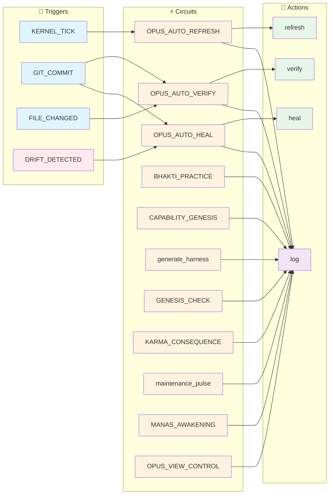
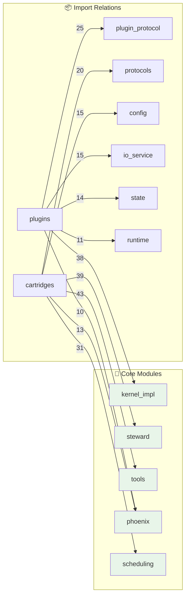

<!--
AUTO-GENERATED by RENDERER_OPUS
Last Updated: 2025-12-18 11:29 UTC
Kernel: STOPPED (1 agents)
Quick Start: python -m vibe_core.cli boot
-->

# OPUS - System State

> 🟡 **NOTICE** - Trust Score 78% - Minor issues detected

**🟡 DEGRADED** | Updated: 2025-12-18 11:29:21 UTC | Kernel: STOPPED (0 agents)

---

## 🎛️ Control Plane

**Status:** full_power | **Karma:** 100% | **Health:** DEGRADED

**Panels:**

- [x] Tests - [x] Code Health - [ ] Debug _(hidden)_

**Layer 1.5 Settings:**
- [ ] Auto-Heal Mode - [x] Live Fire Mode 🔥_(active!)_- [ ] Aggressive Refactoring - [x] Budget Limit: $5.00

**💰 Treasury:** $0.0000 / $5.00 (0.0%)

---

## 🎯 Intent Buffer

🧠 **MANAS Active** | 1 pending | Idle: 0 min

### 1. Commit 15 pending changes

> There are 15 uncommitted changes in the working tree. Consider organizing them into commits.

| Property | Value |
|----------|-------|
| **ID** | `manas_0001` |
| **Priority** | 🟡 MEDIUM |
| **Risk** | 🟡 MEDIUM |

**Reasoning:** Large numbers of uncommitted changes increase the risk of losing work and make it harder to review changes.

- [ ] Approve `manas_0001`
- [ ] Reject `manas_0001`

---

📜 Recently Executed (3)

| Intent | Status | Time |
|--------|--------|------|
| Sutra Gap: Doc 054-SUTRA.md re | ✅ | `0.719578` |
| Sutra Gap: Doc 054-SUTRA.md re | ✅ | `0.757159` |
| Sutra Gap: Doc 077-PRATYAYA-MU | ✅ | `4.613949` |

---

## ⚡ Syscall Console

**Status:** 100.0% real success | 500 total | 500 learned

| Time | Intent | Type | Result |
|------|--------|------|--------|
| `7.459166` | Execute ALLOCATE_PRANA | **ALLOCATE_PRANA** | ✅ |
| `7.453846` | Execute ALLOCATE_PRANA | **ALLOCATE_PRANA** | ✅ |
| `7.448362` | Execute ALLOCATE_PRANA | **ALLOCATE_PRANA** | ✅ |
| `7.442487` | Execute ALLOCATE_PRANA | **ALLOCATE_PRANA** | ✅ |
| `7.436884` | Execute ALLOCATE_PRANA | **ALLOCATE_PRANA** | ✅ |

**By Type:**
- `SPAWN_COGNITION`: 146/146 successful
- `GRANT_MANDATE`: 177/177 successful
- `ALLOCATE_PRANA`: 177/177 successful

> 🧠 **Experience Replay:** 20 entries available for few-shot learning

---

<!-- @LIVE:state_of_mind -->
## 🧠 State of Mind

*What the system knows right now (synthesized from Prakriti)*

### Layer 1 - Sthula (Physical Reality)

- **Branch:** `claude/enhance-prompt-manas-LhkjA` @ `8b79d5d`
- **Working Tree:** ⚠️ Uncommitted
### Layer 2 - Prana (Runtime Energy)

- **Kernel:** ⚪ STOPPED- **Agents:** 0 active
- **Session:** `0047e332...`
### Layer 3 - Purusha (Cognitive Identity)

- **Ephemeral Thoughts:** 0
- **Active Persona:** None
### ⚖️ Karma State

- **Score:** 🟢 **100%** (full_power)
- **Trend:** ➡️ Stable- **Last Update:** `2025-12-15T10:48:18.390236` (errors: 0, crashes: 0)

### 🎯 Focus Areas

- Commit pending changes
- Documentation drift detected

<!-- /@LIVE -->

<!-- @LIVE:system_journal -->
## 📓 System Journal

*Recent observations and insights from the system*

| Time | Severity | Source | Message |
|------|----------|--------|---------|
| `09:50:00` | ⚠️ | battle_test | This observation should survive OPUS.md deletion! |
| `8.967857` | ⚠️ | opus_assistant | Second observation |
| `8.963975` | ⚠️ | opus_assistant | New warning observation |
| `8.949831` | 🚨 | opus_assistant | Alert message |
| `8.948820` | ⚠️ | opus_assistant | Warning message |
| `8.695413` | ⚠️ | auto_verify | Drift detected after commit {{ trigger_event.commi |
| `8.421318` | ⚠️ | auto_verify | Drift detected after commit {{ trigger_event.commi |
| `4.110395` | ⚠️ | opus_assistant | Second observation |
| `4.106864` | ⚠️ | opus_assistant | New warning observation |
| `4.094317` | 🚨 | opus_assistant | Alert message |
| `4.093514` | ⚠️ | opus_assistant | Warning message |
| `4.052010` | ⚠️ | auto_verify | Drift detected after commit {{ trigger_event.commi |
| `4.014657` | ⚠️ | auto_verify | Drift detected after commit {{ trigger_event.commi |
| `8.186832` | ⚠️ | opus_assistant | Second observation |
| `8.181692` | ⚠️ | opus_assistant | New warning observation |
| ... | ... | ... | _+4 more entries_ |

<!-- /@LIVE -->

<!-- @LIVE:circuit_status -->
## ⚡ Cognitive Circuits

*Autonomous behavior patterns available to the system*

| Circuit | Triggers | States | Action | Description |
|---------|----------|--------|--------|-------------|
| **OPUS_AUTO_HEAL** | `OPUS.DRIFT_PERSISTENT, OPUS.HEALTH_CRITICAL` | 8 | [⚡ Run](command:steward.circuit.run?id=OPUS_AUTO_HEAL)
 | Automatic recovery suggestions when drif |
| **OPUS_AUTO_REFRESH** | `KERNEL_BOOT, KERNEL_TICK, GIT_COMMIT...` | 6 | [⚡ Run](command:steward.circuit.run?id=OPUS_AUTO_REFRESH)
 | Keep OPUS.md always up-to-date |
| **OPUS_AUTO_VERIFY** | `GIT_COMMIT, FILE_CHANGED` | 7 | [⚡ Run](command:steward.circuit.run?id=OPUS_AUTO_VERIFY)
 | Automatic drift detection triggered by g |
| **BHAKTI_PRACTICE** | `ERROR_OCCURRED, TEST_CREATED, DOCS_UPDATED...` | 10 | [⚡ Run](command:steward.circuit.run?id=BHAKTI_PRACTICE)
 | Recognition and reward for devotional ac |
| **CAPABILITY_GENESIS** | `CAPABILITY_MISSING, GENESIS_REQUEST, GENESIS_APPROVED` | 30 | [⚡ Run](command:steward.circuit.run?id=CAPABILITY_GENESIS)
 | Generate new capabilities with TDD-first |
| **generate_harness** | `` | 4 | [⚡ Run](command:steward.circuit.run?id=generate_harness)
 | Generates @HARNESS for OPUS docs based o |
| **GENESIS_CHECK** | `KERNEL_BOOT, GENESIS` | 10 | [⚡ Run](command:steward.circuit.run?id=GENESIS_CHECK)
 | Check last session's karma before full b |
| **KARMA_CONSEQUENCE** | `VERIFICATION_COMPLETED, DRIFT_DETECTED, CONTEXT_SYNTHESIS` | 15 | [⚡ Run](command:steward.circuit.run?id=KARMA_CONSEQUENCE)
 | Connect OPUS trust observations to Vedic |
| **maintenance_pulse** | `HOURLY_PULSE, MANAS_WAKE_UP, KERNEL_TICK` | 4 | [⚡ Run](command:steward.circuit.run?id=maintenance_pulse)
 | The autonomous self-healing cycle of OPU |
| **MANAS_AWAKENING** | `HOURLY_PULSE, IDLE_DETECTED, MANAS_FORCE_THINK...` | 9 | [⚡ Run](command:steward.circuit.run?id=MANAS_AWAKENING)
 | Proactive intent generation - transforms |
| **OPUS_VIEW_CONTROL** | `opus.view.toggle, opus.view.set, opus.view.reset` | 3 | [⚡ Run](command:steward.circuit.run?id=OPUS_VIEW_CONTROL)
 | Handles UI toggle interactions from OPUS |

**11 circuits** ready for autonomous execution

### Circuit Flow (Mermaid)

<!-- /@LIVE -->

<!-- @LIVE:verification -->
## System Verification (OPUS-000)

**Trust Score: **🟡 DEGRADED** 78%** (52 docs verified, 17 without @HARNESS)

### OPUS Docs

| Doc | Score | Files | Tests | Wiring | Absent | Config | Semantic |
|-----|-------|-------|-------|--------|--------|--------|----------|
| 000-INDEX.md | - | ⚪ | ⚪ | ⚪ | ⚪ | ⚪ | ⚪ |
| 001-KERNEL-EXTRACTION.md | 100% | ✅ | ✅ | ✅ | ✅ | ✅ | ✅ |
| 002-PHOENIX-CONFIG.md | 100% | ✅ | ✅ | ✅ | ✅ | ✅ | ✅ |
| 003-AOS-FOUNDATION-REPAIR | 100% | ✅ | ✅ | ✅ | ✅ | ✅ | ⚪ |
| 004-BOOT-SEQUENCE-AUDIT.m | 100% | ✅ | ✅ | ✅ | ✅ | ✅ | ✅ |
| 005-UNIFICATION-ROADMAP.m | 100% | ✅ | ✅ | ✅ | ✅ | ✅ | ⚪ |
| 006-GAD000-COMPLIANCE-AUD | 100% | ✅ | ✅ | ✅ | ✅ | ✅ | ⚪ |
| 008-PRAKRITI-PROTOTYPE.md | 55% | ❌ | ❌ | ✅ | ✅ | ✅ | ⚪ |
| 009-UNIFIED-STATE-PRAKRIT | 0% | ❌ | ❌ | ❌ | 🚨 | ❌ | ❌ |
| 010-VERIFICATION-PROTOCOL | 100% | ✅ | ✅ | ✅ | ✅ | ✅ | ⚪ |
| 011-LAYERED-ROUTER.md | 90% | ✅ | ✅ | ✅ | ✅ | ✅ | ✅ |
| 012-SYSTEM-AGENTS.md | 90% | ✅ | ✅ | ✅ | ✅ | ✅ | ✅ |
| 014-UNIFIED-UI-TRANSPAREN | 90% | ✅ | ✅ | ✅ | ✅ | ✅ | ⚪ |
| 015-CONTAINER-FORMAT.md | 100% | ✅ | ✅ | ✅ | ✅ | ✅ | ⚪ |
| 015a-SECURITY-ADDENDUM.md | 90% | ✅ | ✅ | ✅ | ✅ | ✅ | ⚪ |
| 016-RUNTIME-SEPARATION.md | 90% | ✅ | ✅ | ✅ | ✅ | ✅ | ⚪ |
| 017-SECURITY-AUDIT.md | 90% | ✅ | ✅ | ✅ | ✅ | ✅ | ⚪ |
| 018-SENIOR-SECURITY-AUDIT | 90% | ✅ | ✅ | ✅ | ✅ | ✅ | ⚪ |
| 019-P0-RELEASE-MILESTONE. | 90% | ✅ | ✅ | ✅ | ✅ | ✅ | ⚪ |
| 020-CONTAINER-MIGRATION.m | 90% | ✅ | ✅ | ✅ | ✅ | ✅ | ⚪ |
| 021-TEST-ARCHITECTURE.md | 90% | ✅ | ✅ | ✅ | ✅ | ✅ | ⚪ |
| 022-KERNEL-SCALING.md | 90% | ✅ | ✅ | ✅ | ✅ | ✅ | ⚪ |
| 023-FRACTAL-UI-ARCHITECTU | 90% | ✅ | ✅ | ✅ | ✅ | ✅ | ⚪ |
| 024-KERNEL-PROTECTION-AUD | 75% | ✅ | ❌ | ✅ | ✅ | ✅ | ⚪ |
| 025-PATH-LOBOTOMY-CRISIS. | 100% | ✅ | ✅ | ✅ | ✅ | ✅ | ⚪ |
| 026-SEMANTIC-VERIFICATION | 100% | ✅ | ✅ | ✅ | ✅ | ✅ | ⚪ |
| 027-UNIFIED-STATE-IMPLEME | 75% | ✅ | ❌ | ✅ | ✅ | ✅ | ⚪ |
| 028-PRAKRITI-GIT-INTEGRAT | 75% | ✅ | ❌ | ✅ | ✅ | ✅ | ⚪ |
| 029-OPUS-PLUGIN-ARCHITECT | 75% | ✅ | ❌ | ✅ | ✅ | ✅ | ✅ |
| 030-GENESIS-PLUGIN.md | - | ⚪ | ⚪ | ⚪ | ⚪ | ⚪ | ⚪ |
| 031-OPUS-MULTIVERSE-VISIO | 90% | ✅ | ✅ | ✅ | ✅ | ✅ | ⚪ |
| 032-SINGULARITY-50-ROADMA | 90% | ✅ | ✅ | ✅ | ✅ | ✅ | ⚪ |
| 038-SANCTUARY-MUTATION.md | - | ⚪ | ⚪ | ⚪ | ⚪ | ⚪ | ⚪ |
| 039-ECDSA-REGRESSION-REPO | - | ⚪ | ⚪ | ⚪ | ⚪ | ⚪ | ⚪ |
| 050-VEDA.md | 65% | ✅ | ✅ | ✅ | ✅ | ✅ | ❌ |
| 051-MANDALA.md | 65% | ✅ | ✅ | ✅ | ✅ | ✅ | ❌ |
| 052-AKASHA.md | 65% | ✅ | ✅ | ✅ | ✅ | ✅ | ❌ |
| 053-SILPA.md | 65% | ✅ | ✅ | ✅ | ✅ | ✅ | ❌ |
| 054-SUTRA.md | 35% | ❌ | ❌ | ❌ | ✅ | ✅ | ⚪ |
| 055-SANKALPA.md | 65% | ✅ | ✅ | ✅ | ✅ | ✅ | ❌ |
| 056-SHUDDHI.md | - | ⚪ | ⚪ | ⚪ | ⚪ | ⚪ | ⚪ |
| 057-VAJRA.md | - | ⚪ | ⚪ | ⚪ | ⚪ | ⚪ | ⚪ |
| 058-PRATYAHARA.md | - | ⚪ | ⚪ | ⚪ | ⚪ | ⚪ | ⚪ |
| 059-PRAMANA.md | - | ⚪ | ⚪ | ⚪ | ⚪ | ⚪ | ⚪ |
| 060-SATYA.md | - | ⚪ | ⚪ | ⚪ | ⚪ | ⚪ | ⚪ |
| 061-AMRITA.md | - | ⚪ | ⚪ | ⚪ | ⚪ | ⚪ | ⚪ |
| 062-PRANA.md | 65% | ✅ | ✅ | ✅ | ✅ | ✅ | ❌ |
| 063-DRISHTI.md | 90% | ✅ | ✅ | ✅ | ✅ | ✅ | ⚪ |
| 069-SRUTI-SMRITI-PATTERN. | - | ⚪ | ⚪ | ⚪ | ⚪ | ⚪ | ⚪ |
| 070-VAJRA-WIRING-MAP.md | - | ⚪ | ⚪ | ⚪ | ⚪ | ⚪ | ⚪ |
| 074-JNANA-COGNITIVE-ARCHI | - | ⚪ | ⚪ | ⚪ | ⚪ | ⚪ | ⚪ |
| 075-MANAS-RELIABILITY.md | 65% | ✅ | ✅ | ✅ | ✅ | ✅ | ❌ |
| 076-NO-PUSSY-MODE.md | 90% | ✅ | ✅ | ✅ | ✅ | ✅ | ✅ |
| 077-PRATYAYA-MUTATION.md | 100% | ✅ | ✅ | ✅ | ✅ | ✅ | ✅ |
| 078-CLI-CLEAN-ARCH.md | - | ⚪ | ⚪ | ⚪ | ⚪ | ⚪ | ⚪ |
| 080-CORTEX-NARASIMHA.md | 90% | ✅ | ✅ | ✅ | ✅ | ✅ | ✅ |
| 081-RUNTIME-STATE-MANIFES | 75% | ✅ | ❌ | ✅ | ✅ | ✅ | ⚪ |
| 083-COGNITIVE-CIRCUIT-EXE | 45% | ✅ | ✅ | ❌ | ✅ | ✅ | ❌ |
| 085-SAMSARA-GRACE.md | 65% | ✅ | ✅ | ✅ | ✅ | ✅ | ❌ |
| 086-TRIGUNA.md | 65% | ✅ | ✅ | ✅ | ✅ | ✅ | ❌ |
| 087-PRANA.md | 45% | ✅ | ✅ | ❌ | ✅ | ✅ | ❌ |
| 089-MANAS-ORACLE-API.md | - | ⚪ | ⚪ | ⚪ | ⚪ | ⚪ | ⚪ |
| 090-DUAL-CORE-ARCHITECTUR | 90% | ✅ | ✅ | ✅ | ✅ | ✅ | ⚪ |
| 091-HEARTBEAT-REFACTOR.md | - | ⚪ | ⚪ | ⚪ | ⚪ | ⚪ | ⚪ |
| 092-HEARTBEAT-GPG-RESILIE | 40% | ✅ | ❌ | ❌ | ✅ | ✅ | ❌ |
| 095-COGNITIVE-ABSTRACTION | - | ⚪ | ⚪ | ⚪ | ⚪ | ⚪ | ⚪ |
| 096-STATE-SYNC-HOLON-WEAV | 50% | ✅ | ❌ | ✅ | ✅ | ✅ | ❌ |
| 097-SAMKHYA-ARCHITECTURE- | 65% | ✅ | ✅ | ✅ | ✅ | ✅ | ❌ |
| README.md | 90% | ✅ | ✅ | ✅ | ✅ | ✅ | ⚪ |

### ❌ Failures

- **008-PRAKRITI-PROTOTYPE.md** [files]: vibe_core/plugins/interface/renderers/opus/opus_renderer.py
- **008-PRAKRITI-PROTOTYPE.md** [tests]: python scripts/ci/test_kernel_boot.py
- **008-PRAKRITI-PROTOTYPE.md** [doc]: ## Status
- **009-UNIFIED-STATE-PRAKRITI.md** [files]: vibe_core/state/merge_engine.py
- **009-UNIFIED-STATE-PRAKRITI.md** [files]: vibe_core/state/guna_classifier.py
- **009-UNIFIED-STATE-PRAKRITI.md** [tests]: tests/state/test_prakriti.py
- **009-UNIFIED-STATE-PRAKRITI.md** [tests]: tests/state/test_git_state.py
- **009-UNIFIED-STATE-PRAKRITI.md** [tests]: tests/state/test_ledger_state.py
- **009-UNIFIED-STATE-PRAKRITI.md** [tests]: tests/state/test_kernel_state.py
- **009-UNIFIED-STATE-PRAKRITI.md** [tests]: tests/state/test_file_state.py
- _...and 108 more_

<!-- /@LIVE -->

<!-- @LIVE:architecture_plans -->
## Architecture Plans

**68 documents** in `docs/architecture/OPUS/`

- [000-INDEX](docs/architecture/OPUS/000-INDEX.md)
- [001-KERNEL-EXTRACTION](docs/architecture/OPUS/001-KERNEL-EXTRACTION.md)
- [002-PHOENIX-CONFIG](docs/architecture/OPUS/002-PHOENIX-CONFIG.md)
- [003-AOS-FOUNDATION-REPAIR](docs/architecture/OPUS/003-AOS-FOUNDATION-REPAIR.md)
- [004-BOOT-SEQUENCE-AUDIT](docs/architecture/OPUS/004-BOOT-SEQUENCE-AUDIT.md)
- [005-UNIFICATION-ROADMAP](docs/architecture/OPUS/005-UNIFICATION-ROADMAP.md)
- [006-GAD000-COMPLIANCE-AUDIT](docs/architecture/OPUS/006-GAD000-COMPLIANCE-AUDIT.md)
- [008-PRAKRITI-PROTOTYPE](docs/architecture/OPUS/008-PRAKRITI-PROTOTYPE.md)
- [009-UNIFIED-STATE-PRAKRITI](docs/architecture/OPUS/009-UNIFIED-STATE-PRAKRITI.md)
- [010-VERIFICATION-PROTOCOL](docs/architecture/OPUS/010-VERIFICATION-PROTOCOL.md)
- [011-LAYERED-ROUTER](docs/architecture/OPUS/011-LAYERED-ROUTER.md)
- [012-SYSTEM-AGENTS](docs/architecture/OPUS/012-SYSTEM-AGENTS.md)
- [014-UNIFIED-UI-TRANSPARENCY](docs/architecture/OPUS/014-UNIFIED-UI-TRANSPARENCY.md)
- [015-CONTAINER-FORMAT](docs/architecture/OPUS/015-CONTAINER-FORMAT.md)
- [015a-SECURITY-ADDENDUM](docs/architecture/OPUS/015a-SECURITY-ADDENDUM.md)
- [016-RUNTIME-SEPARATION](docs/architecture/OPUS/016-RUNTIME-SEPARATION.md)
- [017-SECURITY-AUDIT](docs/architecture/OPUS/017-SECURITY-AUDIT.md)
- [018-SENIOR-SECURITY-AUDIT](docs/architecture/OPUS/018-SENIOR-SECURITY-AUDIT.md)
- [019-P0-RELEASE-MILESTONE](docs/architecture/OPUS/019-P0-RELEASE-MILESTONE.md)
- [020-CONTAINER-MIGRATION](docs/architecture/OPUS/020-CONTAINER-MIGRATION.md)
- [021-TEST-ARCHITECTURE](docs/architecture/OPUS/021-TEST-ARCHITECTURE.md)
- [022-KERNEL-SCALING](docs/architecture/OPUS/022-KERNEL-SCALING.md)
- [023-FRACTAL-UI-ARCHITECTURE](docs/architecture/OPUS/023-FRACTAL-UI-ARCHITECTURE.md)
- [024-KERNEL-PROTECTION-AUDIT](docs/architecture/OPUS/024-KERNEL-PROTECTION-AUDIT.md)
- [025-PATH-LOBOTOMY-CRISIS](docs/architecture/OPUS/025-PATH-LOBOTOMY-CRISIS.md)
- [026-SEMANTIC-VERIFICATION](docs/architecture/OPUS/026-SEMANTIC-VERIFICATION.md)
- [027-UNIFIED-STATE-IMPLEMENTATION](docs/architecture/OPUS/027-UNIFIED-STATE-IMPLEMENTATION.md)
- [028-PRAKRITI-GIT-INTEGRATION](docs/architecture/OPUS/028-PRAKRITI-GIT-INTEGRATION.md)
- [029-OPUS-PLUGIN-ARCHITECTURE](docs/architecture/OPUS/029-OPUS-PLUGIN-ARCHITECTURE.md)
- [030-GENESIS-PLUGIN](docs/architecture/OPUS/030-GENESIS-PLUGIN.md)
- [031-OPUS-MULTIVERSE-VISION](docs/architecture/OPUS/031-OPUS-MULTIVERSE-VISION.md)
- [032-SINGULARITY-50-ROADMAP](docs/architecture/OPUS/032-SINGULARITY-50-ROADMAP.md)
- [038-SANCTUARY-MUTATION](docs/architecture/OPUS/038-SANCTUARY-MUTATION.md)
- [039-ECDSA-REGRESSION-REPORT](docs/architecture/OPUS/039-ECDSA-REGRESSION-REPORT.md)
- [050-VEDA](docs/architecture/OPUS/050-VEDA.md)
- [051-MANDALA](docs/architecture/OPUS/051-MANDALA.md)
- [052-AKASHA](docs/architecture/OPUS/052-AKASHA.md)
- [053-SILPA](docs/architecture/OPUS/053-SILPA.md)
- [054-SUTRA](docs/architecture/OPUS/054-SUTRA.md)
- [055-SANKALPA](docs/architecture/OPUS/055-SANKALPA.md)
- [056-SHUDDHI](docs/architecture/OPUS/056-SHUDDHI.md)
- [057-VAJRA](docs/architecture/OPUS/057-VAJRA.md)
- [058-PRATYAHARA](docs/architecture/OPUS/058-PRATYAHARA.md)
- [059-PRAMANA](docs/architecture/OPUS/059-PRAMANA.md)
- [060-SATYA](docs/architecture/OPUS/060-SATYA.md)
- [061-AMRITA](docs/architecture/OPUS/061-AMRITA.md)
- [062-PRANA](docs/architecture/OPUS/062-PRANA.md)
- [063-DRISHTI](docs/architecture/OPUS/063-DRISHTI.md)
- [069-SRUTI-SMRITI-PATTERN](docs/architecture/OPUS/069-SRUTI-SMRITI-PATTERN.md)
- [070-VAJRA-WIRING-MAP](docs/architecture/OPUS/070-VAJRA-WIRING-MAP.md)
- [074-JNANA-COGNITIVE-ARCHITECTURE](docs/architecture/OPUS/074-JNANA-COGNITIVE-ARCHITECTURE.md)
- [075-MANAS-RELIABILITY](docs/architecture/OPUS/075-MANAS-RELIABILITY.md)
- [076-NO-PUSSY-MODE](docs/architecture/OPUS/076-NO-PUSSY-MODE.md)
- [077-PRATYAYA-MUTATION](docs/architecture/OPUS/077-PRATYAYA-MUTATION.md)
- [078-CLI-CLEAN-ARCH](docs/architecture/OPUS/078-CLI-CLEAN-ARCH.md)
- [080-CORTEX-NARASIMHA](docs/architecture/OPUS/080-CORTEX-NARASIMHA.md)
- [081-RUNTIME-STATE-MANIFEST](docs/architecture/OPUS/081-RUNTIME-STATE-MANIFEST.md)
- [083-COGNITIVE-CIRCUIT-EXECUTOR](docs/architecture/OPUS/083-COGNITIVE-CIRCUIT-EXECUTOR.md)
- [085-SAMSARA-GRACE](docs/architecture/OPUS/085-SAMSARA-GRACE.md)
- [086-TRIGUNA](docs/architecture/OPUS/086-TRIGUNA.md)
- [087-PRANA](docs/architecture/OPUS/087-PRANA.md)
- [089-MANAS-ORACLE-API](docs/architecture/OPUS/089-MANAS-ORACLE-API.md)
- [090-DUAL-CORE-ARCHITECTURE](docs/architecture/OPUS/090-DUAL-CORE-ARCHITECTURE.md)
- [091-HEARTBEAT-REFACTOR](docs/architecture/OPUS/091-HEARTBEAT-REFACTOR.md)
- [092-HEARTBEAT-GPG-RESILIENCE](docs/architecture/OPUS/092-HEARTBEAT-GPG-RESILIENCE.md)
- [095-COGNITIVE-ABSTRACTION](docs/architecture/OPUS/095-COGNITIVE-ABSTRACTION.md)
- [096-STATE-SYNC-HOLON-WEAVER](docs/architecture/OPUS/096-STATE-SYNC-HOLON-WEAVER.md)
- [097-SAMKHYA-ARCHITECTURE-MAP](docs/architecture/OPUS/097-SAMKHYA-ARCHITECTURE-MAP.md)
<!-- /@LIVE -->

<!-- @LIVE:module_index -->
## 📦 Module Index

*Quick navigation to understand the codebase structure*

| Module | Description | Files | Tests | Path |
|--------|-------------|-------|-------|------|
| **agents** | Agent implementations for vibe-agency OS. | 6 | ❌ | `vibe_core/agents/` |
| **cartridges** | Cartridges - ARCH-050 | 180 | ✅ | `vibe_core/cartridges/` |
| **cli** | Fractal CLI System - Auto-discoverable, plugin-based command | 12 | ❌ | `vibe_core/cli/` |
| **config** | THE DHARMA ENGINE: Configuration-Driven System Architecture | 2 | ❌ | `vibe_core/config/` |
| **cortex** | CORTEX - The Cognitive Engine Layer | 6 | ❌ | `vibe_core/cortex/` |
| **gateway** | (2 files) | 2 | ❌ | `vibe_core/gateway/` |
| **governance** | Governance layer for Vibe Agency. | 3 | ❌ | `vibe_core/governance/` |
| **knowledge** | Unified Knowledge Graph Module | 4 | ❌ | `vibe_core/knowledge/` |
| **llm** | LLM integration for vibe-agency OS. | 9 | ❌ | `vibe_core/llm/` |
| **loaders** | Unified Loader System - VEDA-4 Pattern for ALL Item Types. | 8 | ❌ | `vibe_core/loaders/` |
| **phoenix** | Phoenix Configuration System - The config that never dies. | 38 | ❌ | `vibe_core/phoenix/` |
| **playbook** | Playbook Package (OPERATION SEMANTIC MOTOR) | 7 | ❌ | `vibe_core/playbook/` |
| **plugins** | Kernel Plugins Package | 170 | ✅ | `vibe_core/plugins/` |
| **protocols** | VIBE_CORE PROTOCOLS - Layer 1: Interfaces Only | 8 | ❌ | `vibe_core/protocols/` |
| **runtime** | Runtime Components Package | 27 | ❌ | `vibe_core/runtime/` |
| **scheduling** | Task scheduling definitions for VibeOS | 3 | ❌ | `vibe_core/scheduling/` |
| **scripts** | (1 files) | 1 | ❌ | `vibe_core/scripts/` |
| **settings** | Settings Section Plugin System | 6 | ❌ | `vibe_core/settings/` |
| **shadow_labs** | (1 files) | 1 | ❌ | `vibe_core/shadow_labs/` |
| **specialists** | Specialist Agents - HAP Framework (Hierarchical Agent Patter | 4 | ❌ | `vibe_core/specialists/` |

**20 modules** in `vibe_core/`

<!-- /@LIVE -->

<!-- @LIVE:hot_paths -->
## 🔥 Hot Paths

*Most frequently changed files (last 100 commits) - start here to understand the project*

| File | Commits | Last Change |
|------|---------|-------------|
| `vibe_core/plugins/opus_assistant/manas/tests/test_manas_integration.py` | 2 | fix(test): Make test_intent_generation_e |
| `vibe_core/plugins/opus_assistant/manas/intent_router.py` | 2 | fix(manas): Wire DocHarnessAnalyzer inte |
| `vibe_core/plugins/opus_assistant/manas/analyzers/__init__.py` | 2 | fix(manas): Wire DocHarnessAnalyzer into |
| `vibe_core/plugins/opus_assistant/manas/cortex/wiring_map.py` | 2 | fix(manas): Wire DocHarnessAnalyzer into |
| `vibe_core/plugins/opus_assistant/manas/intent_generator.py` | 2 | fix(manas): Wire DocHarnessAnalyzer into |
| `vibe_core/cartridges/system/chronicle/tools/git_tools.py` | 2 | fix(state): Add no_verify to GitTools fo |
| `vibe_core/__init__.py` | 1 | Merge pull request #524 from kimeisele/c |
| `vibe_core/agent_interface.py` | 1 | Merge pull request #524 from kimeisele/c |
| `vibe_core/agent_protocol.py` | 1 | Merge pull request #524 from kimeisele/c |
| `vibe_core/agents/__init__.py` | 1 | Merge pull request #524 from kimeisele/c |

<!-- /@LIVE -->

<!-- @LIVE:dependency_graph -->
## 🕸️ Module Dependencies

*Which modules import which - understand the architecture at a glance*

### Critical Modules (Most Imported)

- **kernel_impl** - Heavily depended upon, changes here ripple!
- **steward** - Heavily depended upon, changes here ripple!
- **tools** - Heavily depended upon, changes here ripple!
- **phoenix** - Heavily depended upon, changes here ripple!
- **scheduling** - Heavily depended upon, changes here ripple!

### Dependency Flow (Mermaid)

### Module Sizes

| Module | Files | Critical? |
|--------|-------|-----------|
| `cartridges` | 180 |  |
| `plugins` | 170 |  |
| `phoenix` | 38 | ⭐ |
| `runtime` | 27 |  |
| `cli` | 12 |  |
| `steward` | 11 | ⭐ |
| `state` | 10 |  |
| `task_management` | 10 |  |
| `llm` | 9 |  |
| `tools` | 9 | ⭐ |
| `loaders` | 8 |  |
| `protocols` | 8 |  |
| `playbook` | 7 |  |
| `agents` | 6 |  |
| `cortex` | 6 |  |
| `settings` | 6 |  |
| `vajra` | 6 |  |
| `knowledge` | 4 |  |
| `specialists` | 4 |  |
| `governance` | 3 |  |
| `scheduling` | 3 | ⭐ |
| `config` | 2 |  |
| `gateway` | 2 |  |
| `store` | 2 |  |
| `scripts` | 1 |  |
| `shadow_labs` | 1 |  |

<!-- /@LIVE -->

<!-- @LIVE:prakriti_state -->
## Prakriti State (OPUS-027)

### 📍 Session

| Property | Value |
| --- | --- |
| Session ID | `0047e332` |
| Boot Commit | `unknown` |
| Boot Mode | full_power |
| Started | `2025-12-18T11:29:15.830818` |

### 🔮 Three Layers

| Layer | Name | Status | Details |
| --- | --- | --- | --- |
| 1 | STHULA (Physical) | 🟡 | Dirty on `claude/enhance-prompt-manas-LhkjA` |
| 2 | PRANA (Runtime) | ⏹️ | Stopped |
| 3 | PURUSHA (Identity) | ⚪ | No personas defined |

### 🔗 Cryptographic Zipper

| Component | Hash | Synced |
| --- | --- | --- |
| Git HEAD | `8b79d5d` | ⚪ |
| Ledger HEAD | `b8b5ead4ce7a` | ⚪ |

### 🔮 Tri-Guna (State Health)

| Guna | Count | Meaning |
| --- | --- | --- |
| ✅ Sattva | 0 | Synced & Clean |
| 🟡 Rajas | 5 | Active & Dirty |
| ❌ Tamas | 0 | Stale & Broken |

🔄 **Activity Detected**: 5 paths changing

### 🙏 Dharma (Vedic Conscience)

| Aspect | Value | Description |
| --- | --- | --- |
| Agent | `manas` | The entity being governed |
| Ashrama | **grihastha** | Lifecycle stage |
| Varna | manusha | Functional role |
| Bhakti | ⚪ **35/200** | Earned trust (devotion) |

**Granted Permissions:** `code_modify`, `git_commit`, `git_push`, `git_modify`, `pr_create`, `pr_merge`, `test_create`, `doc_modify`, `review`, `state_heal`

### 📜 Sutra (Documentation Curation) *Phase 2: Proactive*
*Bhagavad Gita 9.22: "yoga-kṣemaṁ vahāmy aham" - I bring what is lacking*

| Metric | Value | Status |
| --- | --- | --- |
| Total OPUS Docs | 34 | - |
| With @HARNESS | 22 | ✅ |
| Without @HARNESS | 12 | ⚠️ |
| Doc/Code Gaps | 43 | 🔴 |
| Health Ratio | **64%** | 🟡 |

**Top Gaps (Need Attention):**
- 🟡 `missing_harness`: Doc 056-SHUDDHI.md has no @HARNESS block (056-SHUDDHI.md)
- 🟡 `missing_harness`: Doc 057-VAJRA.md has no @HARNESS block (057-VAJRA.md)
- 🟡 `missing_harness`: Doc 058-PRATYAHARA.md has no @HARNESS block (058-PRATYAHARA.md)
- 🟡 `missing_harness`: Doc 059-PRAMANA.md has no @HARNESS block (059-PRAMANA.md)
- 🟡 `missing_harness`: Doc 060-SATYA.md has no @HARNESS block (060-SATYA.md)

#### 🔍 Phase 2: Proactive Mode

| Capability | Count | Status |
| --- | --- | --- |
| Hidden Code Elements | 259 | ⚠️ 8 high priority |
| Roadmap Items | 41 | 📋 Action needed |
| Intent Clusters | 0 | ⚪ |

**Roadmap Preview (Top 5):**
- [P1] `fix_code_reference` → 096-STATE-SYNC-HOLON-WEAV (small)
- [P2] `add_harness` → 056-SHUDDHI.md (trivial)
- [P2] `add_harness` → 057-VAJRA.md (trivial)
- [P2] `add_harness` → 058-PRATYAHARA.md (trivial)
- [P2] `add_harness` → 059-PRAMANA.md (trivial)

*Last Scan: 2025-12-18 11:29:29 UTC*

<!-- /@LIVE -->

<!-- @LIVE:code_health -->
## Code Health (TODO/HACK/FIXME)

**Total: 17** (TODO: 17, HACK: 0, FIXME: 0)

TODOs (17)

- `vibe_core/cartridges/system/archivist/tools/audit_tool.py:96` - # TODO: Implement real verification with public_key when HER
- `vibe_core/cartridges/system/engineer/cartridge_main.py:465` - # TODO: Implement agent-specific logic
- `vibe_core/cartridges/system/engineer/templates/agent/cartridge_main.py:101` - # TODO: Implement your capability
- `vibe_core/cartridges/system/engineer/templates/agent/cartridge_main.py:106` - # TODO: Implement your capability
- `vibe_core/cartridges/system/envoy/tools/wiring_audit_scripts.py:221` - "# TODO.*implement": "MEDIUM",
- `vibe_core/cli/unified_cli.py:60` - "delegate": None,  # TODO: Migrate to plugin
- `vibe_core/config/__init__.py:21` - # TODO: Remove in v2.0
- `vibe_core/playbook/__init__.py:22` - # TODO: Remove in v2.0
- `vibe_core/plugins/doctor/plugin_main.py:86` - # TODO: Clarify offline mode dependency injection.
- `vibe_core/plugins/envoy/plugin_main.py:617` - # TODO: Create envoy.yaml config section
- `vibe_core/plugins/interface/renderers/opus/panels/code_health.py:58` - # TODOs (collapsible if many)
- `vibe_core/plugins/interface/renderers/opus/panels/code_health.py:65` - lines.append("### TODOs")
- `vibe_core/plugins/opus_assistant/events/kernel_tick.py:2313` - # TODO: Implement actual logic here
- `vibe_core/plugins/opus_assistant/events/kernel_tick.py:2363` - # TODO: Implement analysis logic
- `vibe_core/plugins/opus_assistant/events/kernel_tick.py:2401` - # TODO: Implement formatting logic
- `vibe_core/plugins/opus_assistant/manas/cortex/silpa.py:844` - # TODO: Parse refactoring commands
- `vibe_core/task_management/task_manager.py:341` - # TODO: Integrate with UnifiedRouter for dynamic prioritizat

<!-- /@LIVE -->

<!-- @LIVE:test_health -->
## Test Suite Health

| Metric | Count | Status |
| --- | --- | --- |
| Active Tests | 131 | - |
| Archived (broken) | 1 | - |
| Organized | 130/131 | - |
| Unit Tests | 36 | - |
| Integration Tests | 55 | - |
| Hardening Tests | 4 | - |
| Using Fixtures | 10/13 (77%) | OK |

**Debt:** 1 tests in `tests/archive/` need revival
<!-- /@LIVE -->

---

<!-- @AI:current_work -->
## Current Work

<!-- AI: Update this with what you're working on -->
_Define current task_
<!-- /@AI -->

<!-- @AI:blockers -->
## Blockers

<!-- AI: List any blockers -->
_None_
<!-- /@AI -->

<!-- @HUMAN:notes -->
## Notes

<!-- Human can write here -->
_Add notes here_
<!-- /@HUMAN -->

---
*Generated by OPUS Assistant Plugin | 2025-12-18 11:29:21 UTC*