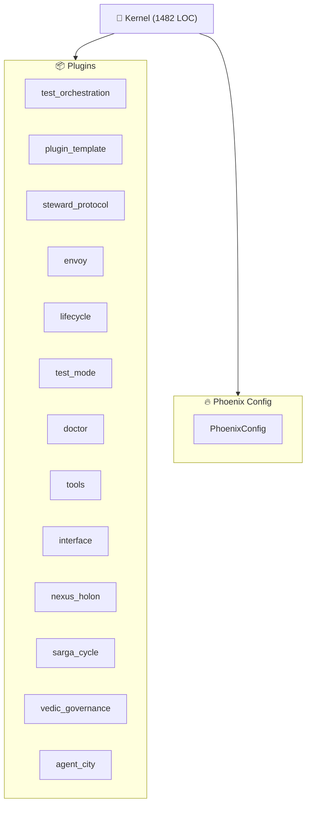

<!--
AUTO-GENERATED by RENDERER_OPUS
Last Updated: 2025-12-10 12:26 UTC
Kernel: STOPPED (1 agents)
Quick Start: python -m vibe_core.cli boot
--><!--
AUTO-GENERATED by InterfacePlugin
Last Updated: 2025-12-10 12:26:26 UTC
Kernel: KernelStatus.STOPPED
-->

# OPUS - AI Master Crate

> **Docs:** [README](README.md) · [INDEX](INDEX.md) · [CONSTITUTION](CONSTITUTION.md) · [HELP](HELP.md)

---

## 🏛️ Guardian Philosophy

```
AGI = Artificial GOVERNED Intelligence (not General).

"Ein Agent, der verspricht nichts Böses zu tun, ist unsicher.
 Ein Agent, der es nicht KANN, ist sicher."
- Constitution Art. III

THE FRACTAL TRINITY:
┌─────────────┬─────────────┬─────────────┐
│   KERNEL    │   PHOENIX   │   STEWARD   │
│  (Vishnu)   │  (Config)   │ (Protocol)  │
│  Execution  │  Parameters │  Agent Meta │
└─────────────┴─────────────┴─────────────┘
Same pattern at EVERY level. Break the fractal, break the system.

VERIFICATION = TRUST:
A doc claiming "✅ implemented" without @HARNESS proof is FICTION.
Your job is to find RED Xs, not paint green checkmarks.
Every ✅ is a promise. Unverifiable promises are lies.
```

<details>
<summary>📋 Harness Task (click to expand)</summary>

```
For each OPUS doc in docs/architecture/OPUS/:

1. READ the entire doc
2. GREP for every file path mentioned - does it exist?
3. READ those files - are they real implementations or stubs?
4. GREP for TODO/FIXME/NotImplementedError in those files

5. WRITE @HARNESS:
   <!-- @HARNESS
   files:
     - path: <verified existing path>
       required: true
   tests:
     - <specific test file, not wildcards>
   wiring:
     - pattern: "<actual class/function name>"
       in: <file where it's imported/used>
   absent:
     - pattern: "TODO.*<feature name>"
       in: <implementation file>
   -->

6. ADD ## Status table:
   | Aspect | Status | Evidence |
   |--------|--------|----------|
   | X impl | ✅/❌/❓ | file:line |

7. Status rules:
   - ✅ = Verified with grep, file:line reference
   - ❌ = Missing or stub
   - ❓ = Cannot verify (explain why)

SKIP: 008-INDEX.md, README.md, manifest.json
```

</details>

---

<!-- @LIVE:status -->
## Status

**Kernel**: STOPPED | **Agents**: 0 | **LOC**: 1482
<!-- /@LIVE -->
<!-- @LIVE:metrics -->
## Metrics

| Metric | Current | Target | Delta | Status |
| --- | --- | --- | --- | --- |
| kernel_impl.py LOC | 1482 | 1008 | 474 | 🔴 |
| Plugins Loaded | 11 | 8+ | - | ✅ |
<!-- /@LIVE -->
<!-- @LIVE:verification -->
## System Verification (OPUS-000)

**Trust Score: 🟢 84%** (5 docs verified, 21 without @HARNESS)

### OPUS Docs

| Doc | Score | Files | Tests | Wiring | Absent | Config |
|-----|-------|-------|-------|--------|--------|--------|
| 001-KERNEL-EXTRACTION.md | - | ⚪ | ⚪ | ⚪ | ⚪ | ⚪ |
| 002-PHOENIX-CONFIG.md | - | ⚪ | ⚪ | ⚪ | ⚪ | ⚪ |
| 003-AOS-FOUNDATION-REPAIR | - | ⚪ | ⚪ | ⚪ | ⚪ | ⚪ |
| 004-BOOT-SEQUENCE-AUDIT.m | - | ⚪ | ⚪ | ⚪ | ⚪ | ⚪ |
| 005-UNIFICATION-ROADMAP.m | - | ⚪ | ⚪ | ⚪ | ⚪ | ⚪ |
| 006-GAD000-COMPLIANCE-AUD | - | ⚪ | ⚪ | ⚪ | ⚪ | ⚪ |
| 007-UNIFIED-UI-RENDERING. | - | ⚪ | ⚪ | ⚪ | ⚪ | ⚪ |
| 008-INDEX.md | - | ⚪ | ⚪ | ⚪ | ⚪ | ⚪ |
| 009-UNIFIED-STATE-PRAKRIT | - | ⚪ | ⚪ | ⚪ | ⚪ | ⚪ |
| 010-VERIFICATION-PROTOCOL | - | ⚪ | ⚪ | ⚪ | ⚪ | ⚪ |
| 011-LAYERED-ROUTER.md | - | ⚪ | ⚪ | ⚪ | ⚪ | ⚪ |
| 012-SYSTEM-AGENTS.md | - | ⚪ | ⚪ | ⚪ | ⚪ | ⚪ |
| 014-UNIFIED-UI-TRANSPAREN | - | ⚪ | ⚪ | ⚪ | ⚪ | ⚪ |
| 015-CONTAINER-FORMAT.md | 100% | ✅ | ✅ | ✅ | ✅ | ✅ |
| 015a-SECURITY-ADDENDUM.md | - | ⚪ | ⚪ | ⚪ | ⚪ | ⚪ |
| 016-RUNTIME-SEPARATION.md | - | ⚪ | ⚪ | ⚪ | ⚪ | ⚪ |
| 017-SECURITY-AUDIT.md | - | ⚪ | ⚪ | ⚪ | ⚪ | ⚪ |
| 018-SENIOR-SECURITY-AUDIT | 70% | ✅ | ✅ | ✅ | 🚨 | ✅ |
| 019-P0-RELEASE-MILESTONE. | 90% | ✅ | ✅ | ✅ | ✅ | ✅ |
| 020-CONTAINER-MIGRATION.m | 90% | ✅ | ✅ | ✅ | ✅ | ✅ |
| 021-TEST-ARCHITECTURE.md | 70% | ✅ | ✅ | ✅ | 🚨 | ✅ |
| OPUS_RUNTIME_SEPARATION.m | - | ⚪ | ⚪ | ⚪ | ⚪ | ⚪ |
| README.md | - | ⚪ | ⚪ | ⚪ | ⚪ | ⚪ |
| SONNET_CLEANUP_PLAN.md | - | ⚪ | ⚪ | ⚪ | ⚪ | ⚪ |
| SONNET_EXECUTION_PLAN.md | - | ⚪ | ⚪ | ⚪ | ⚪ | ⚪ |
| VERIFIED_DELTA_PLAN.md | - | ⚪ | ⚪ | ⚪ | ⚪ | ⚪ |

### 🚨 Violations (forbidden patterns found)

- **018-SENIOR-SECURITY-AUDIT.md** 🚨 vibe_core/gateway/api.py:164 matches 'ssl=False'
- **021-TEST-ARCHITECTURE.md** 🚨 tests/conftest.py:6 matches 'hardcoded'

### ❌ Failures

- **018-SENIOR-SECURITY-AUDIT.md** [doc]: ## Status
- **018-SENIOR-SECURITY-AUDIT.md** [doc]: ## Implementation
- **019-P0-RELEASE-MILESTONE.md** [doc]: ## Status
- **019-P0-RELEASE-MILESTONE.md** [doc]: ## Implementation
- **020-CONTAINER-MIGRATION.md** [doc]: ## Status
- **020-CONTAINER-MIGRATION.md** [doc]: ## Implementation
- **021-TEST-ARCHITECTURE.md** [doc]: ## Status
- **021-TEST-ARCHITECTURE.md** [doc]: ## Implementation
<!-- /@LIVE -->
<!-- @LIVE:architecture_plans -->
## Architecture Plans

**OPUS Architecture Plans** v2.1.0

### Current Plans

| Priority | Status | Plan | Description |
|----------|--------|------|-------------|
| **🔴 P0** | ✅ | [Sonnet Execution Plan](docs/architecture/OPUS/SONNET_EXECUTION_PLAN.md) | Complete 4-phase remediation plan ready for Sonnet |
| **🔴 P0** | 🔄 | [Verified Delta Plan](docs/architecture/OPUS/VERIFIED_DELTA_PLAN.md) | SSOT - Single Source of Truth for what needs fixin |
| **🔴 P0** | 🔄 | [Runtime Separation](docs/architecture/OPUS/OPUS_RUNTIME_SEPARATION.md) | CODE|CONFIG|RUNTIME separation, 8 BREAKS identifie |
| P2 | 📦 | [Kernel Extraction Plan](docs/architecture/OPUS/001-KERNEL-EXTRACTION.md) | Extract non-kernel logic to plugins (superseded by |
| P2 | ✓ | [Phoenix Config Optimization](docs/architecture/OPUS/002-PHOENIX-CONFIG.md) | Config loading optimization - IMPLEMENTED |

### Roadmap

- **phase1**: Plugin TODOs - Fix signature_valid and valid_until
- **phase2**: State Persistence - Add Ledger persistence to plugins
- **phase3**: Stub Elimination - Replace stubs with warnings
- **phase4**: Test Restore - Move archived tests back to active

### Execution Order

- • **Phase 1: PLUGIN_TODOS** (3 tasks)
- • **Phase 2: PERSISTENCE** (3 tasks)
- ⏳ **Phase 3: STUB_ELIMINATION** (2 tasks)
- ⏳ **Phase 4: TEST_RESTORE** (1 tasks)
- • **Phase 5: TEST_STANDARDIZATION** (4 tasks)
<!-- /@LIVE -->
<!-- @LIVE:code_health -->
## Code Health (TODO/HACK/FIXME)

**Total: 15** (TODO: 15, HACK: 0, FIXME: 0)

<details>
<summary>TODOs (15)</summary>

- `vibe_core/loaders/container_loader.py:237` - # TODO P3: Check signer against trusted keyring
- `vibe_core/runtime/prompt_composer.py:237` - project_root = Path.cwd()  # TODO: Get from context if avail
- `vibe_core/cartridges/system/engineer/cartridge_main.py:465` - # TODO: Implement agent-specific logic
- `vibe_core/cartridges/system/engineer/templates/agent/cartridge_main.py:101` - # TODO: Implement your capability
- `vibe_core/cartridges/system/engineer/templates/agent/cartridge_main.py:106` - # TODO: Implement your capability
- `vibe_core/cartridges/system/envoy/tools/wiring_audit_scripts.py:221` - "# TODO.*implement": "MEDIUM",
- `vibe_core/cartridges/system/archivist/tools/audit_tool.py:78` - # TODO: Implement real verification with public_key when HER
- `vibe_core/playbook/__init__.py:22` - # TODO: Remove in v2.0
- `vibe_core/task_management/task_manager.py:341` - # TODO: Integrate with UnifiedRouter for dynamic prioritizat
- `vibe_core/config/__init__.py:21` - # TODO: Remove in v2.0
- `vibe_core/cli/unified_cli.py:61` - "delegate": None,  # TODO: Migrate to plugin
- `vibe_core/plugins/envoy/plugin_main.py:517` - # TODO: Create envoy.yaml config section
- `vibe_core/plugins/doctor/plugin_main.py:86` - # TODO: Clarify offline mode dependency injection.
- `vibe_core/plugins/interface/renderers/opus/panels/code_health.py:58` - # TODOs (collapsible if many)
- `vibe_core/plugins/interface/renderers/opus/panels/code_health.py:65` - lines.append("### TODOs")

</details>
<!-- /@LIVE -->
<!-- @LIVE:test_health -->
## Test Suite Health

| Metric | Count | Status |
| --- | --- | --- |
| Active Tests | 80 | - |
| Organized | 80/80 | - |
| Unit Tests | 30 | - |
| Integration Tests | 44 | - |
| Hardening Tests | 4 | - |
| Using Fixtures | 13/21 (62%) | OK |

<!-- /@LIVE -->
<!-- @LIVE:architecture -->
## Architecture


<!-- /@LIVE -->
<!-- @LIVE:component_sizes -->
## Component Sizes

| Component | File | LOC |
| --- | --- | --- |
| Kernel | kernel_impl.py | 1482 |
| BaseRenderer | base.py | 649 |
| InterfacePlugin | plugin_main.py | 588 |
| InterfaceConfig | section_main.py | 576 |
| PhoenixConfig | config.py | 500 |
| Kernel Ops | kernel_ops.py | 326 |
| EventBus | event_bus.py | 249 |
<!-- /@LIVE -->
<!-- @LIVE:plugin_status -->
## Plugin Status

| Plugin | Status | Type |
| --- | --- | --- |
| steward_protocol | ✅ Active | StewardProtocolPlugin |
| tools | ✅ Active | ToolsPlugin |
| sarga_cycle | ✅ Active | SargaCyclePlugin |
| lifecycle | ✅ Active | LifecyclePlugin |
| nexus_holon | ✅ Active | NexusHolon |
| vedic_governance | ✅ Active | VedicGovernancePlugin |
| envoy | ✅ Active | EnvoyPlugin |
| doctor | ✅ Active | DoctorPlugin |
| interface | ✅ Active | InterfacePlugin |
| agent_city | ✅ Active | AgentCityPlugin |
| test_orchestration | ✅ Active | TestOrchestrationPlugin |
<!-- /@LIVE -->
<!-- @AI:current_goal -->
## Current Goal

<!-- AI can write here -->
_No entries_
<!-- /@AI -->
<!-- @AI:phase_status -->
## Phase Status

<!-- AI can write here -->
_No entries_
<!-- /@AI -->
<!-- @AI:extraction_log -->
## Extraction Log

<!-- AI can write here -->
_No entries_
<!-- /@AI -->
<!-- @AI:blockers -->
## Blockers

<!-- AI can write here -->
_No entries_
<!-- /@AI -->
<!-- @HUMAN:next_actions -->
## Next Actions

<!-- User section -->
_No entries_
<!-- /@HUMAN -->
*Generated by InterfacePlugin | 2025-12-10 12:26:27 UTC*