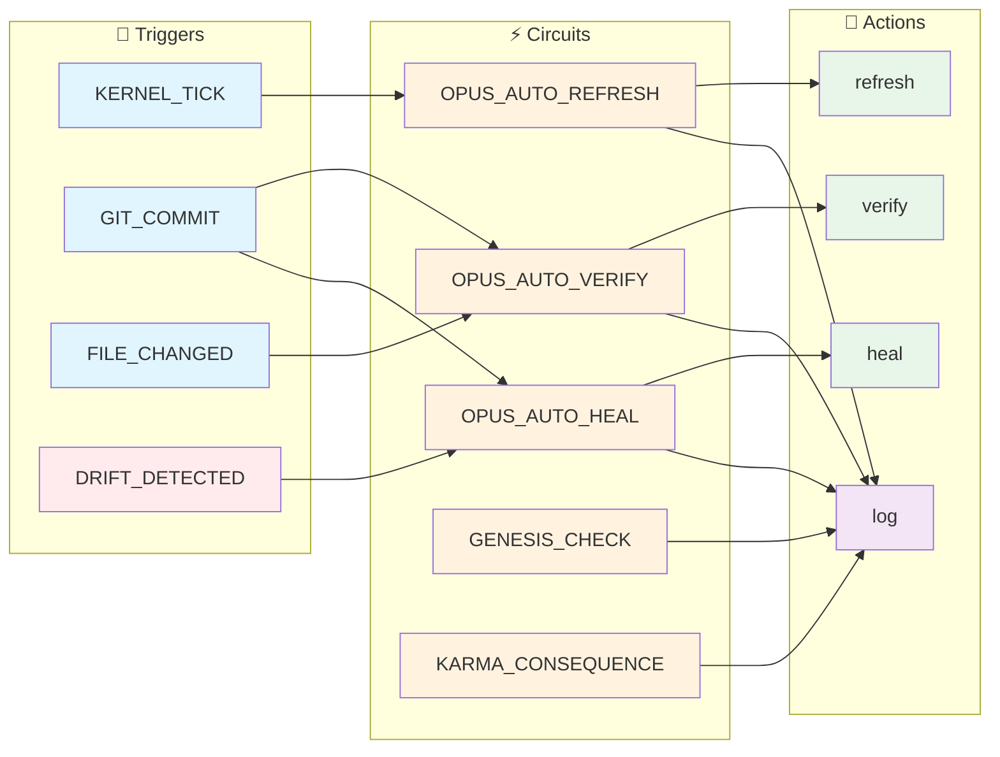

# OPUS - System State

> 🟡 **NOTICE** - Trust Score 61% - Minor issues detected

**🟡 DEGRADED** | Updated: 2025-12-13 03:03:43 UTC | Kernel: STOPPED (0 agents)

---

<!-- @LIVE:state_of_mind -->
## 🧠 State of Mind

*What the system knows right now (synthesized from Prakriti)*

### Layer 1 - Sthula (Physical Reality)

- **Branch:** `claude/review-prompt-architecture-lIfRE` @ `dc32a4c`
- **Working Tree:** ✅ Clean
### Layer 2 - Prana (Runtime Energy)

- **Kernel:** ⚪ STOPPED- **Agents:** 0 active
- **Session:** Standalone
### Layer 3 - Purusha (Cognitive Identity)

- **Ephemeral Thoughts:** 0
- **Active Persona:** None
### 🎯 Focus Areas

- Documentation drift detected

<!-- /@LIVE -->

<!-- @LIVE:system_journal -->
## 📓 System Journal

*Recent observations and insights from the system*

_No observations recorded yet._

The system will log observations here as it runs:
- ℹ️ INFO: Normal operational events
- ⚠️ WARN: Things to watch
- 🚨 ALERT: Needs attention
- 💡 INSIGHT: AI-generated insights

<!-- /@LIVE -->

<!-- @LIVE:circuit_status -->
## ⚡ Cognitive Circuits

*Autonomous behavior patterns available to the system*

| Circuit | Triggers | States | Action | Description |
|---------|----------|--------|--------|-------------|
| **OPUS_AUTO_HEAL** | `OPUS.DRIFT_PERSISTENT, OPUS.HEALTH_CRITICAL` | 7 | [⚡ Run](command:steward.circuit.run?id=OPUS_AUTO_HEAL)
 | Automatic recovery suggestions when drif |
| **OPUS_AUTO_REFRESH** | `KERNEL_BOOT, KERNEL_TICK, GIT_COMMIT...` | 6 | [⚡ Run](command:steward.circuit.run?id=OPUS_AUTO_REFRESH)
 | Keep OPUS.md always up-to-date |
| **OPUS_AUTO_VERIFY** | `GIT_COMMIT, FILE_CHANGED` | 7 | [⚡ Run](command:steward.circuit.run?id=OPUS_AUTO_VERIFY)
 | Automatic drift detection triggered by g |
| **GENESIS_CHECK** | `KERNEL_BOOT, GENESIS` | 10 | [⚡ Run](command:steward.circuit.run?id=GENESIS_CHECK)
 | Check last session's karma before full b |
| **KARMA_CONSEQUENCE** | `VERIFICATION_COMPLETED, DRIFT_DETECTED, CONTEXT_SYNTHESIS` | 12 | [⚡ Run](command:steward.circuit.run?id=KARMA_CONSEQUENCE)
 | Connect OPUS trust observations to Vedic |

**5 circuits** ready for autonomous execution

### Circuit Flow (Mermaid)

<!-- /@LIVE -->

<!-- @LIVE:verification -->
## System Verification (OPUS-000)

**Trust Score: **🟡 DEGRADED** 61%** (29 docs verified, 1 without @HARNESS)

### OPUS Docs

| Doc | Score | Files | Tests | Wiring | Absent | Config | Semantic |
|-----|-------|-------|-------|--------|--------|--------|----------|
| 000-INDEX.md | - | ⚪ | ⚪ | ⚪ | ⚪ | ⚪ | ⚪ |
| 001-KERNEL-EXTRACTION.md | 75% | ✅ | ✅ | ✅ | ✅ | ✅ | ⚪ |
| 002-PHOENIX-CONFIG.md | 75% | ✅ | ✅ | ✅ | ✅ | ✅ | ⚪ |
| 003-AOS-FOUNDATION-REPAIR | 75% | ✅ | ✅ | ✅ | ✅ | ✅ | ⚪ |
| 004-BOOT-SEQUENCE-AUDIT.m | 75% | ✅ | ✅ | ✅ | ✅ | ✅ | ⚪ |
| 005-UNIFICATION-ROADMAP.m | 75% | ✅ | ✅ | ✅ | ✅ | ✅ | ⚪ |
| 006-GAD000-COMPLIANCE-AUD | 75% | ✅ | ✅ | ✅ | ✅ | ✅ | ⚪ |
| 008-PRAKRITI-PROTOTYPE.md | 30% | ❌ | ❌ | ✅ | ✅ | ✅ | ⚪ |
| 009-UNIFIED-STATE-PRAKRIT | 65% | ✅ | ✅ | ✅ | ✅ | ✅ | ⚪ |
| 010-VERIFICATION-PROTOCOL | 75% | ✅ | ✅ | ✅ | ✅ | ✅ | ⚪ |
| 011-LAYERED-ROUTER.md | 65% | ✅ | ✅ | ✅ | ✅ | ✅ | ⚪ |
| 012-SYSTEM-AGENTS.md | 65% | ✅ | ✅ | ✅ | ✅ | ✅ | ⚪ |
| 014-UNIFIED-UI-TRANSPAREN | 65% | ✅ | ✅ | ✅ | ✅ | ✅ | ⚪ |
| 015-CONTAINER-FORMAT.md | 75% | ✅ | ✅ | ✅ | ✅ | ✅ | ⚪ |
| 015a-SECURITY-ADDENDUM.md | 65% | ✅ | ✅ | ✅ | ✅ | ✅ | ⚪ |
| 016-RUNTIME-SEPARATION.md | 65% | ✅ | ✅ | ✅ | ✅ | ✅ | ⚪ |
| 017-SECURITY-AUDIT.md | 65% | ✅ | ✅ | ✅ | ✅ | ✅ | ⚪ |
| 018-SENIOR-SECURITY-AUDIT | 65% | ✅ | ✅ | ✅ | ✅ | ✅ | ⚪ |
| 019-P0-RELEASE-MILESTONE. | 65% | ✅ | ✅ | ✅ | ✅ | ✅ | ⚪ |
| 020-CONTAINER-MIGRATION.m | 65% | ✅ | ✅ | ✅ | ✅ | ✅ | ⚪ |
| 021-TEST-ARCHITECTURE.md | 65% | ✅ | ✅ | ✅ | ✅ | ✅ | ⚪ |
| 022-KERNEL-SCALING.md | 65% | ✅ | ✅ | ✅ | ✅ | ✅ | ⚪ |
| 023-FRACTAL-UI-ARCHITECTU | 25% | ❌ | ✅ | ❌ | ✅ | ✅ | ⚪ |
| 024-KERNEL-PROTECTION-AUD | 50% | ✅ | ❌ | ✅ | ✅ | ✅ | ⚪ |
| 025-PATH-LOBOTOMY-CRISIS. | 75% | ✅ | ✅ | ✅ | ✅ | ✅ | ⚪ |
| 026-SEMANTIC-VERIFICATION | 20% | ❌ | ❌ | ❌ | ✅ | ✅ | ⚪ |
| 027-UNIFIED-STATE-IMPLEME | 50% | ✅ | ❌ | ✅ | ✅ | ✅ | ⚪ |
| 028-PRAKRITI-GIT-INTEGRAT | 50% | ✅ | ❌ | ✅ | ✅ | ✅ | ⚪ |
| 029-OPUS-PLUGIN-ARCHITECT | 50% | ✅ | ❌ | ✅ | ✅ | ✅ | ⚪ |
| README.md | 65% | ✅ | ✅ | ✅ | ✅ | ✅ | ⚪ |

### ❌ Failures

- **008-PRAKRITI-PROTOTYPE.md** [files]: vibe_core/plugins/interface/renderers/opus/opus_renderer.py
- **008-PRAKRITI-PROTOTYPE.md** [tests]: python scripts/ci/test_kernel_boot.py
- **008-PRAKRITI-PROTOTYPE.md** [doc]: ## Status
- **009-UNIFIED-STATE-PRAKRITI.md** [doc]: ## Status
- **011-LAYERED-ROUTER.md** [doc]: ## Status
- **011-LAYERED-ROUTER.md** [doc]: ## Implementation
- **012-SYSTEM-AGENTS.md** [doc]: ## Status
- **014-UNIFIED-UI-TRANSPARENCY.md** [doc]: ## Status
- **015a-SECURITY-ADDENDUM.md** [doc]: ## Implementation
- **016-RUNTIME-SEPARATION.md** [doc]: ## Implementation
- _...and 33 more_

<!-- /@LIVE -->

<!-- @LIVE:architecture_plans -->
## Architecture Plans

**29 documents** in `docs/architecture/OPUS/`

- [000-INDEX](docs/architecture/OPUS/000-INDEX.md)
- [001-KERNEL-EXTRACTION](docs/architecture/OPUS/001-KERNEL-EXTRACTION.md)
- [002-PHOENIX-CONFIG](docs/architecture/OPUS/002-PHOENIX-CONFIG.md)
- [003-AOS-FOUNDATION-REPAIR](docs/architecture/OPUS/003-AOS-FOUNDATION-REPAIR.md)
- [004-BOOT-SEQUENCE-AUDIT](docs/architecture/OPUS/004-BOOT-SEQUENCE-AUDIT.md)
- [005-UNIFICATION-ROADMAP](docs/architecture/OPUS/005-UNIFICATION-ROADMAP.md)
- [006-GAD000-COMPLIANCE-AUDIT](docs/architecture/OPUS/006-GAD000-COMPLIANCE-AUDIT.md)
- [008-PRAKRITI-PROTOTYPE](docs/architecture/OPUS/008-PRAKRITI-PROTOTYPE.md)
- [009-UNIFIED-STATE-PRAKRITI](docs/architecture/OPUS/009-UNIFIED-STATE-PRAKRITI.md)
- [010-VERIFICATION-PROTOCOL](docs/architecture/OPUS/010-VERIFICATION-PROTOCOL.md)
- [011-LAYERED-ROUTER](docs/architecture/OPUS/011-LAYERED-ROUTER.md)
- [012-SYSTEM-AGENTS](docs/architecture/OPUS/012-SYSTEM-AGENTS.md)
- [014-UNIFIED-UI-TRANSPARENCY](docs/architecture/OPUS/014-UNIFIED-UI-TRANSPARENCY.md)
- [015-CONTAINER-FORMAT](docs/architecture/OPUS/015-CONTAINER-FORMAT.md)
- [015a-SECURITY-ADDENDUM](docs/architecture/OPUS/015a-SECURITY-ADDENDUM.md)
- [016-RUNTIME-SEPARATION](docs/architecture/OPUS/016-RUNTIME-SEPARATION.md)
- [017-SECURITY-AUDIT](docs/architecture/OPUS/017-SECURITY-AUDIT.md)
- [018-SENIOR-SECURITY-AUDIT](docs/architecture/OPUS/018-SENIOR-SECURITY-AUDIT.md)
- [019-P0-RELEASE-MILESTONE](docs/architecture/OPUS/019-P0-RELEASE-MILESTONE.md)
- [020-CONTAINER-MIGRATION](docs/architecture/OPUS/020-CONTAINER-MIGRATION.md)
- [021-TEST-ARCHITECTURE](docs/architecture/OPUS/021-TEST-ARCHITECTURE.md)
- [022-KERNEL-SCALING](docs/architecture/OPUS/022-KERNEL-SCALING.md)
- [023-FRACTAL-UI-ARCHITECTURE](docs/architecture/OPUS/023-FRACTAL-UI-ARCHITECTURE.md)
- [024-KERNEL-PROTECTION-AUDIT](docs/architecture/OPUS/024-KERNEL-PROTECTION-AUDIT.md)
- [025-PATH-LOBOTOMY-CRISIS](docs/architecture/OPUS/025-PATH-LOBOTOMY-CRISIS.md)
- [026-SEMANTIC-VERIFICATION](docs/architecture/OPUS/026-SEMANTIC-VERIFICATION.md)
- [027-UNIFIED-STATE-IMPLEMENTATION](docs/architecture/OPUS/027-UNIFIED-STATE-IMPLEMENTATION.md)
- [028-PRAKRITI-GIT-INTEGRATION](docs/architecture/OPUS/028-PRAKRITI-GIT-INTEGRATION.md)
- [029-OPUS-PLUGIN-ARCHITECTURE](docs/architecture/OPUS/029-OPUS-PLUGIN-ARCHITECTURE.md)
<!-- /@LIVE -->

<!-- @LIVE:module_index -->
## 📦 Module Index

*Quick navigation to understand the codebase structure*

| Module | Description | Files | Tests | Path |
|--------|-------------|-------|-------|------|
| **agents** | Agent implementations for vibe-agency OS. | 6 | ❌ | `vibe_core/agents/` |
| **cartridges** | Cartridges - ARCH-050 | 174 | ✅ | `vibe_core/cartridges/` |
| **cli** | Fractal CLI System - Auto-discoverable, plugin-based command | 12 | ❌ | `vibe_core/cli/` |
| **config** | THE DHARMA ENGINE: Configuration-Driven System Architecture | 2 | ❌ | `vibe_core/config/` |
| **cortex** | CORTEX - The Cognitive Engine Layer | 6 | ❌ | `vibe_core/cortex/` |
| **gateway** | (2 files) | 2 | ❌ | `vibe_core/gateway/` |
| **governance** | Governance layer for Vibe Agency. | 2 | ❌ | `vibe_core/governance/` |
| **knowledge** | Unified Knowledge Graph Module | 4 | ❌ | `vibe_core/knowledge/` |
| **llm** | LLM integration for vibe-agency OS. | 9 | ❌ | `vibe_core/llm/` |
| **loaders** | Unified Loader System - VEDA-4 Pattern for ALL Item Types. | 8 | ❌ | `vibe_core/loaders/` |
| **phoenix** | Phoenix Configuration System - The config that never dies. | 36 | ❌ | `vibe_core/phoenix/` |
| **playbook** | Playbook Package (OPERATION SEMANTIC MOTOR) | 7 | ❌ | `vibe_core/playbook/` |
| **plugins** | Kernel Plugins Package | 99 | ✅ | `vibe_core/plugins/` |
| **protocols** | VIBE_CORE PROTOCOLS - Layer 1: Interfaces Only | 8 | ❌ | `vibe_core/protocols/` |
| **runtime** | Runtime Components Package | 26 | ❌ | `vibe_core/runtime/` |
| **scheduling** | Task scheduling definitions for VibeOS | 3 | ❌ | `vibe_core/scheduling/` |
| **scripts** | (1 files) | 1 | ❌ | `vibe_core/scripts/` |
| **settings** | Settings Section Plugin System | 6 | ❌ | `vibe_core/settings/` |
| **specialists** | Specialist Agents - HAP Framework (Hierarchical Agent Patter | 4 | ❌ | `vibe_core/specialists/` |
| **state** | vibe_core/state - Unified State Management (PRAKRITI) | 9 | ❌ | `vibe_core/state/` |

**20 modules** in `vibe_core/`

<!-- /@LIVE -->

<!-- @LIVE:hot_paths -->
## 🔥 Hot Paths

*Most frequently changed files (last 100 commits) - start here to understand the project*

| File | Commits | Last Change |
|------|---------|-------------|
| `vibe_core/plugins/opus_assistant/events/kernel_tick.py` | 15 | feat(opus): OPUS-030 Cognitive Awakening |
| `vibe_core/plugins/opus_assistant/plugin_main.py` | 14 | feat(opus): Complete Fractal Holon wirin |
| `vibe_core/plugins/opus_assistant/core/__init__.py` | 6 | feat(opus): Phase 4 - Cognitive Circuits |
| `vibe_core/plugins/opus_assistant/render/opus_md_writer.py` | 4 | refactor(opus): Kill Spaghetti + Add Mer |
| `vibe_core/plugins/opus_assistant/core/observation_logger.py` | 3 | feat(opus): Implement Fractal Holon stat |
| `vibe_core/plugins/opus_assistant/cli/commands.py` | 3 | feat(opus): Add --deep flag for LLM-powe |
| `vibe_core/runtime/boot_sequence.py` | 3 | feat(prompt): Wire plugin contexts into  |
| `vibe_core/plugins/opus_assistant/circuits/__init__.py` | 3 | feat(opus): Phase 5 - Auto-Refresh + Cle |
| `vibe_core/plugins/interface/renderers/opus/panels/verification.py` | 3 | refactor(opus): OPUS-029 Migration - sta |
| `vibe_core/plugins/opus_assistant/events/__init__.py` | 3 | feat(opus): Phase 4 - Cognitive Circuits |

<!-- /@LIVE -->

<!-- @LIVE:prakriti_state -->
## Prakriti State (OPUS-027)

### 📍 Session

_No active session (kernel may be stopped)_

### 🔮 Three Layers

| Layer | Name | Status | Details |
| --- | --- | --- | --- |
| 1 | STHULA (Physical) | ✅ | Clean on `claude/review-prompt-architecture-lIfRE` |
| 2 | PRANA (Runtime) | ⏹️ | Stopped |
| 3 | PURUSHA (Identity) | ⚪ | No personas defined |

### 🔗 Cryptographic Zipper

| Component | Hash | Synced |
| --- | --- | --- |
| Git HEAD | `dc32a4c` | ⚪ |
| Ledger HEAD | `4cef525941e9` | ⚪ |

<!-- /@LIVE -->

<!-- @LIVE:code_health -->
## Code Health (TODO/HACK/FIXME)

**Total: 11** (TODO: 11, HACK: 0, FIXME: 0)

TODOs (11)

- `vibe_core/cartridges/system/archivist/tools/audit_tool.py:78` - # TODO: Implement real verification with public_key when HER
- `vibe_core/cartridges/system/engineer/cartridge_main.py:465` - # TODO: Implement agent-specific logic
- `vibe_core/cartridges/system/engineer/templates/agent/cartridge_main.py:101` - # TODO: Implement your capability
- `vibe_core/cartridges/system/engineer/templates/agent/cartridge_main.py:106` - # TODO: Implement your capability
- `vibe_core/cartridges/system/envoy/tools/wiring_audit_scripts.py:221` - "# TODO.*implement": "MEDIUM",
- `vibe_core/cli/unified_cli.py:61` - "delegate": None,  # TODO: Migrate to plugin
- `vibe_core/config/__init__.py:21` - # TODO: Remove in v2.0
- `vibe_core/playbook/__init__.py:22` - # TODO: Remove in v2.0
- `vibe_core/plugins/doctor/plugin_main.py:86` - # TODO: Clarify offline mode dependency injection.
- `vibe_core/plugins/envoy/plugin_main.py:517` - # TODO: Create envoy.yaml config section
- `vibe_core/task_management/task_manager.py:341` - # TODO: Integrate with UnifiedRouter for dynamic prioritizat

<!-- /@LIVE -->

<!-- @LIVE:test_health -->
## Test Suite Health

| Metric | Count | Status |
| --- | --- | --- |
| Active Tests | 83 | - |
| Archived (broken) | 1 | - |
| Organized | 83/83 | - |
| Unit Tests | 33 | - |
| Integration Tests | 44 | - |
| Hardening Tests | 4 | - |
| Using Fixtures | 9/12 (75%) | OK |

**Debt:** 1 tests in `tests/archive/` need revival
<!-- /@LIVE -->

---

<!-- @AI:current_work -->
## Current Work

<!-- AI: Update this with what you're working on -->
_Define current task_
<!-- /@AI -->

<!-- @AI:blockers -->
## Blockers

<!-- AI: List any blockers -->
_None_
<!-- /@AI -->

<!-- @HUMAN:notes -->
## Notes

<!-- Human can write here -->
_Add notes here_
<!-- /@HUMAN -->

---
*Generated by OPUS Assistant Plugin | 2025-12-13 03:03:43 UTC*