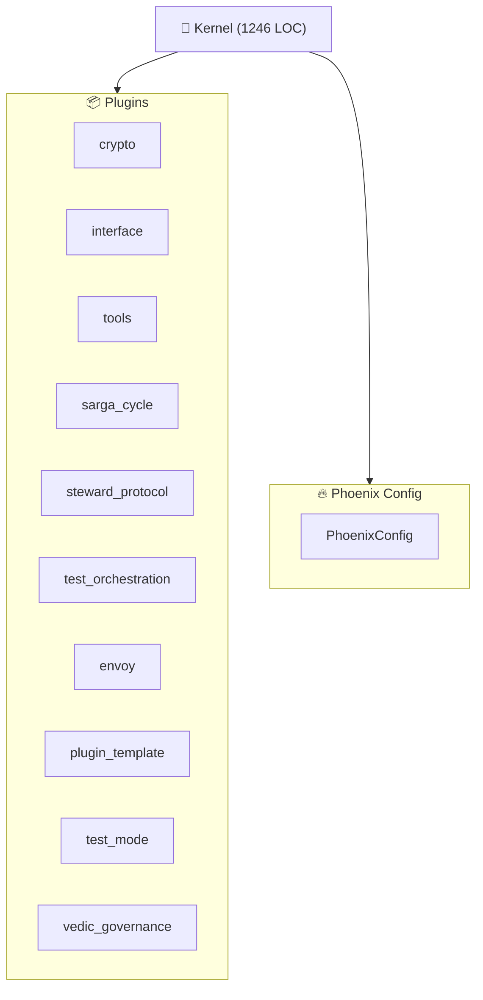

<!--
AUTO-GENERATED by InterfacePlugin
Last Updated: 2025-12-07 07:41:04 UTC
Kernel: KernelStatus.RUNNING
-->
> **Docs:** [README](README.md) · [INDEX](INDEX.md) · [AGENTS](AGENTS.md) · [CITYMAP](CITYMAP.md) · [HELP](HELP.md) · [TASKS](TASKS.md) · [SETTINGS](SETTINGS.md) · [ENVOY](ENVOY.md)

<!-- @LIVE:status -->
## Status

**Kernel**: RUNNING | **Agents**: 0 | **LOC**: 1246
<!-- /@LIVE -->
<!-- @LIVE:metrics -->
## Metrics

| Metric | Current | Target | Delta | Status |
| --- | --- | --- | --- | --- |
| kernel_impl.py LOC | 1246 | 1008 | 238 | 🔴 |
| Plugins Loaded | 8 | 8+ | - | ✅ |
<!-- /@LIVE -->
<!-- @LIVE:code_health -->
## Code Health (TODO/HACK/FIXME)

**Total: 32** (TODO: 32, HACK: 0, FIXME: 0)

TODOs (32)

- `vibe_core/cartridges/system/archivist/tools/audit_tool.py:78` - # TODO: Implement real verification with public_key when HER
- `vibe_core/cartridges/system/envoy/tools/wiring_audit_scripts.py:221` - "# TODO.*implement": "MEDIUM",
- `vibe_core/cartridges/system/engineer/templates/agent/cartridge_main.py:101` - # TODO: Implement your capability
- `vibe_core/cartridges/system/engineer/templates/agent/cartridge_main.py:106` - # TODO: Implement your capability
- `vibe_core/cartridges/agent_city/test_watchman/cartridge_main.py:101` - # TODO: Implement your capability
- `vibe_core/cartridges/agent_city/test_watchman/cartridge_main.py:106` - # TODO: Implement your capability
- `vibe_core/cartridges/agent_city/watchman_102224_4840/cartridge_main.py:101` - # TODO: Implement your capability
- `vibe_core/cartridges/agent_city/watchman_102224_4840/cartridge_main.py:106` - # TODO: Implement your capability
- `vibe_core/cartridges/agent_city/auditor_104151_b183/cartridge_main.py:101` - # TODO: Implement your capability
- `vibe_core/cartridges/agent_city/auditor_104151_b183/cartridge_main.py:106` - # TODO: Implement your capability
- `vibe_core/cartridges/agent_city/watchman_104151_6c8f/cartridge_main.py:101` - # TODO: Implement your capability
- `vibe_core/cartridges/agent_city/watchman_104151_6c8f/cartridge_main.py:106` - # TODO: Implement your capability
- `vibe_core/cartridges/agent_city/scribe_102232_4509/cartridge_main.py:101` - # TODO: Implement your capability
- `vibe_core/cartridges/agent_city/scribe_102232_4509/cartridge_main.py:106` - # TODO: Implement your capability
- `vibe_core/cartridges/agent_city/scribe_104151_e249/cartridge_main.py:101` - # TODO: Implement your capability
- `vibe_core/cartridges/agent_city/scribe_104151_e249/cartridge_main.py:106` - # TODO: Implement your capability
- `vibe_core/cartridges/agent_city/watchman_104146_5639/cartridge_main.py:101` - # TODO: Implement your capability
- `vibe_core/cartridges/agent_city/watchman_104146_5639/cartridge_main.py:106` - # TODO: Implement your capability
- `vibe_core/cartridges/agent_city/watchman_102232_dab6/cartridge_main.py:101` - # TODO: Implement your capability
- `vibe_core/cartridges/agent_city/watchman_102232_dab6/cartridge_main.py:106` - # TODO: Implement your capability
- _...and 12 more_

<!-- /@LIVE -->
<!-- @LIVE:architecture -->
## Architecture

<!-- /@LIVE -->
<!-- @LIVE:component_sizes -->
## Component Sizes

| Component | File | LOC |
| --- | --- | --- |
| Kernel | kernel_impl.py | 1246 |
| InterfaceConfig | section_main.py | 576 |
| PhoenixConfig | config.py | 554 |
| BaseRenderer | base.py | 485 |
| Kernel Ops | kernel_ops.py | 326 |
| InterfacePlugin | plugin_main.py | 315 |
| EventBus | event_bus.py | 249 |
<!-- /@LIVE -->
<!-- @LIVE:plugin_status -->
## Plugin Status

| Plugin | Status | Type |
| --- | --- | --- |
| crypto | ✅ Active | CryptoPlugin |
| tools | ✅ Active | ToolsPlugin |
| sarga_cycle | ✅ Active | SargaCyclePlugin |
| steward_protocol | ✅ Active | StewardProtocolPlugin |
| vedic_governance | ✅ Active | VedicGovernancePlugin |
| envoy | ✅ Active | EnvoyPlugin |
| interface | ✅ Active | InterfacePlugin |
| test_orchestration | ✅ Active | TestOrchestrationPlugin |
<!-- /@LIVE -->
<!-- @AI:current_goal -->
## Current Goal

<!-- AI can write here -->
_No entries_
<!-- /@AI -->
<!-- @AI:phase_status -->
## Phase Status

<!-- AI can write here -->
_No entries_
<!-- /@AI -->
<!-- @AI:extraction_log -->
## Extraction Log

<!-- AI can write here -->
_No entries_
<!-- /@AI -->
<!-- @AI:blockers -->
## Blockers

<!-- AI can write here -->
_No entries_
<!-- /@AI -->
<!-- @HUMAN:next_actions -->
## Next Actions

<!-- User section -->
_No entries_
<!-- /@HUMAN -->
*Generated by InterfacePlugin | 2025-12-07 07:41:07 UTC*