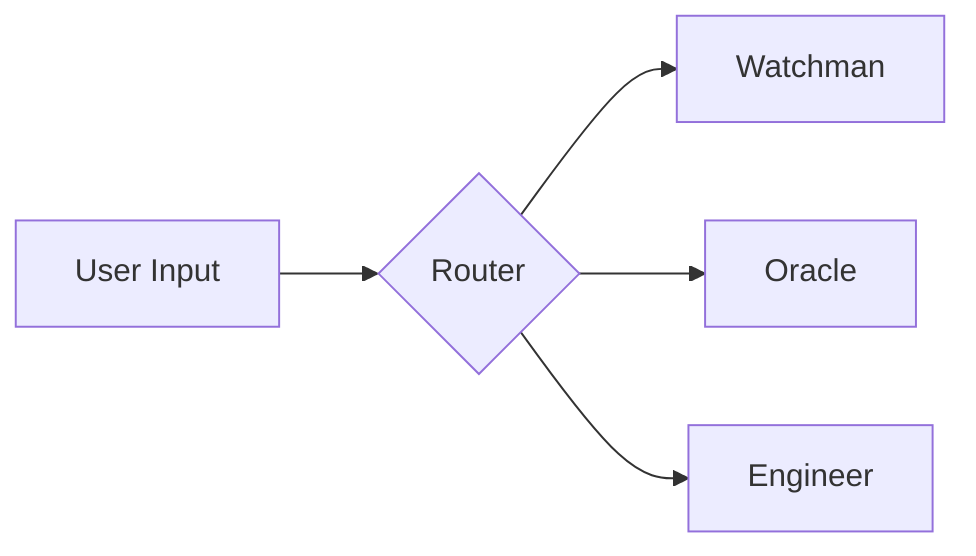

# OPUS-014: Unified UI & Transparency Layer

> **Status**: DRAFT
> **Created**: 2025-12-08
> **Prereqs**: OPUS-007 (Hardening), OPUS-009 (Prakriti)
> **GAD-000**: "What is more transparent than bidirectional files that X-ray the system?"

<!-- @HARNESS
files:
  - path: vibe_core/plugins/interface/plugin_main.py
    required: true
  - path: vibe_core/state/prakriti.py
    required: true
  - path: vibe_core/phoenix/config.py
    required: true
wiring:
  - pattern: "InterfacePlugin"
    in: vibe_core/plugins/interface/plugin_main.py
  - pattern: "Prakriti"
    in: vibe_core/state/prakriti.py
absent:
  - pattern: "TODO.*transparency"
    in: vibe_core/plugins/interface/plugin_main.py
config:
  - section: ui_transparency
-->

---

## Executive Summary

**The Problem**: Root UI files are disconnected from backend reality.
- SETTINGS.md doesn't reflect actual config
- ECONOMY.md doesn't exist (no visibility into tokens/credits)
- STATE.md doesn't exist (no visibility into Prakriti)
- Files are static, not interactive

**The Vision**: Every root .md file is a **live X-ray** of the system.
- No hardcoded values in plugins
- All data flows from `config/` → Plugin → Renderer → Root File
- User can toggle views, change settings via markdown

---

## The Stack

```
┌─────────────────────────────────────────────────────────────┐
│                    USER INTERFACE LAYER                     │
│                     (Root .md Files)                        │
├─────────────────────────────────────────────────────────────┤
│  ONEWORD.md Files          │  Purpose                       │
├─────────────────────────────────────────────────────────────┤
│  INDEX.md                  │  Navigation Hub                │
│  AGENTS.md                 │  Agent Registry                │
│  CITYMAP.md                │  Architecture Overview         │
│  ENVOY.md                  │  Command Interface             │
│  SETTINGS.md               │  System Configuration          │
│  STATE.md (NEW)            │  Prakriti State Inspector      │
│  ECONOMY.md (NEW)          │  Token/Credit/Resource Meter   │
│  MATRIX.md                 │  Routing/Circuit Visualization │
│  TASKS.md                  │  Task Queue & History          │
│  OPUS.md                   │  AI Workspace                  │
│  GIT.md                    │  Repository State              │
└─────────────────────────────────────────────────────────────┘
           ▲ render()              ▲ parse()
           │                       │
┌──────────┴───────────────────────┴──────────────────────────┐
│                    RENDERER LAYER                           │
│              (InterfacePlugin + Renderers)                  │
├─────────────────────────────────────────────────────────────┤
│  config/interface.yaml → Defines which renderers enabled    │
│  vibe_core/plugins/interface/renderers/ → Render logic      │
│  LIVE/AI/HUMAN sections → Bidirectional ownership           │
└─────────────────────────────────────────────────────────────┘
           ▲ data source
           │
┌──────────┴──────────────────────────────────────────────────┐
│                    DATA SOURCE LAYER                        │
│                 (Plugins + Prakriti)                        │
├─────────────────────────────────────────────────────────────┤
│  Prakriti (.prakriti)      │  State, Personas, Git          │
│  StewardProtocol (.trust)  │  Trust Scores, Oath Status     │
│  VedicGovernance (.civic)  │  Varna, Ashrama, Credits       │
│  CapabilityRegistry        │  Permissions, Revocations      │
│  Ledger (.ledger)          │  Audit Trail                   │
│  ToolsPlugin               │  Available Tools               │
│  LifecyclePlugin           │  Spawn History                 │
└─────────────────────────────────────────────────────────────┘
           ▲ config
           │
┌──────────┴──────────────────────────────────────────────────┐
│                    CONFIG LAYER                             │
│                  (No hardcoding!)                           │
├─────────────────────────────────────────────────────────────┤
│  config/interface.yaml     │  UI Renderers                  │
│  config/governance.yaml    │  Credits, Limits               │
│  config/economy.yaml (NEW) │  Token Budgets, Pricing        │
│  context/personas/*.yaml   │  Agent Identities              │
└─────────────────────────────────────────────────────────────┘
```

---

## New Files

### 1. STATE.md - Prakriti Inspector

**Purpose**: X-ray into OPUS-009's 3-layer state.

**Sections**:
```markdown
# STATE.md

<!-- @LIVE:purusha -->
## Purusha (Identity Layer)
| Agent | Varna | Dharma | Personality |
|-------|-------|--------|-------------|
| envoy | kshatriya | routing | curious: 0.8 |
<!-- /@LIVE -->

<!-- @LIVE:prana -->
## Prana (Runtime Layer)
- Active Tasks: 3
- Queue Depth: 12
- Ephemeral Storage: 45KB
<!-- /@LIVE -->

<!-- @LIVE:sthula -->
## Sthula (Physical Layer)
- Git Branch: main
- Dirty Files: 2
- Last Commit: abc123 (2 min ago)
<!-- /@LIVE -->
```

**Data Sources**:
- `kernel.prakriti.get_system_status()`
- `kernel.prakriti.personas`
- `kernel.prakriti.git.current_branch()`

---

### 2. ECONOMY.md - Resource Meters

**Purpose**: Transparency into token usage, credits, costs.

**Sections**:
```markdown
# ECONOMY.md

<!-- @LIVE:treasury -->
## Treasury
| Resource | Used | Budget | Remaining |
|----------|------|--------|-----------|
| OpenAI Tokens | 45,230 | 100,000 | 54,770 |
| Local LLM Queries | 127 | ∞ | ∞ |
| API Calls | 23 | 1,000 | 977 |
<!-- /@LIVE -->

<!-- @LIVE:agent_credits -->
## Agent Credits
| Agent | Credits | Spent Today | Status |
|-------|---------|-------------|--------|
| envoy | 1000 | 45 | active |
| oracle | 500 | 230 | low |
<!-- /@LIVE -->

<!-- @LIVE:transactions -->
## Recent Transactions
| Time | Agent | Action | Cost |
|------|-------|--------|------|
| 12:34 | oracle | GPT-4 query | 1200 tokens |
<!-- /@LIVE -->
```

**Data Sources**:
- `config/economy.yaml` (budgets)
- `kernel.ledger.get_events(type="token_usage")`
- `kernel.plugins["vedic_governance"].get_credits()`

**Config** (`config/economy.yaml`):
```yaml
treasury:
  openai_tokens:
    budget: 100000
    reset_interval: daily
  api_calls:
    budget: 1000
    reset_interval: hourly

agent_defaults:
  initial_credits: 1000
  credit_recovery_rate: 10  # per hour

pricing:
  gpt4: 0.03  # per 1k tokens
  gpt35: 0.002
  local: 0  # free
```

---

### 3. SETTINGS.md - Interactive Config

**Current Problem**: SETTINGS.md is trash - doesn't reflect actual config.

**New Design**:
```markdown
# SETTINGS.md

<!-- @HUMAN:commands -->
## Commands
Type commands here:
> set interface.renderers.economy.enabled true
> set economy.treasury.openai_tokens.budget 200000
> reload config
<!-- /@HUMAN -->

<!-- @LIVE:current_config -->
## Active Configuration

### Interface
| Renderer | Enabled | Interval | Output |
|----------|---------|----------|--------|
| envoy | ✅ | 0s | ENVOY.md |
| economy | ❌ | 30s | ECONOMY.md |
| state | ❌ | 10s | STATE.md |

### Economy
| Setting | Value |
|---------|-------|
| openai_budget | 100,000 |
| credit_recovery | 10/hr |
<!-- /@LIVE -->

<!-- @LIVE:config_diff -->
## Pending Changes
```diff
+ interface.renderers.economy.enabled = true
- interface.renderers.economy.enabled = false
```
<!-- /@LIVE -->
```

**Data Sources**:
- `config/*.yaml` (read)
- SETTINGS.md @HUMAN section (write)
- Parser extracts commands, applies to config

---

### 4. MATRIX.md - Routing Visualization

**Purpose**: See how requests flow through the system.

**Sections**:
```markdown
# MATRIX.md

<!-- @LIVE:routes -->
## Active Routes
| Intent | Handler | Circuit |
|--------|---------|---------|
| "status" | watchman | DIRECT |
| "research" | oracle | RESEARCH_DEEP_V1 |
| "code" | engineer | ARCHITECT_V1 |
<!-- /@LIVE -->

<!-- @LIVE:circuit_graph -->
## Circuit Flow (Current)

<!-- /@LIVE -->
```

---

## Implementation Phases

### Phase 1: OPUS-007 Hardening ✅ ALREADY DONE
- [x] Law 1: Backup before write (`_create_backup`)
- [x] Law 2: Error boundaries (`_render_error_placeholder`)
- [x] Law 3: Hash-based dirty tracking (`_last_content_hash`)
- [x] OPUS.md section preservation

### Phase 2: Config Layer
- [ ] Create `config/economy.yaml`
- [ ] Extend `config/interface.yaml` with STATE.md, ECONOMY.md renderers
- [ ] Config validation schema

### Phase 3: New Renderers
- [ ] `renderers/state.py` - Prakriti inspector
- [ ] `renderers/economy.py` - Resource meters
- [ ] `renderers/matrix.py` - Routing viz
- [ ] Update `renderers/settings.py` - Interactive config

### Phase 4: SETTINGS.md Command Parser
- [ ] Parse @HUMAN section for commands
- [ ] `set path.to.key value` syntax
- [ ] Apply to config files
- [ ] Reload affected plugins

### Phase 5: Dynamic Toggles
- [ ] UI file with renderer toggles
- [ ] User can enable/disable renderers via markdown
- [ ] Changes persist to config

---

## GAD-000 Compliance

| Test | Implementation |
|------|----------------|
| Discoverability | `InterfacePlugin.get_ui_schema()` returns all renderers |
| Observability | Every data point traced to source |
| Parseability | StructuredError for all failures |
| Composability | Section markers machine-readable |
| Idempotency | Hash-based write prevention |
| Identity | Audit trail for config changes |

---

## Non-Goals

- **Not replacing existing 17 renderers** - extending them
- **Not building a GUI** - markdown is the interface
- **Not adding LLM calls** - pure data visualization

---

## Open Questions

1. **ECONOMY credit system**: Is this per-agent or global?
2. **SETTINGS commands**: Shell syntax or custom DSL?
3. **Toggle persistence**: Store in interface.yaml or separate file?

---

## Related Documents

- **OPUS-007**: UI Hardening (prereq)
- **OPUS-009**: Prakriti State (data source for STATE.md)
- **GAD-000**: Operator Inversion
- **config/interface.yaml**: Renderer definitions

---

**Status**: AWAITING USER INPUT
