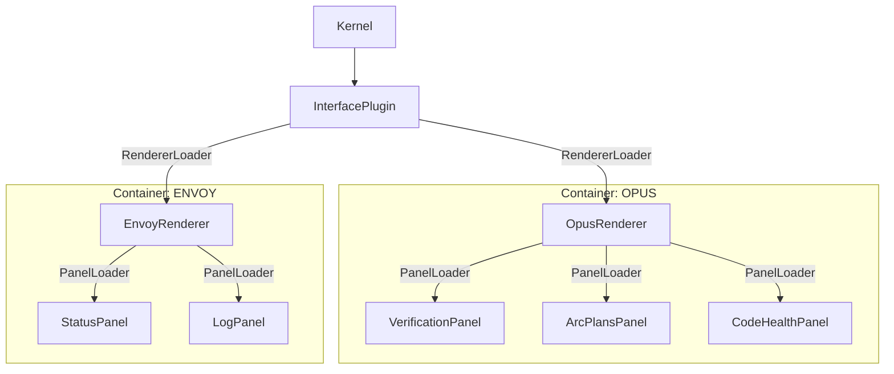

# OPUS-023: Fractal UI Architecture (VEDA-4)

> **Status**: ✅ IMPLEMENTED
> **Created**: 2025-12-10
> **Replaces**: OPUS-007 (Archived)
> **GAD-000**: Compliant (Safety, Discoverability, Fractal Integrity)

<!-- @HARNESS
files:
  - path: vibe_core/plugins/interface/renderer_loader.py
    required: true
  - path: vibe_core/plugins/interface/renderers/opus/renderer.py
    required: true
  - path: vibe_core/plugins/opus_assistant/render/opus_dashboard_renderer.py
    required: true
wiring:
  - pattern: "RendererLoader"
    in: vibe_core/plugins/interface/plugin_main.py
  - pattern: "OpusDashboardRenderer"
    in: vibe_core/plugins/interface/renderers/opus/renderer.py
-->

## Executive Summary

The VEDA-4 UI Architecture is **FRACTAL**. It rejects the flat, monolithic renderer list of OPUS-007 in favor of a nested, container-based hierarchy where every component is a self-contained "holon" with its own physics (manifest), lifecycle, and safety boundaries.

### The Fractal Hierarchy



---

## Core Components

### 1. Fractal Loaders

We extend `UnifiedLoader` to create specialized, recursive loaders.

- **`RendererLoader`**: Loads Top-Level Renderers (containers) into `InterfacePlugin`.
- **`PanelLoader`**: Loads Sub-Panels (components) into Renderers.

**Key Feature: Relative Path Injection**
Each loader injects the *contextual root path* into its children. This allows a Container (folder) to be moved anywhere and still find its assets relative to itself.

```python
# InterfacePlugin.py
renderer.set_root_path(meta.entry_path.parent) # Inject /renderers/opus

# OpusRenderer.py
# Uses injected root to find panels
panels_dir = self._root / "panels"
```

### 2. Manifest Physics (`manifest.json`)

Every UI component is defined by a manifest, not just code.

```json
{
  "type": "renderer",
  "id": "opus",
  "name": "OpusRenderer",
  "entry_point": "renderer.py",
  "output": "OPUS.md",
  "dependencies": ["prakriti", "steward"]
}
```

This adheres to **GAD-000**:
- **Discoverability**: System knows capabilities without importing code.
- **Safety**: Dependencies computed before execution.

### 3. GAD-000 Compliance Boundaries

UI Components are untrusted. They must be wrapped in safety barriers.

- **Double Import Resolution**: `PanelLoader` uses a "Loose Check" strategy to verify class identity across dynamic import contexts.
- **Capability Safety**: `VerificationPanel` (and others) MUST check `hasattr(kernel, "capability")` before access.
    - *Violation*: Crashing kernel because `envoy` plugin isn't loaded.
    - *Compliance*: Rendering "Envoy: N/A" or hiding section.

---

## Implementation Details

### Panel Loading Strategy

The `PanelLoader` solves the **"Fractal Identity Crisis"** (where `class A` imported via path != `class A` imported via module).

1. **Strict Check**: `issubclass(Candidate, BasePanel)`
2. **Loose Check**: If rigid check fails (due to import path variance), check `Candidate.__bases__[x].__name__ == "BasePanel"`.

### Opus Renderer (The Master Container)

`OpusRenderer` is no longer a monolith. It is a **Coordinator**.
1. **Lazy Loading**: Delays panel discovery until `render()` to wait for Dependency Injection.
2. **Aggregation**: It gathers content from `VerificationPanel`, `CodeHealthPanel`, etc.
3. **Dirty Tracking**: Only writes `OPUS.md` if hash changes (Law 3).

---

## Migration Status

| Component | Architecture | Status |
|-----------|--------------|--------|
| InterfacePlugin | VEDA-4 (Fractal) | ✅ |
| OpusRenderer | VEDA-4 (Container) | ✅ |
| VerificationPanel | VEDA-4 (Panel) | ✅ |
| Other Renderers | Legacy (Flat) | ⚠️ (Migrate as needed) |

## Related Docs
- `015-CONTAINER-FORMAT.md`: The physics of .vibe containers.
- `006-GAD000-COMPLIANCE-AUDIT.md`: The law.
