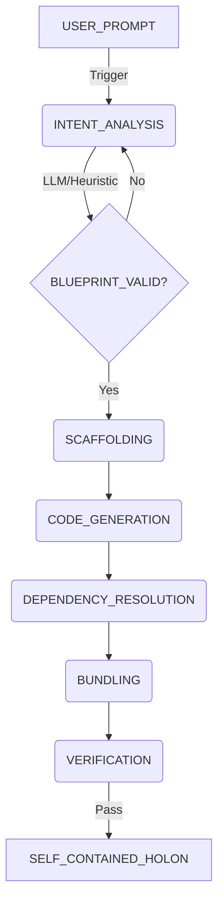

# OPUS-030: The Genesis Engine

**Status:** PROPOSAL (Senior Grade)  
**Author:** Claude (Systems Architect)  
**Date:** 2025-12-12  
**Scope:** Autonomous Agent Factory & Holon Construction System  
**Architecture:** Circuit-Driven Hybrid Intelligence (Deterministic + LLM)


<!-- @HARNESS
files:
  - path: scripts/research/genesis_economy.py
    required: true

wiring:
  - pattern: "def main"
    in: scripts/research/genesis_economy.py
-->

---

## Executive Summary

The **Genesis Engine** is a specialized orchestrator responsible for the **creation** and **packing** of autonomous agents. Unlike simple scaffolding scripts, Genesis operates as a **Circuit-Driven System** that combines:

1.  **Determinism**: Strict adherence to OPUS-015 Container Format and OS conventions.
2.  **Intelligence**: Hybrid AI/Heuristic architecture for interpreting vague user intent.
3.  **Recursion**: Capability to analyze and bundle dependencies into self-contained Holons.

**Core Philosophy:** "The Factory must be smarter than the Worker."

---

## 1. Architecture: The Creation Circuit

Genesis transforms the creation process into a **Finite State Machine** governed by the `CircuitEngine`. This ensures every step is observable, reversible, and debuggable.

### 1.1 The Circuit Flow (`genesis_prime.yaml`)



---

## 2. Component Design

The system is composed of three distinct functional units (The Triad):

### 2.1 The Architect (Brain)
**Responsibility:** Turn vague intent into strict JSON Blueprints.
**Integration:**
-   Primary: `vibe_core.runtime.LLMEngine` (Local/Cloud).
-   Fallback: Deterministic Heuristics (Regex/Keyword Analysis).

```python
class GenesisArchitect:
    """Hybrid Intelligence Engine."""

    def design_blueprint(self, prompt: str) -> AgentBlueprint:
        # 1. Try Local/Cloud LLM
        try:
            return self._llm_design(prompt)
        except LLMUnavailableError:
            # 2. Fallback to deterministic patterns
            return self._heuristic_design(prompt)
```

### 2.2 The Builder (Hands)
**Responsibility:** Physical file system operations.
**Integration:**
-   Uses `steward.json` Passport structure.
-   Enforces `tests/` existence (GAD-000 compliance).
-   Writes `manifest.json` with strict schema validation.

### 2.3 The Bundler (Logistics)
**Responsibility:** Dependency Resolution & Containerization.
**Algorithm:**
1.  Read `manifest.dependencies` (Virtual Links).
2.  Resolve Source Paths via `PluginRegistry`.
3.  **Recursive Walk**: Find transitive dependencies (Depth N).
4.  **Physical Materialization**: Copy to `hollows/` (Physical Embedding).
5.  **Seal**: Invoke `pack_vibe.build_container()` (Cryptographic Seal).

---

## 3. Implementation Plan

### 3.1 Directory Structure

```text
vibe_core/plugins/genesis/
├── manifest.json            # Plugin Declaration
├── plugin_main.py           # Facade (Thin Layer)
├── circuits/
│   └── genesis_prime.yaml   # The Creation Circuit FSM
├── core/
│   ├── architect.py         # Hybrid Intelligence
│   ├── builder.py           # Deterministic I/O
│   ├── bundler.py           # Recursive Resolution
│   └── templates.py         # Jinja2/F-String Templates
├── tasks/
│   └── creation_tasks.py    # Async Task definitions
└── tests/
    ├── test_architect.py
    └── test_bundler_scenarios.py
```

### 3.2 The Genesis Circuit (`circuits/genesis_prime.yaml`)

```yaml
circuit:
  id: GENESIS_PRIME
  name: "Genesis Prime Creation Flow"
  domain: INFRASTRUCTURE

  entry_state: INTENT_ANALYSIS

  states:
    INTENT_ANALYSIS:
      actions:
        - target: "genesis.architect"
          method: "analyze"
          params: { prompt: "{{ prompt }}" }
      transitions:
        - condition: "blueprint.valid == true"
          to: SCAFFOLDING

    SCAFFOLDING:
      actions:
        - target: "genesis.builder"
          method: "scaffold"
          params: { blueprint: "{{ blueprint }}" }
      transitions:
        - condition: "scaffold.success == true"
          to: CODE_GENERATION

    CODE_GENERATION:
      actions:
        - target: "genesis.builder"
          method: "write_code"
      transitions:
        - condition: "code.written == true"
          to: BUNDLING

    BUNDLING:
      actions:
        - target: "genesis.bundler"
          method: "bundle"
          params: { recursive: true }
      transitions:
        - condition: "container.path is defined"
          to: VERIFY

    VERIFY:
        description: "GAD-000 Compliance Check"
        actions:
          - target: "genesis.verifier"
            method: "check_integrity"
        transitions:
          - condition: "integrity.ok == true"
            to: COMPLETE
```

---

## 4. Verification Protocol

This plugin is critical infrastructure. It must be verified against:

1.  **GAD-000 (The Zero Touch Check)**:
    -   Generated containers must be parsable without execution.
    -   `manifest.json` checks.

2.  **OPUS-015 (Container Format)**:
    -   `hollows/` must contain valid `.vibe` structure.
    -   `SIGNATURE.sig` must be present.

3.  **Resilience**:
    -   Must function strictly offline (using Heuristic Architect + Templates).

---

## 5. Next Steps

1.  **Plugin Initialization**: Create `vibe_core/plugins/genesis/` structure.
2.  **Core Logic**: Implement `Bundler` (easiest win) first.
3.  **Circuit Wiring**: implement `GenesisCircuit` loader.
4.  **CLI Hook**: Register `steward genesis:create`.

---

**References:**
- `vibe_core/cartridges/system/engineer/cartridge_main.py` (Legacy Builder)
- `docs/architecture/OPUS/015-CONTAINER-FORMAT.md` (Target Spec)
