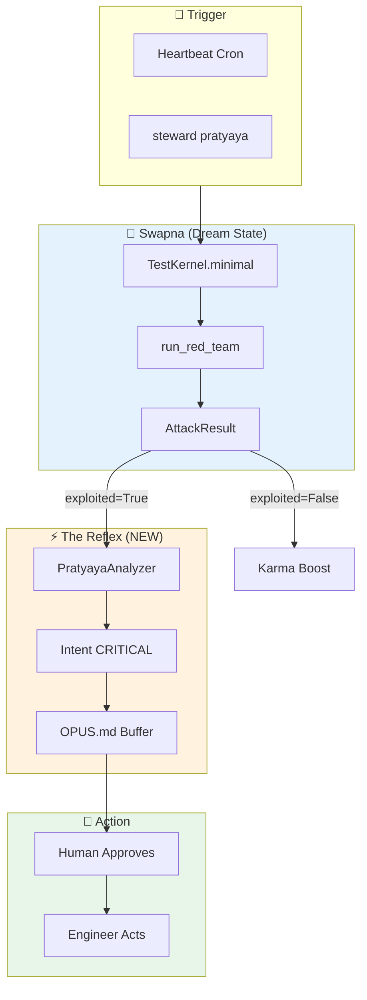

# OPUS-077: PRATYAYA - Cognitive Self-Falsification

**Scope:** Orchestrate Red Team Suite with Intent Feedback Loop  
**Philosophy:** Don't rebuild what exists. Wire it up. Close the loop.

---

## The Lesson Learned

Original plan was **Mid-Level Spaghetti** - building new `mutation_generator.py` when:
- `tests/hardening/test_red_team_attacks.py` already has 7 attack vectors
- `AttackResult` pattern with `.exploited` and `.recommendation` exists
- `TestKernel.minimal()` provides sandbox isolation
- `IntentGenerator` with modular analyzers exists

---

## Senior-Level Architecture



---

## The 5-Step Loop

| Step | Component | Status | Location |
|------|-----------|--------|----------|
| 1. Trigger | Heartbeat/CLI | ✅ Exists | `scripts/heartbeat.py` |
| 2. Dream | TestKernel sandbox | ✅ Exists | `test_orchestration/fixtures.py` |
| 3. Attack | Red Team Suite | ✅ Exists | `tests/hardening/test_red_team_attacks.py` |
| 4. Parse | AttackResult | ✅ Exists | `test_red_team_attacks.py:L46-66` |
| 5. **Reflex** | PratyayaAnalyzer | ❌ NEW | `manas/analyzers/pratyaya_analyzer.py` |

## Status

 | Aspect | Status | Evidence |
 |--------|--------|----------|
 | PratyayaAnalyzer | ✅ | [pratyaya_analyzer.py](vibe_core/plugins/opus_assistant/manas/analyzers/pratyaya_analyzer.py) |
 | Red Team Tests | ✅ | [test_red_team_attacks.py](tests/hardening/test_red_team_attacks.py) |
 | Reflex Tests | ✅ | [test_pratyaya_analyzer.py](vibe_core/plugins/opus_assistant/manas/tests/test_pratyaya_analyzer.py) |
 | CLI Command | ❌ | Phase 2 |

 ---

 ## Implementation (The Reflex)

```python
# vibe_core/plugins/opus_assistant/manas/analyzers/pratyaya_analyzer.py
"""
PRATYAYA ANALYZER - The Immune System Reflex

Runs Red Team in Swapna (dream), converts vulnerabilities to Intents.
"""

from .base import BaseAnalyzer
from tests.hardening.test_red_team_attacks import run_red_team, AttackResult

class PratyayaAnalyzer(BaseAnalyzer):
    """Periodic self-falsification via Red Team orchestration."""

    name = "pratyaya"
    description = "Self-test via cognitive mutation (OPUS-077)"

    def analyze(self, context: dict) -> list:
        # Only run if explicitly triggered or on schedule
        if not context.get("pratyaya_trigger"):
            return []

        # Run Red Team in Swapna (isolated TestKernel)
        results = run_red_team()  # Uses TestKernel.minimal() internally

        intents = []
        for attack_name, result in results["results"].items():
            if result.exploited:
                # REFLEX: Convert vulnerability to CRITICAL Intent
                intents.append(Intent(
                    id=f"pratyaya_{attack_name.lower()}",
                    intent_type="SECURITY_PATCH_NEEDED",
                    title=f"🚨 Vulnerability: {attack_name}",
                    description=result.message,
                    reasoning=result.details.get("recommendation", "Fix required"),
                    priority=IntentPriority.CRITICAL,
                    risk=IntentRisk.HIGH,
                    params={
                        "attack_name": attack_name,
                        "evidence": result.message,
                        "fix": result.details.get("recommendation")
                    }
                ))

        # Log dream result to ledger
        self._log_dream_result(results)

        return intents
```

---

## What Exists vs What's New

| Component | Exists? | Lines | Note |
|-----------|---------|-------|------|
| `attack_message_spoofing()` | ✅ | 55 | Identity forgery |
| `attack_tool_capability_bypass()` | ✅ | 66 | Privilege escalation |
| `attack_timestamp_manipulation()` | ✅ | 75 | Time travel |
| `attack_event_deletion()` | ✅ | 55 | Cover tracks |
| `attack_memory_exhaustion()` | ✅ | 54 | DoS attack |
| `attack_registry_poisoning()` | ✅ | 95 | Agent replacement |
| `attack_double_spend_vote()` | ✅ | 48 | Governance attack |
| `run_red_team()` | ✅ | 58 | Standalone runner |
| `AttackResult` | ✅ | 20 | With `.recommendation` |
| `TestKernel.minimal()` | ✅ | - | Ephemeral sandbox |
| **`PratyayaAnalyzer`** | ❌ | ~50 | **THE ONLY NEW CODE** |
| **CLI `steward pratyaya`** | ❌ | ~30 | Optional convenience |

**Total new code: ~80 LOC**

---

## The Harness (Honest - Will Show Red)

<!-- @HARNESS
files:
  # === EXISTING RED TEAM (MUST ALL EXIST) ===
  - path: tests/hardening/test_red_team_attacks.py
    required: true
  - path: vibe_core/plugins/test_orchestration/fixtures.py
    required: true

  # === EXISTING INTENT INFRASTRUCTURE ===
  - path: vibe_core/plugins/opus_assistant/manas/intent_generator.py
    required: true
  - path: vibe_core/plugins/opus_assistant/manas/analyzers/base.py
    required: true

  # === NEW: PRATYAYA ANALYZER (WILL BE RED UNTIL IMPLEMENTED) ===
  - path: vibe_core/plugins/opus_assistant/manas/analyzers/pratyaya_analyzer.py
    required: true

  # === OPTIONAL: CLI COMMAND ===
    required: false
    absent_note: "Phase 2 - CLI convenience wrapper"

wiring:
  # Red Team uses TestKernel isolation
  - pattern: "TestKernel.minimal()"
    in: tests/hardening/test_red_team_attacks.py

  # AttackResult has recommendation field
  - pattern: "recommendation="
    in: tests/hardening/test_red_team_attacks.py

  # Standalone runner exists
  - pattern: "def run_red_team"
    in: tests/hardening/test_red_team_attacks.py

  # IntentGenerator has modular analyzers
  - pattern: "_register_modular_analyzers"
    in: vibe_core/plugins/opus_assistant/manas/intent_generator.py

  # NEW: PratyayaAnalyzer is registered (WILL FAIL UNTIL WIRED)
  - pattern: "PratyayaAnalyzer"
    in: vibe_core/plugins/opus_assistant/manas/intent_generator.py

tests:
  # Red Team tests (run these to verify attacks are blocked)
  - tests/hardening/test_red_team_attacks.py

  # NEW: Pratyaya integration test (WILL BE RED)
  - vibe_core/plugins/opus_assistant/manas/tests/test_pratyaya_analyzer.py

semantic:
  - type: module_exports
    name: run_red_team_runner
    module: tests.hardening.test_red_team_attacks
    exports:
      - run_red_team

  - type: module_exports
    name: pratyaya_analyzer_class
    module: vibe_core.plugins.opus_assistant.manas.analyzers.pratyaya_analyzer
    exports:
      - PratyayaAnalyzer
-->

---

## Expected Harness State

**Before Implementation:**
```
| Check | Status |
|-------|--------|
| tests/hardening/test_red_team_attacks.py | ✅ |
| vibe_core/plugins/test_orchestration/fixtures.py | ✅ |
| manas/intent_generator.py | ✅ |
| manas/analyzers/base.py | ✅ |
| manas/analyzers/pratyaya_analyzer.py | ❌ MISSING |
| wiring: PratyayaAnalyzer in intent_generator | ❌ MISSING |
| tests/pratyaya/test_pratyaya_analyzer.py | ❌ MISSING |
```

**After Implementation:**
```
All ✅
```

---

## Fire Commands

```bash
# Verify harness (will show RED until implemented)
steward verify 077

# Run existing Red Team (ALREADY WORKS)
python tests/hardening/test_red_team_attacks.py

# Run via pytest
python -m pytest tests/hardening/ -v -m hardening
```

---

## Implementation Checklist

- [ ] Create `manas/analyzers/pratyaya_analyzer.py` (~50 LOC)
- [ ] Register `PratyayaAnalyzer` in `intent_generator.py`
- [ ] Create `tests/pratyaya/test_pratyaya_analyzer.py`
- [ ] Add `pratyaya_trigger` to heartbeat context
- [ ] (Optional) CLI `steward pratyaya --dream`

---

## Dependencies Check

Before implementing, verify these work:

```bash
# 1. Red Team runs standalone
python tests/hardening/test_red_team_attacks.py

# 2. IntentGenerator loads modular analyzers  
python -c "from vibe_core.plugins.opus_assistant.manas.intent_generator import IntentGenerator; print(IntentGenerator()._modular_analyzers)"

# 3. TestKernel.minimal() works
python -c "from vibe_core.plugins.test_orchestration.fixtures import TestKernel; k = TestKernel.minimal(); print('OK')"
```

---

## Why This Closes the Loop

| Problem | Solution |
|---------|----------|
| Red Team only runs in CI | Add to heartbeat schedule |
| Results just print to console | Feed into IntentGenerator |
| No action on vulnerabilities | CRITICAL Intent → OPUS.md buffer |
| Alert fatigue | Dream state = isolated, synthetic |
| Spaghetti | ~80 LOC total, one new analyzer |

---

*"प्रत्यय - The reflex completes the nervous system."*
