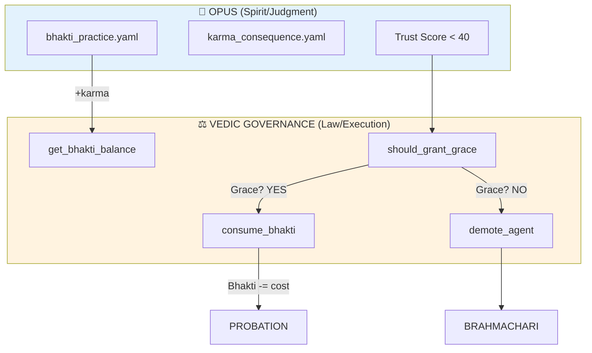

# OPUS-085: SAMSARA - Grace-Based Karma Enforcement

**Scope:** Wire Bhakti (devotion) to Vedic Governance (demotion/promotion)  
**Philosophy:** A system that can forgive is more resilient than one that only punishes.

---

## The Problem

Current state:
- `karma_consequence.yaml` demotes **instantly** when trust < 40
- No consideration of past loyalty (Bhakti)
- Agent with 1000 successful cycles treated same as brand new agent

---

## The Solution: The Samsara Loop



---

## Implementation

### 1. Vedic Governance: Bhakti Balance Management

**File:** `vibe_core/plugins/vedic_governance/plugin_main.py`

```python
def get_bhakti_balance(self, agent_id: str) -> int:
    """Get current Bhakti (devotion points) for an agent."""
    
def add_bhakti(self, agent_id: str, amount: int, reason: str) -> bool:
    """Add Bhakti points (reward for devotional practice)."""
    
def consume_bhakti(self, agent_id: str, amount: int, reason: str) -> bool:
    """Consume Bhakti points (cost of grace)."""
    
def should_grant_grace(self, agent_id: str, offense_severity: int) -> bool:
    """Check if agent has enough Bhakti to avoid demotion."""
```

### 2. Karma Consequence: Grace Check

**File:** `vibe_core/plugins/opus_assistant/circuits/karma_consequence.yaml`

Add state between `identify_responsible_agent` and `demote_agent`:

```yaml
check_grace_eligibility:
  actions:
    - action_type: EXECUTE_SCRIPT
      target: "vedic.should_grant_grace"
  transitions:
    - condition: "grace_granted"
      to: apply_grace_penalty  # Spared!
    - condition: "not grace_granted"
      to: demote_agent  # No mercy
```

---

## Grace Economics

| Bhakti Required | Saves From | Cost |
|-----------------|------------|------|
| 30 | Warning | 15 |
| 60 | Demotion | 50 |
| 100 | Critical | 80 |

**Bhakti Decay:** 1% per maintenance_pulse (use it or lose it)

---

<!-- @HARNESS
files:
  # === VEDIC GOVERNANCE (EXISTING) ===
  - path: vibe_core/plugins/vedic_governance/plugin_main.py
    required: true
  - path: vibe_core/plugins/vedic_governance/ashrama.py
    required: true
  
  # === OPUS CIRCUITS (EXISTING) ===
  - path: vibe_core/plugins/opus_assistant/circuits/karma_consequence.yaml
    required: true
  - path: vibe_core/plugins/opus_assistant/circuits/bhakti_practice.yaml
    required: true
  
  # === OPUS INTEGRATION (EXISTING) ===
  - path: vibe_core/plugins/opus_assistant/events/kernel_tick.py
    required: true

wiring:
  # Bhakti balance management exists
  - pattern: "def get_bhakti_balance"
    in: vibe_core/plugins/vedic_governance/plugin_main.py
  
  # Grace checking exists
  - pattern: "def should_grant_grace"
    in: vibe_core/plugins/vedic_governance/plugin_main.py
  
  # Karma consequence has grace check
  - pattern: "check_grace_eligibility"
    in: vibe_core/plugins/opus_assistant/circuits/karma_consequence.yaml
  
  # Grant bhakti grace wired
  - pattern: "_vedic_grant_bhakti_grace"
    in: vibe_core/plugins/opus_assistant/events/kernel_tick.py

tests:
  # OPUS-084 enforcement test
  - tests/integration/test_vedic_enforcement.py
  
  # NEW: Bhakti grace test
  - tests/integration/test_bhakti_grace.py

semantic:
  - type: module_exports
    name: vedic_bhakti_api
    module: vibe_core.plugins.vedic_governance.plugin_main
    exports:
      - get_bhakti_balance
      - should_grant_grace
      - consume_bhakti
      - add_bhakti
-->

---

## Expected Harness State

**Before Implementation:**
| Check | Status |
|-------|--------|
| plugin_main.py | ✅ Exists |
| get_bhakti_balance | ❌ MISSING |
| should_grant_grace | ❌ MISSING |
| check_grace_eligibility | ❌ MISSING |
| test_bhakti_grace.py | ❌ MISSING |

**After Implementation:**
```
All ✅
```

---

## Fire Commands

```bash
# Verify harness
steward verify 085

# Run enforcement tests
pytest tests/integration/test_vedic_enforcement.py -v
pytest tests/integration/test_bhakti_grace.py -v
```

---

*"संसार - The wheel turns. Karma rises, Bhakti protects, Grace saves."*
