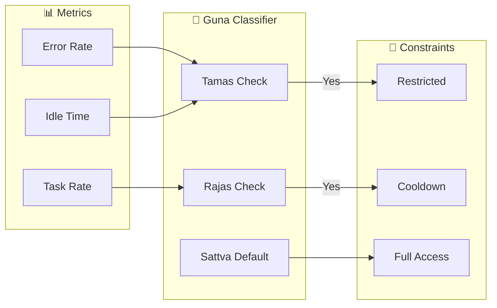

# OPUS-086: TRIGUNA - Agent Health Classification

**Scope:** Classify agents by "Mode of Nature" (Guna) for dynamic task restrictions  
**Philosophy:** It's not just WHAT you do (Karma), but HOW you do it (Guna)

---

## The Three Gunas (Bhagavad Gita, Chapter 14)

| Guna | Nature | Vibe-OS Symptoms | Governance Response |
|------|--------|------------------|---------------------|
| **Tamas** | Darkness/Inertia | High error rate, idle, silent failures | Restrict to self-check tasks |
| **Rajas** | Passion/Overaction | High churn, CPU burn, rapid commits | Enforce cooldown, require tests |
| **Sattva** | Virtue/Clarity | Clean logs, efficient, helpful | Full access, may touch critical infra |

---

## Implementation

### 1. Guna Classification (`determine_guna`)

**File:** `vibe_core/plugins/vedic_governance/plugin_main.py`

```python
def determine_guna(self, agent_id: str) -> str:
    """Classify agent's current state by Guna."""
    if self._is_tamasic(agent_id):
        return "tamas"
    if self._is_rajasic(agent_id):
        return "rajas"
    return "sattva"
```

### 2. Dynamic Constraints (`on_task_pre_assign`)

```python
guna = self.determine_guna(agent_id)
if guna == "tamas":
    # Agent is "drunk/tired" - only allow simple tasks
    if action not in ["read", "observe", "self_check"]:
        return False
elif guna == "rajas":
    # Agent is "manic" - no writes to critical paths
    if action == "write" and is_critical_path(task):
        return False
```

---

## Architecture



---

<!-- @HARNESS
files:
  - path: vibe_core/plugins/vedic_governance/plugin_main.py
    required: true
  - path: vibe_core/plugins/vedic_governance/ashrama.py
    required: true

wiring:
  - pattern: "def determine_guna"
    in: vibe_core/plugins/vedic_governance/plugin_main.py
  - pattern: "_is_tamasic"
    in: vibe_core/plugins/vedic_governance/plugin_main.py
  - pattern: "_is_rajasic"
    in: vibe_core/plugins/vedic_governance/plugin_main.py

tests:
  - tests/integration/test_triguna.py

semantic:
  - type: module_exports
    name: guna_classifier
    module: vibe_core.plugins.vedic_governance.plugin_main
    exports:
      - determine_guna
-->

---

## Expected Harness State

**Before Implementation:**
| Check | Status |
|-------|--------|
| determine_guna | ❌ MISSING |
| _is_tamasic | ❌ MISSING |
| _is_rajasic | ❌ MISSING |
| test_triguna.py | ❌ MISSING |

**After Implementation:**
```
All ✅
```

---

*"त्रिगुण - The modes of material nature bind the eternal soul to the material body."*
